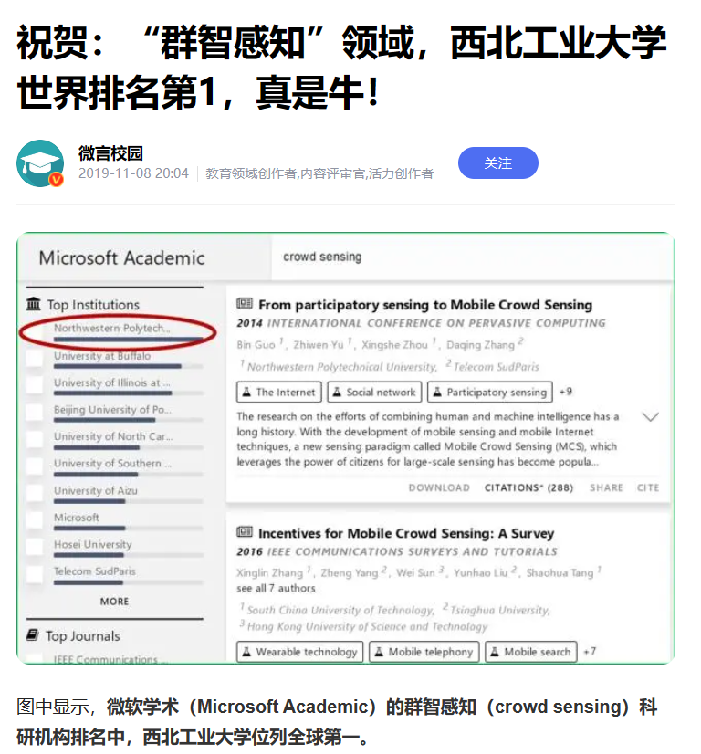
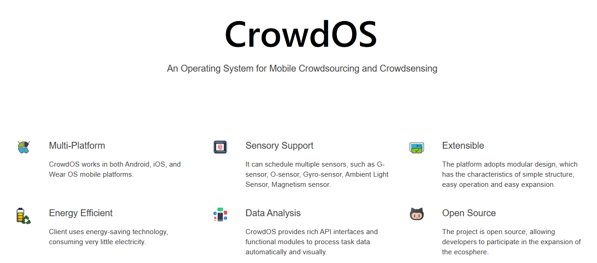
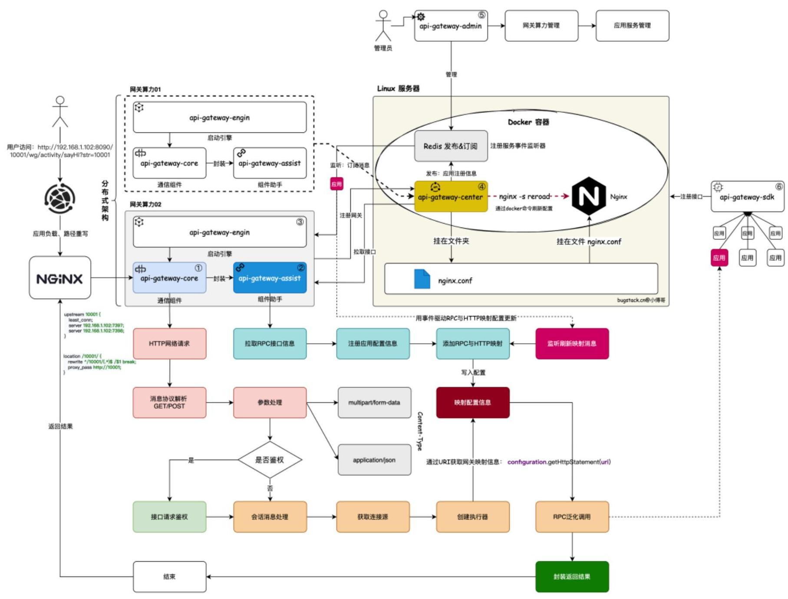
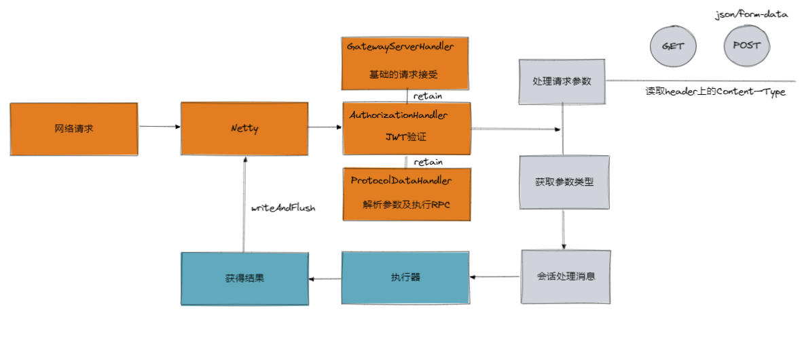
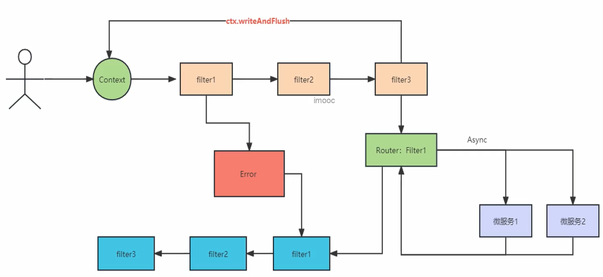
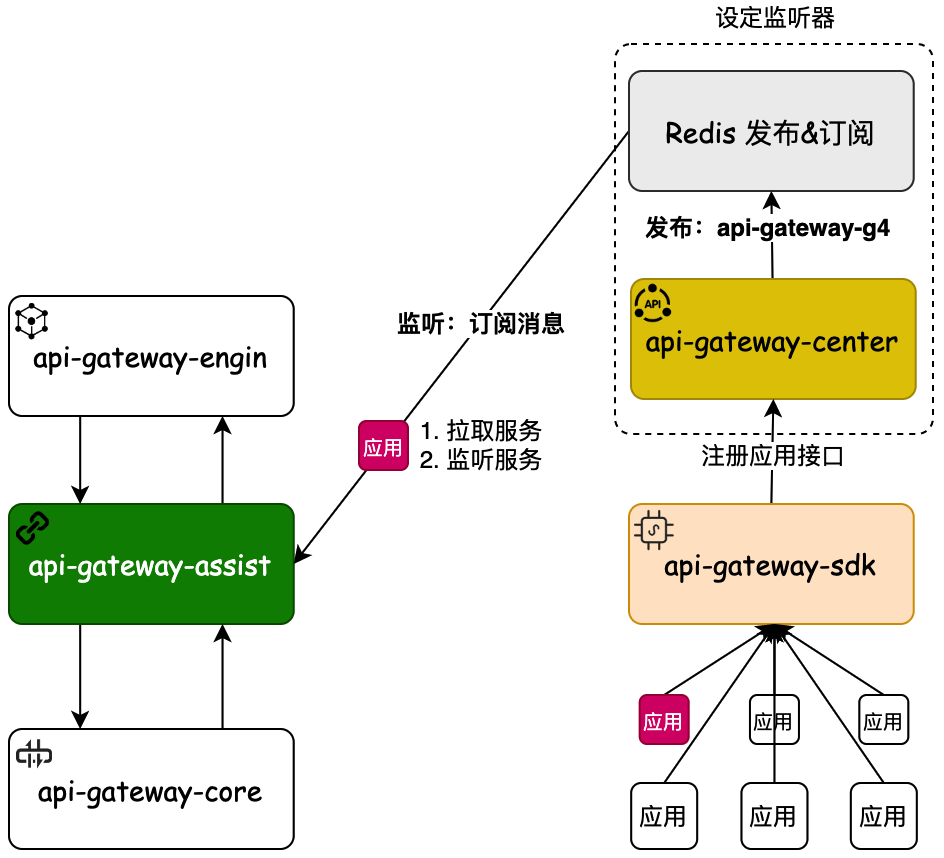
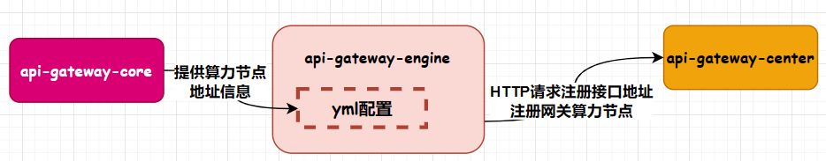
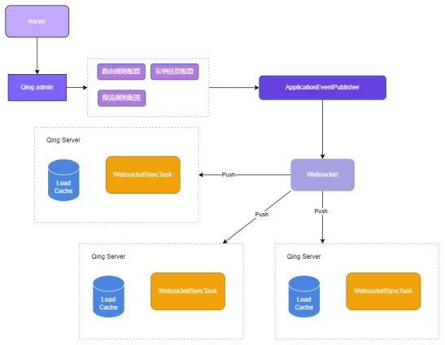

# CrowdOS-Gateway

本项目由**西北工业大学计算机学院“智能感知与计算工信部重点实验室与陕西省嵌入式系统技术重点实验室**进行设计与开发，主要针对于 **国家重点研发计划“物联网与智慧城市关键技术及示范”** 而进行研发，Gateway是配合着我们自主研发的CrowdOS系统，解决城市群智感知的相关问题。

  

## 一、**群智感知是什么？**

群智感知，是物联网和人工智能相结合的前沿研究方向，它利用大量普通用户使用的移动设备作为基本感知单元，通过物联网和移动互联网进行协作，实现感知任务分发与感知数据收集利用，最终完成大规模、复杂的城市与社会感知任务。具体对未来的生活所产生的影响有：

比如——

1. 如何了解城市交通路网的畅通和拥堵情况，并对车流和人群进行引导？

2. 如何低成本、高效率地获知遍布城市的公共设施出现了损坏？

3. 如果发生了安全事故或者突发事件，该如何取证？

4. 城市的空气、水体等的检测如何能更有效？

5. 城市中某一地区的消费者是否更偏爱某些特定的产品？

……

这些与我们衣食住行息息相关的问题，都可以通过“群智感知”技术来有效解决。如何“感知”一座城市？

作为国内最早开始在群智感知领域探索的高校之一，2013年，西北工业大学计算机学院的於志文教授便带领团队，在国家自然科学重点基金等的支持下，开始了群智感知领域的探索。并逐渐做到了世界第一

并在丰富的科研成果的基础上，**[研发通用的“群智感知操作系统平台”——CrowdOS]([CrowdOS sensing framework](https://www.crowdos.cn/))。该平台支持群智任务敏捷发布、复杂任务高效分配、多粒度隐私保护等核心功能。**

  

<Badge text="CrowdOS资源资讯"/>

- *CrowdOS系统平台已举办三届开源大赛*，第一届和第三届竞赛依托**中国软件开源大赛**（同大赛其他赛道包括华为，openGauss，达摩院ModelScope，百度Paddle等），国内外30余所研究机构和60支队伍参加竞赛。

- CrowdOS项目集（CrowdOS和CrowdOS-Gateway）正在加入**工信部开源原子基金会**（同基金会的项目包括：TecentOS Tiny，openHarmony等）

<Badge text="相关链接" type="warning"/>

- **项目网站：**[https://www.crowdos.cn/](https://www.crowdos.cn/)
- **竞赛网站：**[https://www.crowdos.cn/competition/competition_en.html](https://www.crowdos.cn/competition/competition_en.html)
- **CrowdOS-Gateway仓库：**[JoelEmbiiddddd/CrowdOS-Gateway (github.com)](https://github.com/JoelEmbiiddddd/CrowdOS-Gateway)
- **CrowdOS仓库：**[JoelEmbiiddddd/CrowdOS-Gateway (github.com)](https://github.com/loyx/CrowdOS)
- **第六届开源大赛CrowdOS赛道：**[GitLink | 确实开源](https://www.gitlink.org.cn/competitions/index/track2_2023_crowdos)

## 二、为啥做设计一个网关？

在群智任务中，群智任务必然会涉及到高并发，同时上千人或上万人进行一个群智任务，并同时对数据进行处理并返回给用户进行下一阶段群智任务开展。

像京东、阿里、美团都是有自己的API网关的，因为这样可以更好的控制网关和自身系统的结合，也可以添加各类自己需要的功能，以及支撑更大的流量。同时像目前所开源的著名Gateway，例如Spring Cloud Gateway，shenyu等等，为我们提供了研究思路。

为了能够更了解流量输入和针对于不同群智任务的所设计（异常如何处理，多群智任务流量入口如何设计），对此，秉承着**秉承开源精神以及研究者的学习和实践**，**同时为整个国家重点实验室群智计算作出贡献：**

**我们希望能够设计出一款依托于[“群智感知操作系统平台”——CrowdOS]([CrowdOS sensing framework](https://www.crowdos.cn/))**，不断发展，最终成为 **[Apache](https://baike.baidu.com/item/Apache/8512995?fromModule=lemma_inlink)软件基金会的著名项目**

### 设计的理念

1. **轻量化**：能够做到即插即用，而不需要引用过多的组件，降低使用者的学习成本。
2. **高扩展化**：能够快速部署服务，为使用者和研究人员根据不同的群智任务需求进行自定义扩展，使用 SPI 机制进行扩展，同时支持业务使用方的 Plugin 插件扩展。
3. **稳定性：**，在执行群智感知任务的时候，为避免系统崩溃造成执行任务时连接异常，进行了线程隔离、异步请求等处理。
4. **高效性**：在群智任务中，可能会涉及到同时上万个设备进行处理任务，这将带来巨大的负载压力。对此我们做了多网关处理，接入Disruptor处理任务。

同时，CrowdOS-Gateway2.0版本将针对于CrowdOS系统进行升级，以承担起群智任务的流量入口和群智任务的用户数据预处理。

## 三、网关：系统架构设计

**我们整个微服务模块结构如下：**

| 序号 |      系统      |                             描述                             | 完成情况 |
| :--: | :------------: | :----------------------------------------------------------: | :------: |
|  1   |  Gateway-Core  | 网关核心系统：用于网络通信转换处理，承接http请求，调用RPC服务，责任链模块调用 |    √     |
|  2   | Gateway-Admin  |     网关管理系统：用于网关接口后台管理，注册下线停用控制     |    √     |
|  3   |  Gateway-SDK   |     网关注册组件：用于注解方式采集接口，发送消息注册接口     |    √     |
|  4   | Gateway-Center |     网关注册中心：提供网关注册中心服务，登记网关接口信息     |    √     |
|  5   | Gateway-Assit  | 网关服务中心：通信服务组件封装，用于包装gateway-core，通信服务组件封装，让springboot更加容易使用 |    √     |
|  6   | Gateway-Engine |         网关引擎工程：将网关打包成jar放到容器中运行          |    √     |
|  7   |  Gateway-Test  |           网关测试中心：对网关的运行进行测试使用的           |    √     |

### 技术栈

Dubbo,Nacos,Nginx,Netty,Shiro,Zookeeper,Disruptor,Hystrix,MySQL

### 架构设计

**网关核心（Gateway-Core，Gateway-Assit）**

Gateway-Core提供核心的通信功能，以及简单易上手的可扩展功能。 

Gateway-Assit则是将Gateway-Core进行封装，这是因为我们希望把这样的统一公用能力进行一致的管理，如果没有这样的组件服务，那么将需要每一个 SpringBoot 服务都要做类似这样的事情，整体来看就会耗费很大的成本，所以要把这样的功能进行收口。

即，配置Gateway-Assit中的Application.yml文件即可快速使用。

**网关管理系统（Gateway-Center，Gateway-Admin）**

Gateway-Center作为我们Gateway的注册中心，最核心管理就是 RPC 接口映射成一个 HTTP 请求地址，并把这个信息下发给对应的协议转发服务上进行使用，作为Http和RPC衔接的桥梁。

Gateway-Admin则是Gateway-Center的可视化平台，并在后期能够为CrowdOS进行适配，快速发布群智任务，并最终设计为一个低代码平台。

**网关注册组件（Gateway-SDK）**

Gateway-SDK主要负责的是服务发现。用于注册到API网关注册中心的 RPC 服务，通过 SDK 配置的方式，采集到 RPC 服务中的接口信息。因为这些接口的定义如果都是手动配置到API网关注册中心，那么就会非常麻烦。所以通过 SDK 采集的方式进行自动注册，当有接口变更的时候也会及时的变更接口信息。

**网关容器部署（Gateway-Engine）**

Gateway-Engine 是一个用于启动网关算力服务的引擎工程，我们可以将这个服务部署到docker，形成一个网关集群。本组件的重点在于把 Gateway-Core、Gateway-Assit、Gateway-Engine 三个工程串联起来使用打包镜像的方式进行部署使用。

## 四、网关：技术亮点

### 会话模型

我们**基于Netty框架搭建了一套完整的请求与应答的Gateway响应系统**，并与此实现高扩展性和稳定性。具体为：

1. 将复杂的会话流程划分为多个阶段，以提高处理效率；将**连接(RPC\HTTP\其他)抽象为数据源**，为数据的读取和写入提供支持，并允许使用者根据自身需求自信添加其他数据源；
2. 实现HTTP请求参数解析，确保请求参数的正确处理；
3. 引入执行器封装服务调用，提供对各种服务的调用支持；
4. 集成插件链，高度自由允许用户自行添加相关插件；
5. 实现网关会话鉴权处理，为会话的安全管理提供支持；
6. 实现网络通信配置提取，将网络通信的配置信息抽象为可配置的模块，提高配置的灵活性。

### 可插拔式SPI插件链

我们设计了一种可插拔式SPI插件链，使用插件化设计思想，实现插件的热插拔，允许使用者根据群智任务的需求自主扩展插件，极易扩展。可扩展的信息有：

1. 注册中心
2. 监控中心
3. 负载均衡
4. 限流方法
5. 匹配方法
6. 条件策略

### 订阅服务

**目的：**

使用事件发布订阅机制异步进行，比如redis、MQ，这里网关引擎与注册中心采用redis的发布订阅模式进行通信。新的应用接口启动注册后，触发注册中心的事件发布机制，gateway-center向网关引擎推送新注册接口的信息，gateway-assist收到后进行更新

**优点：**

使用到了 Redis 发布和订阅的功能，开发了新增接口时候事件通知和处理的操作，让我们可以在不重启服务的情况下把新的接口注册到网关服务中。其实类似这样的不重启服务完成处理的思想也可以作用到自己的业务场景中

### 轻量设计

为了简化群智任务的进行，我们对所有的组件都进行了简易，通用，轻量化的设计，以允许使用者能够快速部署 **群智感知** 任务：

- 设计了一个注册中心，以期间 Http -> RPC之间的桥梁，并且可扩展性强，允许未来我们设计为一个低代码平台，能够快速部署群智任务。
- 避免过多组件参与。我们尽可能只使用必要的组件，而不用引入过多的组件，比如MQ、Nacos等等。
- 全自动化进行。我们分别通过 **Gateway-Assit和Gateway-SDK** 来包装 **Gateway-Core和用户所使用的RPC服务**，通过自定义注解和配置文件即可快速配置网关，并进行使用。
- Docker云响应。我们可以通过 **Gateway-Engine**部署到云上，通过Redis订阅与推送，自动完成RPC服务的上下线，不需要过多的操作与担心。

## 五、网关：未来拓展计划

### 分布式数据同步设计

为了提升网关的性能，**Gateway**将所有的路由规则、限流规则、服务及实例数据缓存在JVM 内存里面。在集群部署/分布式场景中，**Gateway**自主研发了一套将Admin控制台的数据，远程同步到每一个**Gateway**网关节点JVM内存的方案，流程如图3-5所示。

数据同步是指在 `shenyu-admin` 后台操作数据以后，使用何种策略将数据同步到 `CrowdOS-Gateway` 网关。`CrowdOS-Gateway` 网关当前支持`ZooKeeper`、`WebSocket`、`Http长轮询`、`Nacos` 、`Etcd` 和 `Consul` 进行数据同步。

**Gateway-Admin**开启一个子线程轮询拉取注册中心数据，首次启动时，将注册中心的数据全量同步至网关节点，之后采用数据增量同步的策略，减少数据包的大小，加快消息传输速度。当在控制台更改路由规则、实例信息、限流规则时，会触发Spring的发布事件机制，异步将消息通知网关节点。

### 插件备选

未来我们会针对我们的网关对现有插件的实现，例如注册中心、熔断组件、监控中心等等，为使用者一键到位的方便体验。

### 客户端注册

应用客户端接入是指将你的微服务接入到`CrowdOS-Gateway`网关，目前由于整个项目处于初步阶段，仅支持Http和Dubbo的访问，未来计划是支持`Http、 Dubbo、 Spring Cloud、 gRPC、 Motan、 Sofa、 Tars`等协议的接入。

将应用客户端接入到`CrowdOS-Gateway`网关是通过注册中心来实现的，涉及到客户端注册和服务端同步数据。未来计划注册中心支持`Http`、`Zookeeper`、`Etcd`、`Consul`和`Nacos`。

以及实现以下功能：

- 插件：`CrowdOS-Gateway` 使用插件化设计思想，实现插件的热插拔，极易扩展。内置丰富的插件，包括 `RPC` 代理、熔断和限流、权限认证、监控等等。**该部分已经实现**，只需要进行更多的插件支持即可。
- 选择器：每个插件可设置多个选择器，对流量进行初步筛选。
- 规则：每个选择器可设置多个规则，对流量进行更细粒度的控制。

### 异步响应

在CrowdOS-Gateway2.0的构想中，将使用Spring webflux来重构整个代码。webflux是完全异步且非阻塞的，底层也是基于Netty实现的。在处理IO密集型请求场景下有着更大的优势。