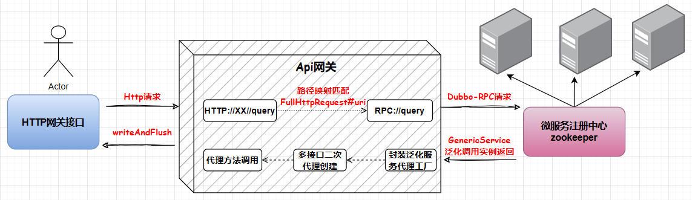

# Gateway-Core

```java
这是最核心的部件！
```





如图所示，所有的 HTTP 请求协议转发，到最终的 RPC 泛化调用，这些操作都在这一个服务中完成。而整个这一块服务的实现，其实就是一套会话模型的架构分层设计。一次网络请求经过 Netty 处理可以分为三段；消息接收、链路处理、消息回调。这样就由原来我们只是在接收消息后直接把消息协议转换后请求到 RPC 服务，等到RPC服务完成后再将结果进行打包返回回来。具体而言，我们可以将整个流程理解为：

```html
一个合法的请求（包括uri和请求方法），通过Http与一个应用服务绑定，并且配置到SessionConfig中，即在session服务运行中，config一直维持URL-应用服务的绑定关系。并将URL与泛化调用实例进行绑定，注册到Registry中。

通过该URL就能够通过泛化调用的代理方法调用远程应用服务。
```

亦或者是

```html
通过一个http网络请求，调用一个对应的远程服务,过程是:

http网络请求 -- 解析http请求报文，获得参数 -- 根据参数，建立一个session -- 会话根据映射，得到泛化调用对象 -- 泛化调用执行代理方法 -- 获得数据源连接对象 -- 连接对象执行方法访问数据源 -- 完成服务调用
```


而我们的**Gateway-Core**则是承担着最为主要的部分，如何基于Netty搭建起Http请求和RPC服务二者之间的桥梁。


**1、 会话模型**

- 会话模型是网关算力中非常重要的一环，所有的 HTTP 请求都可以被抽象为会话模型。通过会话模型封装出 HTTP 到 RPC 的处理，中间再通过执行器和RPC抽象的数据源进行衔接。
- 网关会话中还需要协议的处理，而协议的接收、解析、转换，就需要通过 Netty 实现的 Socket 服务来封装。通过为了更好的体现出会话的结构，这里我们通过一个抽象类模板，定义出 session 方法。—— 好的代码，就是好的文档。有了这样的约定，也就不需要太多的口口相传。提高我们代码的解耦性和高扩展性。

**2、 映射代理**

- 为了更好的衔接 HTTP 请求的地址【`/wg/activity/sayHi`】与 RPC 服务的映射关系，利用Dubbo中的泛化调用来实现调用RPC，有了这次映射关系后，我们就可以更好地维护好代码的实现关系。
- 实际的应用中会遇到很多不同的协议，作为一个网关不应该只允许一种协议，而应该能够接收到多种的协议并将其转化同一种格式，以便调用RPC来处理问题。这里我们将这种连接看作是一种资源，将不同的协议看作是一种连接池中的东西，随时取出，以解耦调用结构并提高扩展


**3、链路插件**

- 基于责任链设计模式和插件化思想，将网关的处理逻辑抽象成多个插件，按顺序去处理推到下一层或拒绝服务。
- 网关会将匹配路由断言的请求，在目标服务的所有实例中根据配置的负载均衡策略选择一个实例转发。
- 同时我们也支持SPI热拔插技术，可动态配置


**4、异步缓存**

- 我们的网关对API请求做了全异步化处理，请求通过Netty网络框架异步提交到业务处理线程池，调用后端服务使用RPC或HTTP框架的异步方式，释放了由于网络等待引起的线程占用，使线程数不再成为网关的瓶颈。
- `我们的网关`在注册中心的原理设计上引入了`Disruptor`，`Disruptor`队列在其中起到数据与操作解耦，利于扩展。如果注册请求过多，导致注册异常，也有数据缓冲作用。将数据发到`Disruptor`队列，然后从队列中消费数据，将消费者放到线程池中去执行，最终通过发送`http`请求到`admin`。引入`Disruptor`队列是为了数据与操作解耦，以及数据缓冲。


**5、重试机制**

- 服务支持请求的快慢线程池隔离。快慢线程池隔离主要用于一些使用了同步阻塞组件的API，例如SSO鉴权、自定义鉴权等，可能导致长时间阻塞共享业务线程池。快慢隔离的原理是统计API请求的处理时间，将请求处理耗时较长，超过容忍阈值的API请求隔离到慢线程池，避免影响其他正常API的调用。


## 会话模型

在CrowdOS-Gateway模型中，


## 映射代理


## 链路插件


## 异步缓存


## 重试机制

