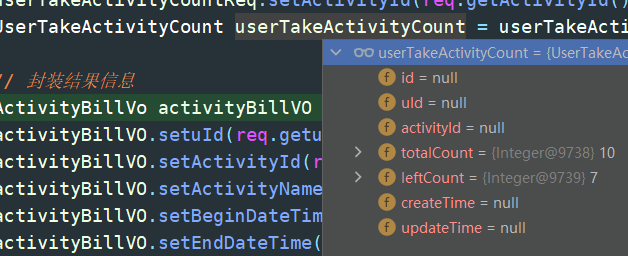

# Gateway-Lottery


## 开始

ActivityProcessImpl.doDrawProcess

**活动流程编排**

使用**模板模式（规范步骤1234）**统一规范化各流程的编排


并且使用**门面模式（数据dto2vo）**避免各层之间的数据混乱脏污。

主要流程为：

1. 领取活动
2. 首次成功领取活动，发送 MQ 消息异步通知
3. 执行抽奖策略
4. 抽奖结果落库
5. 发送 MQ 触发发奖流程
6. 返回发奖结果

## 1、领取活动

活动领取模板抽奖类 BaseActivityPartake.doPartake

入参: 【 userId, acitivityId 】

### 1、查询是否存在抽奖单 queryNoConsumedTakeActivityOrder

查询（where uid and activity and state ?= 0）该活动中用户是否存在抽奖单未消费（state = 0表示有抽奖单但未消费。1表示已消费），因为抽奖单的创建和库存的消耗不保证事务性，在抽奖单创建完后，系统可能崩溃导致商品还未发送给用户

而从用户体验角度来说，如果重新进行抽奖，是很不友好的，因此库表增添 state 字段来检查该活动是否消费抽奖单，没有新建，有则查询抽奖单`user_take_activity` （该库表只分库不分表，目的是为了提升数据库连接量，提高整体系统并发性能）

### 2、查询活动账单 queryActivityBill

#### 1、查询该活动信息: 入参【activityId】

```xml
<select id="queryActivityById" parameterType="java.lang.Long" resultMap="activityMap">
    select activity_id,
    activity_name,
    activity_desc,
    begin_date_time,
    end_date_time,
    stock_count, # 库存
    stock_surplus_count,
    take_count, # 每人可参与次数
    strategy_id, # 策略ID
    state, # 活动状态[流程编排状态模式]
    creator,
    create_time,
    update_time
    from activity
    where activity_id = #{activityId};
</select>
```


活动内容展示：


#### 2、在缓存里获取库存，及时更新当前库存量，防止超卖现象发生

```java
Object usedStockCountObj = redisUtil.get(Constants.RedisKey.KEY_LOTTERY_ACTIVITY_STOCK_COUNT(req.getActivityId()));

...
    
// 抽奖活动库存 Key
private static final String LOTTERY_ACTIVITY_STOCK_COUNT = "lottery_activity_stock_count_";

public static String KEY_LOTTERY_ACTIVITY_STOCK_COUNT(Long activityId) {
    return LOTTERY_ACTIVITY_STOCK_COUNT + activityId;
}
```


#### 3、查询当前用户可领取次数，处理边界情况

分库路由 `user_take_activity_count` --> 通过分析当前用户的userId 定位数据会存储在哪个库中。（路由策略可看数据库路由中间件开发这篇文章。本质上是基于hashmap扰动和斐波那契散列）



#### 4、封装结果信息

**剩余库存的计算**

```java
    activityBillVO.setStockSurplusCount(null == usedStockCountObj ? activity.getStockSurplusCount() : activity.getStockCount() - Integer.parseInt(String.valueOf(usedStockCountObj)));
```


如果 redis 没有库存记录，说明是第一次访问，请求**通过数据库获取到库存数**，并将结果存储在 redis 里（在后面的流程里 subtractionActivityStockByRedis ），否则 就用 **该活动总库存 - 该活动奖品领取次数**

**用户已领取次数的计算**

每个用户刚参与活动时，参与次数和领取次数都为 null，因此要考虑这个边界问题

```java
activityBillVO.setUserTakeLeftCount(null == userTakeActivityCount ? null : userTakeActivityCount.getLeftCount());
```


当用户第一次进入，填入数据库默认用户最大参与次数

### 3、活动信息校验 checkActivityBill

检验方向：

- 活动状态：ActivityState，通过状态模式进行统一规范处理
- 活动日期：活动截至日期和用户参与日期做校验
- 活动库存：stockSurplusCount <= 0 时抛出异常日志
- 个人参与次数校验：userTakeLeftCount !=null（第一次进入） && <= 0 抛出异常日志

### 4、扣减活动库存 subtractionActivityStockByRedis

注意

线上运行中的活动，操作库存往往是一个风险很高的操作

一般仅允许新增库存而不允许扣减，因此我们这里巧妙地设置了一个用户已参与次数，这样一来，用户每次参与活动，只是已参与次数原子递增。最终处理完后再计算库存存储到数据库中

用户通过校验后，有参与的资格了，活动库存开始减少

因为是必中奖决策，因此将库存扣减挪移到抽奖策略执行之前，防止超卖现象发生

```java
public StockResult subtractionActivityStockByRedis(String uId, Long activityId, Integer stockCount) {
    // 1. 获取抽奖活动库存 Key
    String stockKey = Constants.RedisKey.KEY_LOTTERY_ACTIVITY_STOCK_COUNT(activityId);

    // 2. 扣减库存，目前占用库存数
    Integer stockUsedCount = (int) redisUtil.incr(stockKey, 1);

    // 3. 超出库存判断，进行恢复初始库存
    if (stockUsedCount > stockCount) {
        redisUtil.decr(stockKey, 1);
        return new StockResult(Constants.ResponseCode.OUT_OF_STOCK.getCode(), Constants.ResponseCode.OUT_OF_STOCK.getInfo());
    }

    // 4. 以活动库存占用编号，生成对应加锁Key，细化锁的粒度
    String stockTokenKey = Constants.RedisKey.KEY_LOTTERY_ACTIVITY_STOCK_COUNT_TOKEN(activityId, stockUsedCount);

    // 5. 使用 Redis.setNx 加分布式锁
    boolean lockToken = redisUtil.setNx(stockTokenKey, 350L);
    if (!lockToken) {
        logger.info("抽奖活动 {} 用户秒杀 {} 扣减库存，分布式锁失败：{}", activityId, uId, stockTokenKey);
        return new StockResult(Constants.ResponseCode.ERR_TOKEN.getCode(), Constants.ResponseCode.ERR_TOKEN.getInfo());
    }

    return new StockResult(Constants.ResponseCode.SUCCESS.getCode(), Constants.ResponseCode.SUCCESS.getInfo(), stockTokenKey, stockCount - stockUsedCount);
}
```


原子操作 incr 增加 当前占用库存。并处理边界情况，如果库存超过数据库上限，原子 decr 减少进行恢复

以当前活动库存 + 活动Id 生成 独占 滑动锁。细化锁粒度，从KEY(activityId) 到 KEY(activityId + stockUserCount)

为防止死锁，使用 setNx 添加过期时间，不用expire，原因在 文章 [Redis 分布式锁 (opens new window)](https://blog.csdn.net/CSDN877425287/article/details/107370533)有提及，简单来说就是将 **设置过期时间和占位原子化处理，setNx 正好可以满足**，但可能会导致 redis 因崩溃或异常无法释放锁而原子化失败，做法是将异常库存放到 worker 队列做异步处理，最后通过定时任务保证事务的最终一致性 AP


### 5、领取活动信息填充 grabActivity

雪花算法生成活动领取单号 takeId

使用编程式事务将扣减个人已参与次数和写入领取活动记录原子化。如果遇到边界情况（领取次数耗尽，及时回滚事务返回）

subtractionLeftCount 第一次领取新增记录 insert，否则更新 update。

sql 使用**行记录锁**（left_count > 0）细化锁粒度，防止并发量过大导致数据卡死停顿

```xml
<update id="updateLeftCount" parameterType="com.bantanger.lottery.infrastructure.po.UserTakeActivityCount">
    update user_take_activity_count
    set left_count = left_count - 1
    where u_id = #{uId} and activity_id = #{activityId} and left_count > 0;
</update>
```


takeActivity 创建活动单 user_take_activity 并且将用户参与记录写入库表 user_take_activity_count 中

活动单状态设置为未使用 state = 0，（只是创建）

表的记录数 = 用户数 * 活动数 * 活动领取次数，每条记录由用户ID和活动ID、活动领取次数共同决定，**每条记录由uuid唯一标识（防重,保证幂等性）**，uuid策略为 `uId + activityId + takeCount`，takeCount 每次插入前都通过 set 更新，具体代码在 `UserTakeActivityRepository#takeActivity`。可以和export表一一对应，但要注意 uuid 所导致的唯一索引冲突


## 2、首次成功领取活动单，异步发送 MQ 消息通知

KafkaProducer.sendLotteryActivityPartakeRecord

入参：【 activityPartakeRecord(uid, activityId, stockCount, stockSurplusCount) 】

通过 yaml 文件进行 kafka 的配置（序列化和反序列化都是用 json 方式）

```java
public ListenableFuture<SendResult<String, Object>> sendLotteryActivityPartakeRecord(ActivityPartakeRecordVO activityPartakeRecord) {
    String objJson = JSON.toJSONString(activityPartakeRecord);
    logger.info("发送MQ消息(领取活动记录) topic：{} bizId：{} message：{}", TOPIC_ACTIVITY_PARTAKE, activityPartakeRecord.getuId(), objJson);
    return kafkaTemplate.send(TOPIC_ACTIVITY_PARTAKE, objJson);
}
```


异步发送领域活动记录 MQ 消息，解耦流程

MQ消息如下：

```bash
2023-01-27 22:50:13.309  INFO 17968 --- [           main] c.b.l.a.mq.producer.KafkaProducer        : 
发送MQ消息(领取活动记录) topic：lottery-activity-partake bizId：xiaofuge message：
{"activityId":100001,"stockCount":100,"stockSurplusCount":95,"uId":"xiaofuge"}
```


## 3、执行抽奖算法

drawExec.doDrawExec

入参：【 DrawReq(uid, strategyId) 】


### 1、获取抽奖策略 queryStrategyRich

查询策略信息 strategy 和 策略详细配置信息 strategy_details

策略信息表如下：

```sql
create table strategy
(
    id            bigint(11) auto_increment comment '自增ID'
        primary key,
    strategy_id   bigint(11)                         not null comment '策略ID',
    strategy_desc varchar(128) charset utf8mb4       null comment '策略描述',
    strategy_mode tinyint(2)                         null comment '策略方式（1:单项概率、2:总体概率）',
    grant_type    tinyint(2)                         null comment '发放奖品方式（1:即时、2:定时[含活动结束]、3:人工）',
    grant_date    datetime                           null comment '发放奖品时间',
    ext_info      varchar(128) charset utf8mb4       null comment '扩展信息',
    create_time   datetime default CURRENT_TIMESTAMP null on update CURRENT_TIMESTAMP comment '创建时间',
    update_time   datetime default CURRENT_TIMESTAMP null on update CURRENT_TIMESTAMP comment '修改时间',
    constraint strategy_strategyId_uindex
        unique (strategy_id)
)
```


策略详细配置信息

```sql
create table strategy_detail
(
    id                  bigint(11) auto_increment comment '自增ID'
        primary key,
    strategy_id         bigint(11)                         not null comment '策略ID',
    award_id            varchar(64) charset utf8mb4        null comment '奖品ID',
    award_name          varchar(128) charset utf8mb4       null comment '奖品描述',
    award_count         int                                null comment '奖品库存',
    award_surplus_count int      default 0                 null comment '奖品剩余库存',
    award_rate          decimal(5, 2)                      null comment '中奖概率',
    create_time         datetime default CURRENT_TIMESTAMP null comment '创建时间',
    update_time         datetime default CURRENT_TIMESTAMP null comment '修改时间'
)
```


查询后都织入聚合 Rich 对象 StrategyRich 中


### 2、校验抽奖策略是否已经初始化到内存中 checkAndInitRateDate

入参：【 strategyId, strategyMode, strategyDetailList 】

先通过 strategyMode 获取使用什么算法进行初始化 【strategyMode = 1 单体（可以不中奖）， 2 总体（必中奖）】

判断该策略是否已经初始化过（元组 rateTupleMap 里判断该策略id是否存在）

```java
@Override
public boolean isExistRateTuple(Long strategyId) {
    return rateTupleMap.containsKey(strategyId);
}
```


将数据库中 strategy_detail 策略详细配置信息（概率）逐个存入到散列表 `awardRateInfoList` 中，散列表进行斐波那契散列 `initRateTuple` 保证数据不会冲突

awardRateInfoMap **本地缓存** 某策略id下的详细配置信息

```java
awardRateInfoMap.put(strategyId, awardRateInfoList);
```


缓存优化总体概率，因为总体概率是固定的，而遇到单体概率，不必存入缓存，因为这一部分的抽奖算法是需要实时计算的，详细分析可看文章 [总体概率(算法)(opens new window)](https://www.bantanger.tk/pages/f11afc/#总体概率-算法)

数据库中配置的概率范围为 100%，为了充分使用斐波那契散列和 hashmap 哈希扰动函数，设置阶梯型概率桶的长度大小为 比 100 大的最小 2 的幂次方 2 ^ 7 = 128

之后进行阶梯型概率计算

```java
// 阶梯型概率桶初始化
String[] rateTuple = rateTupleMap.computeIfAbsent(strategyId, k -> new String[RATE_TUPLE_LENGTH]);

int cursorVal = 0;
for (AwardRateVO awardRateInfo : awardRateInfoList) {
    int rateVal = awardRateInfo.getAwardRate().multiply(new BigDecimal(100)).intValue();
    // 循环填充概率范围值
    for (int i = cursorVal + 1; i <= (rateVal + cursorVal); i++) {
        rateTuple[hashIdx(i)] = awardRateInfo.getAwardId();
    }
    cursorVal += rateVal;
}
```


假设我现在已经成功初始化了所有的奖品信息（一共有五个奖品，一等奖 mac 5%，二等奖 iphone 15% ..)

for 循环逐个读取奖品信息。`awardRateInfoList` 中的 `awardRateInfo` 首先读取的是一等奖 Mac。获取到他的中奖概率 `rateVal`.

下一个 for 循环，循环填充范围值做的操作时将 奖品对应的概率值转化成阶梯范围值。可以参考参考总体概率的那张图，假设说我中一等奖的概率是 5%，那么转化成阶梯范围值后 `i` 的范围就是 [ 0（阶梯值 cursorVal，下限）， 0 + 5 （单品中奖概率 rateVal + 阶梯值 cursorVal， 上限）]。

i 通过 斐波那契散列计算，获取出它在概率桶里应该存储的位置，这里所有奖品的总概率和为 100%，但概率桶的大小应该设置为 **比100 大的 最小的 2 的幂次方**。这是因为斐波那契散列在二的幂次方下可以更充分地散列，避免碰撞。

当前阶梯的所有 中奖id `awardId` 都已计算完时，阶梯值 cursorVal 上升为前一个奖品阶梯型获奖概率的上限 cursorVal += 5，然后就进入下一个 `awardRateInfo` ,也就是二等奖。此时他的中奖概率为 [ 5, 15 + 5 ] ，以此循环存储

### 3、获取不在抽奖范围的列表 queryExcludeAwardIds

```text
[奖品库为空、风控策略、临时调整]
```


当前只实现奖品库为空的情况

```java
protected List<String> queryExcludeAwardIds(Long strategyId) {
    List<String> awardList = strategyRepository.queryNoStockStrategyAwardList(strategyId);
    logger.info("执行抽奖策略 strategyId：{}，无库存排除奖品列表ID集合 awardList：{}",
            strategyId, JSON.toJSONString(awardList));
    return awardList;
}
```


```xml
<select id="queryNoStockStrategyAwardList" parameterType="java.lang.Long" resultType="java.lang.String">
    select award_id
    from strategy_detail
    where strategy_id = #{strategyId}
    and award_surplus_count = 0
</select>
```


```bash
2023-01-27 23:33:39.544  INFO 21032 --- [           main] c.b.l.d.s.s.draw.impl.DrawExecImpl       : 
执行抽奖策略 strategyId：10001，无库存排除奖品列表ID集合 awardList：["1"]
```


当前数据库情况


奖品一 IMac 已被抽完

### 4、执行抽奖算法 drawAlgorithm

#### 1、执行抽奖算法 randomDraw

排除掉不在抽奖范围内的奖品ID，进行概率计算。

逐个读取策略详细信息表中的奖品概率。如下图所示，当前奖品概率为0.15，差异分母从0提升至0.15


之后提升至 0.35


最终提升至0.95（排除了已经抽完的奖品一 IMac 概率 0.05）


使用 SecureRandom 获取随机值

```java
protected int generateSecureRandomIntCode(int bound){
    return new SecureRandom().nextInt(bound) + 1;
}
```


概率区间 0 ~ 100，当前随机概率值（表示抽中奖品的坐标点）为 **43**


逐一计算当前奖品的概率区间范围

奖品2 的区间范围上限 rateVal 计算为

```text
0.15 ÷ 0.95 × 100 = 15.789473684210526315789473684211
```


向上取整 rateVal = 16 ，意味着 奖品2 的中奖概率区间为 0 ~ 16


奖品3 的区间范围上限 为

```text
0.20 ÷ 0.95 = 21.052631578947368421052631578947
```

向上取整 rateVal = 22 意味着 奖品3 的中奖概率区间为 16 ~ 22


奖品4，中奖，终止计算，返回中奖 ID = 4


形象表示如下：


#### 2、扣减库存 deductStock

提示

扣减库存, 暂时采用数据库行级锁的方式进行扣减库存, 后续使用 Redis 分布式锁的方式扣减 decr/incr

因为数据库直接进行 行记录锁的方式 **并不能支持大体量的并发操作**

但在分库分表下的正常数据流量下的个人数据记录中，是可以使用行记录锁的。因为这是对个人而言的，不会影响到他人

行记录锁方式实现库存扣减

```xml
<update id="deductStock" parameterType="com.bantanger.lottery.infrastructure.po.StrategyDetail">
    update strategy_detail
    set award_surplus_count = award_surplus_count - 1
    where strategy_id = #{strategyId}
    and award_id = #{awardId}
    and award_surplus_count > 0
</update>
```


返回结果，库存扣减成功则返回奖品 ID（对于总体概率而言），否则返回 NULL，也可以发放兜底奖品：代金卷、优惠卷（对于单体概率而言）

## 4、结果落库

activityPartake.recordDrawOrder

入参：【buildDrawOrderVO(uid, activity, strategyId, takeId, draw, drawAwardVO) 】

其中 drawAwardVO 封装以下数据


编程式事务保证锁定抽奖领取记录和保存抽奖信息的原子性

锁定抽奖领取记录（更改 state 状态，由0到1）

```xml
<update id="lockTackActivity" parameterType="com.bantanger.lottery.infrastructure.po.UserTakeActivity">
    update user_take_activity set state = 1
    where u_id = #{uId} and activity_id = #{activityId} and state = 0
</update>
```


保存抽奖信息，由于用户抽奖信息数据量庞大，需要分库分表存入数据库中，其中分库由编程式事务dbRouter.doRouter保证.分表由注解 @DBRouter(key = uId) 保证。数据新增到 user_strategy_export

```xml
<insert id="insert" parameterType="com.bantanger.lottery.infrastructure.po.UserStrategyExport">
    insert into user_strategy_export
    (u_id, activity_id, order_id, strategy_id, strategy_mode,
    grant_type, grant_date, grant_state, award_id, award_type,
    award_name, award_content, uuid, mq_state, create_time, update_time)
    VALUES
    (#{uId},#{activityId},#{orderId},#{strategyId},#{strategyMode},
    #{grantType},#{grantDate},#{grantState},#{awardId},#{awardType},
    #{awardName},#{awardContent},#{uuid},#{mqState},now(),now())
</insert>
```


## 5、发送 MQ 消息，触发发奖流程

kafkaProducer.sendLotteryInvoice()

入参：【invoice】


```bash
2023-01-28 13:47:53.643  INFO 4088 --- [           main] c.b.l.a.mq.producer.KafkaProducer        : 
发送 MQ 消息 topic: lottery-invoice bizId: xiaofuge message: 
{"awardContent":"Code","awardId":"5","awardName":"Book","awardType":1,
"orderId":1619171342123433984,"uId":"xiaofuge"}
```

MQ消息发送成功与否做逻辑处理


