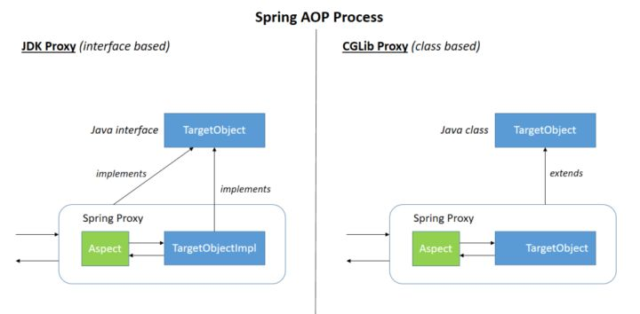
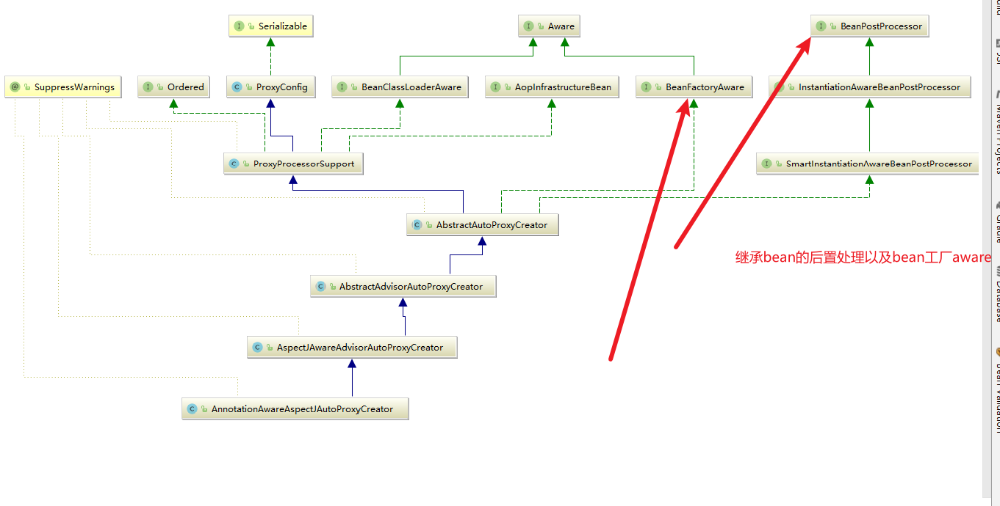
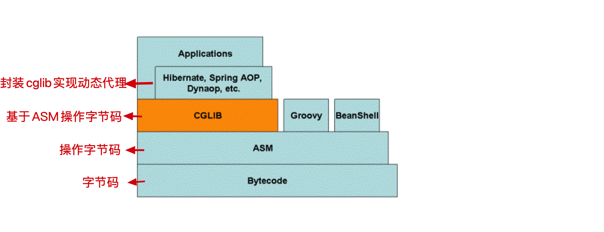
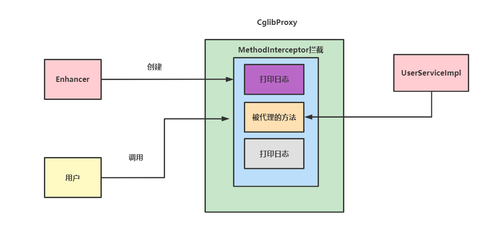

# Spring核心AOP详解

## 铺垫知识

### 谈谈你对AOP的理解

**答:** `AOP(Aspect-Oriented Programming:面向切面编程)`，它实际做的就是将业务和一些非业务进行拆解，降低彼此业务模块与非业务模块的耦合度，便于后续的扩展维护。例如`权限校验`、`日志管理`、`事务处理`等都可以使用`AOP`实现。而`Spring`就是基于动态代理实现`AOP`的。如果被代理的类有实现接口的话，就会基于`JDK Proxy`完成代理的创建。反之就是通过`Cglib`完成代理创建。



### 那你可以说说AOP中切点、切面、通知是什么意思嘛？

**答:** `AOP`中有很多核心术语，分别是:

1. `目标(Target)`: 这就被代理的对象，例如我们希望对`UserService`每个方法进行`增强(在不动它的代码情况下增加一些非业务的动作)`，那么这个`UserService`就是目标。
2. `代理(Proxy)`: 就是给你被代理后的对象的厂商，例如我们上面说过希望对`UserService`每个方法进行增强，那么给用户返回增强后的对象的类就是`代理类`。
3. `连接点(JoinPoint)`:目标对象，每一个可能可以被增强的方法都可以称为连接点，尽管它最后可能不会被增强。
4. `切入点(Pointcut)`: 连接点中确确实实被做增强操作的方法就叫切入点。
5. `通知(Advice)`: 不要被表面的语义误导，通知并不是告知某人的意思，通知的意思是拦截对象后，做的增强操作。
6. `切面(Aspect)`: 切入点`(Pointcut)`+通知`(Advice)`
7. `织入(Weaving)`：把通知的动作融入到对象中，生成代理对象的过程就叫做织入。

### Spring AOP和AspectJ AOP的区别知道吗？

**答:** 这个嘛，其实`Spring AOP`属于运行时增强，基于`代理(Proxying)`实现的。而`AspectJ AOP`属于编译时增强，基于`字节码操作(Bytecode Manipulation)`实现的。相比之下后者比前者更成熟、更强大一些。如果在切面不多的情况下，两者差异是不大的，如果切面非常多的话，后者性能会比强者好很多。

### AspectJ 通知类型有哪些？

**答:** emmm，有很多，分别是:

1. `Before（前置通知）`: 目标对象方法调用前触发增强。
2. `After （后置通知）`:目标对象方法调用后进行增强。
3. `AfterReturning（返回通知）`:目标对象方法执行结束，返回值时进行增强。
4. `AfterThrowing（异常通知）`:目标对象方法执行报错并抛出时做的增强。
5. `Around(环绕通知）`:这个比较常用了，目标对象方法调用前后我们可以做各种增强操作,甚至不调用对象的方法都能做到。

### 多个切面执行顺序我们如何确定呢？

答: 有两种方式:

1. 注解法:使用`@Order`注解来决定切面`bean`的执行顺序。

```css
// 值越小优先级越高
@Order(1)
@Component
@Aspect
public class LoggingAspect implements Ordered {
```

1. 继承接口法:`implements Ordered`接口

```java
@Component
@Aspect
public class LoggingAspect implements Ordered {

    // ....

    @Override
    public int getOrder() {
        // 返回值越小优先级越高
        return 1;
    }
}
```

## 核心内容

为了更好的讲述这个面试题，我们不妨列出下面这些示例代码

首先是目标类代码

```java
public class AopDemoServiceImpl {

	public void doMethod1() {
		System.out.println("调用AopDemoServiceImpl.doMethod1()");
	}

	public String doMethod2() {
		System.out.println("调用AopDemoServiceImpl.doMethod2()会返回hello world");
		return "hello world";
	}

	public String doMethod3() throws Exception {
		System.out.println("调用AopDemoServiceImpl.doMethod3()会抛出exception");
		throw new Exception("some exception");
	}

}
```

然后是通知类

```css
public class LogAspect {

	/**
	 * 环绕通知.
	 *
	 * @param  pjp
	 * @return obj
	 * @throws Throwable exception
	 */
	public Object doAround(ProceedingJoinPoint joinPoint) throws Throwable {
		System.out.println("-----------------------");
		System.out.println("环绕通知开始，方法名"+joinPoint.getSignature());
		Object o = joinPoint.proceed();
		System.out.println("环绕通知得到结果:"+String.valueOf(o));
		return o;
	}

	/**
	 * 前置通知.
	 */
	public void doBefore() {
		System.out.println("前置通知");
	}

	/**
	 * 后置通知.
	 *
	 * @param result return val
	 */
	public void doAfterReturning(String result) {
		System.out.println("后置通知, 返回值: " + result);
	}

	/**
	 * 异常通知.
	 *
	 * @param e exception
	 */
	public void doAfterThrowing(Exception e) {
		System.out.println("异常通知, 异常: " + e.getMessage());
	}

	/**
	 * 最终通知.
	 */
	public void doAfter() {
		System.out.println("最终通知");
	}

}
```

xml配置

```css
<?xml version="1.0" encoding="UTF-8"?>
<beans xmlns="http://www.springframework.org/schema/beans"
	   xmlns:xsi="http://www.w3.org/2001/XMLSchema-instance" xmlns:p="http://www.springframework.org/schema/p"
	   xmlns:aop="http://www.springframework.org/schema/aop"
	   xmlns:context="http://www.springframework.org/schema/context"
	   xsi:schemaLocation="http://www.springframework.org/schema/beans
       http://www.springframework.org/schema/beans/spring-beans.xsd
  http://www.springframework.org/schema/beans http://www.springframework.org/schema/beans/spring-beans.xsd
       http://www.springframework.org/schema/aop
       http://www.springframework.org/schema/aop/spring-aop.xsd
       http://www.springframework.org/schema/context
       https://www.springframework.org/schema/context/spring-context.xsd">

	<!--aop相关配置-->

	<context:component-scan base-package="com.study" />

	<aop:aspectj-autoproxy/>

	<!-- 目标类 -->
	<bean id="demoService" class="com.study.aop.AopDemoServiceImpl">
		<!-- configure properties of bean here as normal -->
	</bean>

	<!-- 切面 -->
	<bean id="logAspect" class="com.study.aop.LogAspect">
		<!-- configure properties of aspect here as normal -->
	</bean>

	<aop:config>
		<!-- 配置切面 -->
		<aop:aspect ref="logAspect">
			<!-- 配置切入点 -->
			<aop:pointcut id="pointCutMethod" expression="execution(* com.study.aop.*.*(..))"/>
			<!-- 环绕通知 -->
			<aop:around method="doAround" pointcut-ref="pointCutMethod"/>
			<!-- 前置通知 -->
			<aop:before method="doBefore" pointcut-ref="pointCutMethod"/>
			<!-- 后置通知；returning属性：用于设置后置通知的第二个参数的名称，类型是Object -->
			<aop:after-returning method="doAfterReturning" pointcut-ref="pointCutMethod" returning="result"/>
			<!-- 异常通知：如果没有异常，将不会执行增强；throwing属性：用于设置通知第二个参数的的名称、类型-->
			<aop:after-throwing method="doAfterThrowing" pointcut-ref="pointCutMethod" throwing="e"/>
			<!-- 最终通知 -->
			<aop:after method="doAfter" pointcut-ref="pointCutMethod"/>
		</aop:aspect>
	</aop:config>

	<!-- more bean definitions for data access objects go here -->


</beans>
```

最后编写上我们的测试代码

```java
public class Entrance {
	/**
	 * 基于配置文件的依赖注入测试
	 *
	 * @param args
	 */
	public static void main(String[] args) {

		ApplicationContext context = new ClassPathXmlApplicationContext("spring-config.xml");
		// retrieve configured instance
		AopDemoServiceImpl demoService = context.getBean("demoService", AopDemoServiceImpl.class);

		// use configured instance
		demoService.doMethod1();
		demoService.doMethod2();
		try {
			demoService.doMethod3();
		} catch (Exception e) {
			// e.printStackTrace();
		}

	}


}
```

最终输出结果如下所示

```bash
-----------------------
环绕通知开始，方法名void com.study.aop.AopDemoServiceImpl.doMethod1()
前置通知
调用AopDemoServiceImpl.doMethod1()
环绕通知得到结果:null
最终通知
-----------------------
环绕通知开始，方法名String com.study.aop.AopDemoServiceImpl.doMethod2()
前置通知
调用AopDemoServiceImpl.doMethod2()会返回hello world
环绕通知得到结果:hello world
后置通知, 返回值: hello world
最终通知
-----------------------
环绕通知开始，方法名String com.study.aop.AopDemoServiceImpl.doMethod3()
前置通知
调用AopDemoServiceImpl.doMethod3()会抛出exception
异常通知, 异常: some exception
最终通知
```

## 注解切面代理类的创建类知道嘛？请问它是如何判断是否是AOP类的？以及如何封装成通知器的知道嘛？

**答:** 注解切面类名为:`AnnotationAwareAspectJAutoProxyCreator`,在介绍这个类之前，我们不妨看看它的类图:



从类图中我们可以看到它继承了`BeanPostProcessor`以及`BeanFactoryAware`这就意味着这个类在`bean`工厂加载期间以及`bean`初始化前后会对`bean`做一些手脚。 而且我们看到这个类继承了`AbstractAutoProxyCreator`，这就意味它的抽象类一定为当前类做了某些方法的模板，即**模板方法模式**。 笔者贴出了`bean`初始化前置处理器的`postProcessBeforeInstantiation`的核心逻辑，可以看到`AbstractAutoProxyCreator`里面会判断当前传入的`bean`是否是`AOP`类，如果是则将其生成通知器类然后放入缓存`advisedBeans`中。

```text
@Override
	public Object postProcessBeforeInstantiation(Class<?> beanClass, String beanName) {
		Object cacheKey = getCacheKey(beanClass, beanName);

		......
			//判断是否是AOP类，或者是否需要跳过?
			if (isInfrastructureClass(beanClass) || shouldSkip(beanClass, beanName)) {
					//放到增强其的缓存中
				this.advisedBeans.put(cacheKey, Boolean.FALSE);
				return null;
			}
		}

		.......
		}

	......
	}
```

判断是否是`AOP`类的逻辑方法如下所示，`isInfrastructureClass`就是判断这个类是否属于通知或者切点或者通知器`Advisor`类，如果是就返回true。

```text
protected boolean isInfrastructureClass(Class<?> beanClass) {
//判断这个类是否是切点、增强器或者需要被代理的类
		boolean retVal = Advice.class.isAssignableFrom(beanClass) ||
				Pointcut.class.isAssignableFrom(beanClass) ||
				Advisor.class.isAssignableFrom(beanClass) ||
				AopInfrastructureBean.class.isAssignableFrom(beanClass);
		if (retVal && logger.isTraceEnabled()) {
			logger.trace("Did not attempt to auto-proxy infrastructure class [" + beanClass.getName() + "]");
		}
		return retVal;
	}
```

判断是否跳过的逻辑也很简单，如下所示，找到所有的通知器，判断当前这个`bean`是否这里面某个通知器名字一样，如果一样就返回`true`。

```text
@Override
	protected boolean shouldSkip(Class<?> beanClass, String beanName) {
	// 这步就会找到并生成通知器类，然后和当前bean比对，如果这个bean属于通知器类则返回true
		List<Advisor> candidateAdvisors = findCandidateAdvisors();
		for (Advisor advisor : candidateAdvisors) {
			if (advisor instanceof AspectJPointcutAdvisor &&
					((AspectJPointcutAdvisor) advisor).getAspectName().equals(beanName)) {
					//如果和当前bean名字一样则返回true
				return true;
			}
		}
		return super.shouldSkip(beanClass, beanName);
	}
```

我们不妨看看`findCandidateAdvisors`的逻辑，可以看到它又会调用一个`findCandidateAdvisors`查找通知器

```text
@Override
	protected List<Advisor> findCandidateAdvisors() {
		// 查找通知器然后返回
		List<Advisor> advisors = super.findCandidateAdvisors();
		//然后创建生成通知器
		if (this.aspectJAdvisorsBuilder != null) {
			advisors.addAll(this.aspectJAdvisorsBuilder.buildAspectJAdvisors());
		}
		return advisors;
	}
```

核心逻辑来了`buildAspectJAdvisors`

```text
public List<Advisor> buildAspectJAdvisors() {
		List<String> aspectNames = this.aspectBeanNames;

		if (aspectNames == null) {
			synchronized (this) {
				aspectNames = this.aspectBeanNames;
				if (aspectNames == null) {
				//将这个bean封装成factory 
				MetadataAwareAspectInstanceFactory factory =
										new BeanFactoryAspectInstanceFactory(this.beanFactory, beanName);
						Class<?> beanType = this.beanFactory.getType(beanName);

						//如果当前这个bean类型是切面类则调用getAdvisors然后返回
						if (this.advisorFactory.isAspect(beanType)) {
								List<Advisor> classAdvisors = this.advisorFactory.getAdvisors(factory);
								if (this.beanFactory.isSingleton(beanName)) {
								//存放到缓存中，后续调用时会用到
									this.advisorsCache.put(beanName, classAdvisors);
								}
							......
					return advisors;
				}
			}
		}

.....
	}
```

最终我们不断步进就会看到，通过上述的`factory`各种参数信息找到这个`bean`的切点，切点表达式，方法名，切面名称构成一个增强器。

```text
@Override
	@Nullable
	public Advisor getAdvisor(Method candidateAdviceMethod, MetadataAwareAspectInstanceFactory aspectInstanceFactory,
			int declarationOrderInAspect, String aspectName) {

		validate(aspectInstanceFactory.getAspectMetadata().getAspectClass());

		AspectJExpressionPointcut expressionPointcut = getPointcut(
				candidateAdviceMethod, aspectInstanceFactory.getAspectMetadata().getAspectClass());
		if (expressionPointcut == null) {
			return null;
		}


			
		//返回一个增强器
		return new InstantiationModelAwarePointcutAdvisorImpl(expressionPointcut, candidateAdviceMethod,
				this, aspectInstanceFactory, declarationOrderInAspect, aspectName);
	}
```

### 嗯，既然封装成了增强器，那你知道它最后又如何将其他类变成代理类的嘛？(重点)

**答:** 这就到`bean`初始化后置操作了，如下代码所示，从缓存中获取这个`bean`，如果这个`bean`不在`earlyProxyReferences`中，则调用`wrapIfNecessary`，这个方法会在必要情况下根据策略决定用`cglib`或者jdk代理完成某些需要被代理的类的创建。

```text
@Override
	public Object postProcessAfterInitialization(@Nullable Object bean, String beanName) {
		if (bean != null) {
			Object cacheKey = getCacheKey(bean.getClass(), beanName);
			// 如果这个bean不在代理缓存中，则进行增强
			if (this.earlyProxyReferences.remove(cacheKey) != bean) {
				return wrapIfNecessary(bean, beanName, cacheKey);
			}
		}
		return bean;
	}
```

## 那你知道他们在bean生命周期的那个阶段实现的呢？

**答:** 上面的类图已经写的非常清楚了，在`bean初始化前后`也就我们常说的`BPP阶段`完成`AOP`类的缓存以及通知器创建。在`bean`初始化后，根据需要结合通知器完成代理类的改造。

## 既然你说你读过AOP的源码，那你说说代理的创建过程是什么呢？

**答:** AOP提供了一个默认工厂根据类是否有继承接口或者是否就是目标类决定创建的策略。然后根据不同的策略决定代理类的创建。

```text
@Override
	public AopProxy createAopProxy(AdvisedSupport config) throws AopConfigException {
		if (config.isOptimize() || config.isProxyTargetClass() || hasNoUserSuppliedProxyInterfaces(config)) {
			Class<?> targetClass = config.getTargetClass();
			if (targetClass == null) {
				throw new AopConfigException("TargetSource cannot determine target class: " +
						"Either an interface or a target is required for proxy creation.");
			}
			if (targetClass.isInterface() || Proxy.isProxyClass(targetClass)) {
				return new JdkDynamicAopProxy(config);
			}
			return new ObjenesisCglibAopProxy(config);
		}
		else {
			return new JdkDynamicAopProxy(config);
		}
	}
```

以下便是`jdk`代理的创建策略

```text
@Override
	public Object getProxy(@Nullable ClassLoader classLoader) {
		.........
	//获取被代理的类的接口
		Class<?>[] proxiedInterfaces = AopProxyUtils.completeProxiedInterfaces(this.advised, true);
		findDefinedEqualsAndHashCodeMethods(proxiedInterfaces);

		//生成代理对象并返回
		return Proxy.newProxyInstance(classLoader, proxiedInterfaces, this);
	}
```

以下便是`cglib`的创建策略

```text
@Override
	public Object getProxy(@Nullable ClassLoader classLoader) {
	.......
		try {
		.......
		将当前类信息通过enhancer 生成代理对象
			Enhancer enhancer = createEnhancer();
			if (classLoader != null) {
				enhancer.setClassLoader(classLoader);
				if (classLoader instanceof SmartClassLoader &&
						((SmartClassLoader) classLoader).isClassReloadable(proxySuperClass)) {
					enhancer.setUseCache(false);
				}
			}
			enhancer.setSuperclass(proxySuperClass);
			enhancer.setInterfaces(AopProxyUtils.completeProxiedInterfaces(this.advised));
			enhancer.setNamingPolicy(SpringNamingPolicy.INSTANCE);
			enhancer.setStrategy(new ClassLoaderAwareGeneratorStrategy(classLoader));

			Callback[] callbacks = getCallbacks(rootClass);
			Class<?>[] types = new Class<?>[callbacks.length];
			for (int x = 0; x < types.length; x++) {
				types[x] = callbacks[x].getClass();
			}
		//返回最终生成的代理对象
			return createProxyClassAndInstance(enhancer, callbacks);
		}
		........
		}
		catch (Throwable ex) {
		......
		}
	}
```

## 说说动态代理，动态代理是什么。

**答：** 说白了就是在运行期间，创建目标对象的代理对象，目标对象不变，我们通过对方法动态拦截，进行前置或者后置等各种增强操作。`AOP`中就有`CGLIB动态代理和JDK动态代理`。

## Cglib代理

### CGlib？Spring AOP和Cglib是什么关系呢？

**答:** `CGLIB`是一个强大、高性能的代码生成包。使用`ASM`操作字节码，动态生成代理，对方法进行增强。，它广泛的被许多`AOP`框架使用，为他们提供方法的拦截。



### 能不能给我讲一个Cglib的案例呢？

答: 可以，我们希望对某个service进行日志打印，基于CGLIB我们可以这样实现

前置步骤引入依赖

```text
  <dependency>
            <groupId>org.aspectj</groupId>
            <artifactId>aspectjweaver</artifactId>
            <version>1.9.7</version>
        </dependency>
```

首先创建用户类

```text
public class User {
    private String name;

    private int age;

    public String getName() {
        return name;
    }

    public void setName(String name) {
        this.name = name;
    }

    public int getAge() {
        return age;
    }

    public void setAge(int age) {
        this.age = age;
    }


    public User() {
    }

    public User(String name, int age) {
        this.name = name;
        this.age = age;
    }


    @Override
    public String toString() {
        return "User{" +
                "name='" + name + '\'' +
                ", age=" + age +
                '}';
    }
}
```

service类

```text
public class UserServiceImpl {

    public List<User> findUserList() {
        return Collections.singletonList(new User("xiaoming", 18));
    }
}
```

代理类

```text
public class CglibProxy<T> implements MethodInterceptor {


    private static Logger logger = LoggerFactory.getLogger(CglibProxy.class);

    private Object target;


    public  T getTargetClass(Object target) {
        //设置被代理的目标类
        this.target = target;
        // 创建加强器设置代理类以及回调，当代理类被调用时，callback就会去调用intercept
        Enhancer enhancer = new Enhancer();
        enhancer.setSuperclass(this.target.getClass());
        enhancer.setCallback(this);
        //返回代理类
        return (T) enhancer.create();
    }

    @Override
    public Object intercept(Object o, Method method, Object[] args, MethodProxy methodProxy) throws Throwable {
        logger.info("调用被代理对象的方法,代理对象：[{}]，代理方法:[{}]", o.getClass().getName(), method.getName());
        Object result = methodProxy.invokeSuper(o, args);
        logger.info("代理调用结束，返回结果：[{}]", String.valueOf(result));

        return null;
    }
}
```

测试代码

```text
public class Main {
    public static void main(String[] args) {
        CglibProxy<UserServiceImpl> cglibProxy = new CglibProxy();

        UserServiceImpl targetClass =cglibProxy.getTargetClass(new UserServiceImpl());
        targetClass.findUserList();

    }
}
```

### Cglib代理流程是什么知道嘛？

**答:** 如下图所示，整体来说就是基于`enhancer`去配置被代理类的各种参数，然后生成代理类，注意final方法无法被代理，因为它不可被子类覆盖。



### 那你再说说Spring中的Cglib代理流程吧？顺便说说源码中是如何体现的。

**答:** 源码如下，我们可以看出和我们写的实例代码是差不多的。

```text
@Override
	public Object getProxy(@Nullable ClassLoader classLoader) {
.....

		try {
			//获取当前类信息获取生成代理对象
			Enhancer enhancer = createEnhancer();
			if (classLoader != null) {
				enhancer.setClassLoader(classLoader);
				if (classLoader instanceof SmartClassLoader &&
						((SmartClassLoader) classLoader).isClassReloadable(proxySuperClass)) {
					enhancer.setUseCache(false);
				}
			}
			enhancer.setSuperclass(proxySuperClass);
			enhancer.setInterfaces(AopProxyUtils.completeProxiedInterfaces(this.advised));
			enhancer.setNamingPolicy(SpringNamingPolicy.INSTANCE);
			enhancer.setStrategy(new ClassLoaderAwareGeneratorStrategy(classLoader));

		// 获取当前类中的方法
			Callback[] callbacks = getCallbacks(rootClass);
			Class<?>[] types = new Class<?>[callbacks.length];
			for (int x = 0; x < types.length; x++) {
				types[x] = callbacks[x].getClass();
			}
			
			enhancer.setCallbackFilter(new ProxyCallbackFilter(
					this.advised.getConfigurationOnlyCopy(), this.fixedInterceptorMap, this.fixedInterceptorOffset));
			enhancer.setCallbackTypes(types);

			// 生成代理对象
			return createProxyClassAndInstance(enhancer, callbacks);
		}
		catch (CodeGenerationException | IllegalArgumentException ex) {
			.....
		}
		catch (Throwable ex) {
			.....
		}
	}
```

## JDK代理相关

## 刚刚你还和我说了一个JDK代理的东西，能不能给我说说这是什么东西？顺便给我讲一个简单的示例吧。

答:这个是jdk自带的一种代理，我们只需继承InvocationHandler即可实现。但是前提是这个类必须继承某些接口才能使用jdk代理。

首先我们定义接口，User类沿用上述的

```text
public interface UserService {

    List<User> findUserList();
}
```

修改UserServiceImpl

```text
public class UserServiceImpl implements UserService{

    @Override
    public List<User> findUserList() {
        return Collections.singletonList(new User("xiaoming", 18));
    }
}
```

jdk代理类

```text
public class JDKProxy<T> {

    private static Logger logger = LoggerFactory.getLogger(JDKProxy.class);

    private Object target;

    public JDKProxy(Object target) {
        this.target = target;
    }


    public T getTargetObj() {
        UserService proxy;
        ClassLoader loader = target.getClass().getClassLoader();
        Class[] interfaces = new Class[]{UserService.class};
        InvocationHandler handler = (p, method, args) -> {
            logger.info("代理方法被调用，类名称[{}],方法名称[{}]", target.getClass().getName(), method.getName());
            Object result = method.invoke(target, args);
            logger.info("代理方法调用结束，返回结果:[{}]", String.valueOf(result));
            return result;
        };

        proxy = (UserService) Proxy.newProxyInstance(loader, interfaces, handler);
        return (T) proxy;
    }


}
```

测试代码

```text
public class Main {
    public static void main(String[] args) {
       
        JDKProxy<UserService> jdkProxy=new JDKProxy<>(new UserServiceImpl());
        UserService userService = jdkProxy.getTargetObj();
        System.out.println(userService.findUserList());
    }
}
```

## 它的代理流程你知道嘛？

答：我们不妨在`jvm`在下面这样一段参数，或者在上述`main`方法加这个代码

```text
 System.getProperties().put("sun.misc.ProxyGenerator.saveGeneratedFiles", "true");
```

然后我们通过debug可以发现它回步入这段代码，其中他会生成一个`ClassFile`，方法名为`generateClassFile`

```text
public static byte[] generateProxyClass(final String name,
                                        Class<?>[] interfaces,
                                        int accessFlags)
{
    ProxyGenerator gen = new ProxyGenerator(name, interfaces, accessFlags);
    final byte[] classFile = gen.generateClassFile();
    ...
}
```

而代理方法做的事情，整体如下所示，可以看到它整体做的就是拿着被代理类的 各种方法封装成`ProxyMethod`方法，然后写入`class`文件中

```text
/**
    * Generate a class file for the proxy class.  This method drives the
    * class file generation process.
    */
private byte[] generateClassFile() {

    /* 第一步：将所有方法包装成ProxyMethod对象 */
    
    // 将Object类中hashCode、equals、toString方法包装成ProxyMethod对象
    addProxyMethod(hashCodeMethod, Object.class);
    addProxyMethod(equalsMethod, Object.class);
    addProxyMethod(toStringMethod, Object.class);

    // 将代理类接口方法包装成ProxyMethod对象
    for (Class<?> intf : interfaces) {
        for (Method m : intf.getMethods()) {
            addProxyMethod(m, intf);
        }
    }

    // 校验返回类型
    for (List<ProxyMethod> sigmethods : proxyMethods.values()) {
        checkReturnTypes(sigmethods);
    }

    /* 第二步：为代理类组装字段，构造函数，方法，static初始化块等 */
    try {
        // 添加构造函数，参数是InvocationHandler
        methods.add(generateConstructor());

        // 代理方法
        for (List<ProxyMethod> sigmethods : proxyMethods.values()) {
            for (ProxyMethod pm : sigmethods) {

                // 字段
                fields.add(new FieldInfo(pm.methodFieldName,
                    "Ljava/lang/reflect/Method;",
                        ACC_PRIVATE | ACC_STATIC));

                // 上述ProxyMethod中的方法
                methods.add(pm.generateMethod());
            }
        }

        // static初始化块
        methods.add(generateStaticInitializer());

    } catch (IOException e) {
        throw new InternalError("unexpected I/O Exception", e);
    }

    if (methods.size() > 65535) {
        throw new IllegalArgumentException("method limit exceeded");
    }
    if (fields.size() > 65535) {
        throw new IllegalArgumentException("field limit exceeded");
    }

    /* 第三步：写入class文件 */

    /*
        * Make sure that constant pool indexes are reserved for the
        * following items before starting to write the final class file.
        */
    cp.getClass(dotToSlash(className));
    cp.getClass(superclassName);
    for (Class<?> intf: interfaces) {
        cp.getClass(dotToSlash(intf.getName()));
    }

    /*
        * Disallow new constant pool additions beyond this point, since
        * we are about to write the final constant pool table.
        */
    cp.setReadOnly();

    ByteArrayOutputStream bout = new ByteArrayOutputStream();
    DataOutputStream dout = new DataOutputStream(bout);

    try {
        /*
            * Write all the items of the "ClassFile" structure.
            * See JVMS section 4.1.
            */
                                    // u4 magic;
        dout.writeInt(0xCAFEBABE);
                                    // u2 minor_version;
        dout.writeShort(CLASSFILE_MINOR_VERSION);
                                    // u2 major_version;
        dout.writeShort(CLASSFILE_MAJOR_VERSION);

        cp.write(dout);             // (write constant pool)

                                    // u2 access_flags;
        dout.writeShort(accessFlags);
                                    // u2 this_class;
        dout.writeShort(cp.getClass(dotToSlash(className)));
                                    // u2 super_class;
        dout.writeShort(cp.getClass(superclassName));

                                    // u2 interfaces_count;
        dout.writeShort(interfaces.length);
                                    // u2 interfaces[interfaces_count];
        for (Class<?> intf : interfaces) {
            dout.writeShort(cp.getClass(
                dotToSlash(intf.getName())));
        }

                                    // u2 fields_count;
        dout.writeShort(fields.size());
                                    // field_info fields[fields_count];
        for (FieldInfo f : fields) {
            f.write(dout);
        }

                                    // u2 methods_count;
        dout.writeShort(methods.size());
                                    // method_info methods[methods_count];
        for (MethodInfo m : methods) {
            m.write(dout);
        }

                                        // u2 attributes_count;
        dout.writeShort(0); // (no ClassFile attributes for proxy classes)

    } catch (IOException e) {
        throw new InternalError("unexpected I/O Exception", e);
    }

    return bout.toByteArray();
}
```

看看上文命令下创建`class`，可以看到它 `implements UserService` 以及通过我们的的代理类的`InvocationHandler` 调用这些方法

```text
public final class $Proxy0 extends Proxy implements UserService {
    private static Method m1;
    private static Method m3;
    private static Method m2;
    private static Method m0;

    public $Proxy0(InvocationHandler var1) throws  {
        super(var1);
    }

    public final boolean equals(Object var1) throws  {
        try {
            return (Boolean)super.h.invoke(this, m1, new Object[]{var1});
        } catch (RuntimeException | Error var3) {
            throw var3;
        } catch (Throwable var4) {
            throw new UndeclaredThrowableException(var4);
        }
    }

    public final List findUserList() throws  {
        try {
            return (List)super.h.invoke(this, m3, (Object[])null);
        } catch (RuntimeException | Error var2) {
            throw var2;
        } catch (Throwable var3) {
            throw new UndeclaredThrowableException(var3);
        }
    }

    public final String toString() throws  {
        try {
            return (String)super.h.invoke(this, m2, (Object[])null);
        } catch (RuntimeException | Error var2) {
            throw var2;
        } catch (Throwable var3) {
            throw new UndeclaredThrowableException(var3);
        }
    }

    public final int hashCode() throws  {
        try {
            return (Integer)super.h.invoke(this, m0, (Object[])null);
        } catch (RuntimeException | Error var2) {
            throw var2;
        } catch (Throwable var3) {
            throw new UndeclaredThrowableException(var3);
        }
    }

    static {
        try {
            m1 = Class.forName("java.lang.Object").getMethod("equals", Class.forName("java.lang.Object"));
            m3 = Class.forName("com.pdai.aop.jdkProxy.UserService").getMethod("findUserList");
            m2 = Class.forName("java.lang.Object").getMethod("toString");
            m0 = Class.forName("java.lang.Object").getMethod("hashCode");
        } catch (NoSuchMethodException var2) {
            throw new NoSuchMethodError(var2.getMessage());
        } catch (ClassNotFoundException var3) {
            throw new NoClassDefFoundError(var3.getMessage());
        }
    }
}
```

### Spring AOP中JDK代理的实现你知道嘛？它是怎么实现代理的创建和执行的呢？

答: 源码如下

```text
@Override
	public Object getProxy(@Nullable ClassLoader classLoader) {
		if (logger.isTraceEnabled()) {
			logger.trace("Creating JDK dynamic proxy: " + this.advised.getTargetSource());
		}
		Class<?>[] proxiedInterfaces = AopProxyUtils.completeProxiedInterfaces(this.advised, true);
		findDefinedEqualsAndHashCodeMethods(proxiedInterfaces);
		return Proxy.newProxyInstance(classLoader, proxiedInterfaces, this);
	}
```

## 参考文献

[Spring 常见面试题总结(opens new window)](https://javaguide.cn/system-design/framework/spring/spring-knowledge-and-questions-summary.html#spring-基础)

[Spring进阶 - Spring AOP实现原理详解之AOP切面的实现(opens new window)](https://www.pdai.tech/md/spring/spring-x-framework-aop-source-1.html)

[Spring进阶 - Spring AOP实现原理详解之AOP代理的创建(opens new window)](https://www.pdai.tech/md/spring/spring-x-framework-aop-source-2.html)

[Spring进阶 - Spring AOP实现原理详解之Cglib代理实现(opens new window)](https://www.pdai.tech/md/spring/spring-x-framework-aop-source-3.html)

[Spring进阶 - Spring AOP实现原理详解之JDK代理实现](https://www.pdai.tech/md/spring/spring-x-framework-aop-source-4.html)