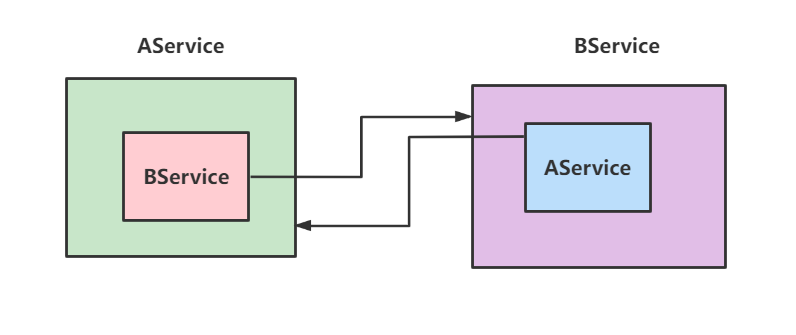
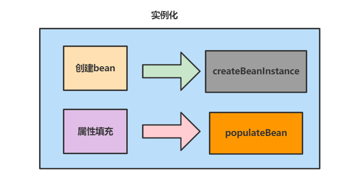
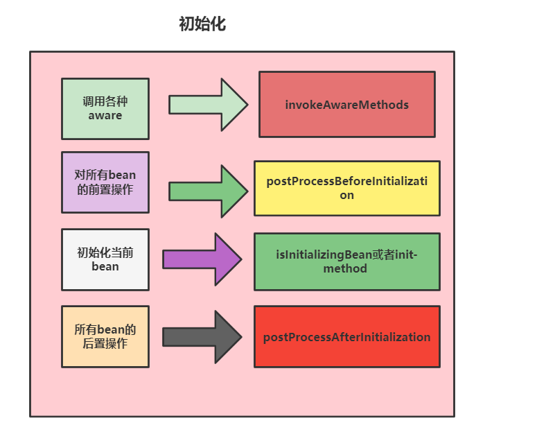
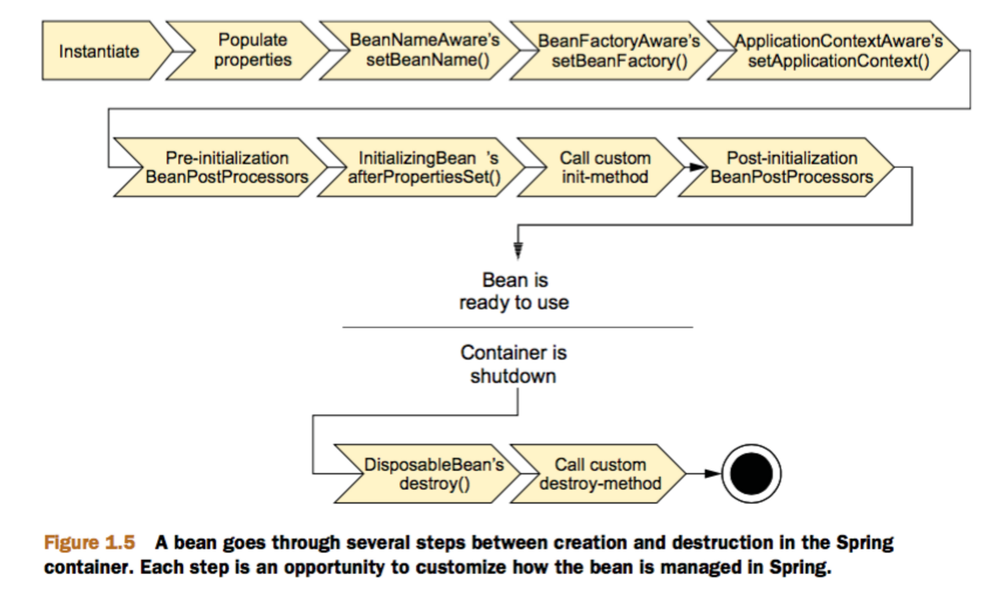

## 从面试者的角度看看IOC源码解析

### 前置步骤

为了解析源码，我们首先需要完成以下配置步骤，首先是创建配置文件`spring-config.xml`

```text
<?xml version="1.0" encoding="UTF-8"?>
<beans xmlns="http://www.springframework.org/schema/beans"
	   xmlns:xsi="http://www.w3.org/2001/XMLSchema-instance"
	   xsi:schemaLocation="http://www.springframework.org/schema/beans
       http://www.springframework.org/schema/beans/spring-beans.xsd">


	

	<bean id="aService" class="com.study.service.AService"></bean>


</beans>
```

然后编写一个上述所说的AService 类

```text
public class AService {
	public void sayHello() {
		System.out.println("hello");
	}
}
```

最后编写一个测试方法，完成后我们就可以开始`debug`了，由于源码阅读复杂度高，笔者就将核心步骤基于面试题的形式去逐步讲述。

```text
public class Entrance {
	/**
	 * 基于配置文件的依赖注入测试
	 *
	 * @param args
	 */
	public static void main(String[] args) {

		// 读取类路径下的xml配置加载bean
		ApplicationContext applicationContext = new ClassPathXmlApplicationContext("spring-config.xml");
		AService aService = (AService) applicationContext.getBean("aService");
		aService.sayHello();

	}


}
```

### 能不能说一下IOC的整体步骤

**答:** 通过我对源代码的`debug`，我认为它整体做了以下几个步骤:

```
1. 初始化资源解析器以及父容器。
2. 设置配置文件的路径。
3. 初始化容器，这步是核心，他会完成旧的容器销毁和新的容器的创建。
public ClassPathXmlApplicationContext(
			String[] configLocations, boolean refresh, @Nullable ApplicationContext parent)
			throws BeansException {
		// 初始化资源解析器械以及父容器
		super(parent);
		// 设置配置文件的路径
		setConfigLocations(configLocations);
		// 初始化容器
		if (refresh) {
			refresh();
		}
	}
```

### 能不能说一下bean工厂是如何实现刷新的?

**答:** 这就是`Spring`源码中的`refresh()`的调用方法`obtainFreshBeanFactory`(),它首先会刷新容器，然后再返回一个全新的容器，大体步骤如下所示:

```text
protected ConfigurableListableBeanFactory obtainFreshBeanFactory() {
		//刷新容器
		refreshBeanFactory();
		//返回刷新结果
		return getBeanFactory();
	}
```

然后我们再展开讲述，首先是刷新容器，它大概做的事情是先销毁容器，然后创建一个`DefaultListableBeanFactory` 并将`bean定义信息(BeanDefinition)`加载到这个新创建的工厂中。最后将`beanFactory` 设置为这个新创建的`DefaultListableBeanFactory` 。

```text
@Override
	protected final void refreshBeanFactory() throws BeansException {
		if (hasBeanFactory()) {
			destroyBeans();
			closeBeanFactory();
		}
		try {
		//常见一个全新的容器
			DefaultListableBeanFactory beanFactory = createBeanFactory();
			beanFactory.setSerializationId(getId());
			customizeBeanFactory(beanFactory);
			//加载BeanDefinition
			loadBeanDefinitions(beanFactory);
			synchronized (this.beanFactoryMonitor) {
				this.beanFactory = beanFactory;
			}
		}
		catch (IOException ex) {
			throw new ApplicationContextException("I/O error parsing bean definition source for " + getDisplayName(), ex);
		}
	}
```

返回全新容器这一步就不必多说了，上面那一步完成创建，这一步当然就直接返回咯。

```text
@Override
	public final ConfigurableListableBeanFactory getBeanFactory() {
		synchronized (this.beanFactoryMonitor) {
			if (this.beanFactory == null) {
				throw new IllegalStateException("BeanFactory not initialized or already closed - " +
						"call 'refresh' before accessing beans via the ApplicationContext");
			}
		//返回上述创建的bean工厂
			return this.beanFactory;
		}
	}
```

### 能不能说一下loadBeanDefinitions做了什么吗？

整体步骤是创建`BeanDefinition解析器(beanDefinitionReader)`，然后用这个解析器去加载`BeanDefinition`。

```text
@Override
	protected void loadBeanDefinitions(DefaultListableBeanFactory beanFactory) throws BeansException, IOException {
		// 创建解析器
		XmlBeanDefinitionReader beanDefinitionReader = new XmlBeanDefinitionReader(beanFactory);

		// 配置解析器
		beanDefinitionReader.setEnvironment(this.getEnvironment());
		beanDefinitionReader.setResourceLoader(this);
		beanDefinitionReader.setEntityResolver(new ResourceEntityResolver(this));

		
		initBeanDefinitionReader(beanDefinitionReader);
		
		//加载BeanDefinition
		loadBeanDefinitions(beanDefinitionReader);
	}
```

### 那你知道beanDefinitionReader如何读取BeanDefinition的资源嘛？

**答:** 获取文件路径或者配置资源名称，然后使用我们上面所说初始化好的`BeanDefinition解析器`完成`BeanDefinition`的加载。

```text
protected void loadBeanDefinitions(XmlBeanDefinitionReader reader) throws BeansException, IOException {
		// 加载xml配置中的bean定义资源
		Resource[] configResources = getConfigResources();
		if (configResources != null) {
		//解析器从配置标签从解析bean定义信息
			reader.loadBeanDefinitions(configResources);
		}
		// 加载构造函数中的xml配置的资源
		String[] configLocations = getConfigLocations();
		if (configLocations != null) {
			reader.loadBeanDefinitions(configLocations);
		}
	}
```

### 那你说说具体加载BeanDefinition的过程吧？

通过上述步骤可以获取到文件名称，然后通过资源解析器`reader.loadBeanDefinitions(configResources);`，这一步会获取到一个`Resource`对象，这个对象记录着之前加载的文件的各种信息。我们就可以拿着这个对象去完成`BeanDefinition`资源的加载。

```text
public int loadBeanDefinitions(String location, @Nullable Set<Resource> actualResources) throws BeanDefinitionStoreException {
	//忽略细节

		if (resourceLoader instanceof ResourcePatternResolver) {
				//忽略细节
			try {
				Resource[] resources = ((ResourcePatternResolver) resourceLoader).getResources(location);
				//返回加载到的个数
				int count = loadBeanDefinitions(resources);
				//忽略细节
		}
		else {
				//忽略细节
		}
	}
```


### 你说到Spring会进行文件资源加载，那你知道它是如何实现的嘛？

答: 它会将这个文件`encoding`一下，然后转换成为流，最终生成一个`Document`对象，供容器去获取`bean的信息`。

```text
public int loadBeanDefinitions(EncodedResource encodedResource) throws BeanDefinitionStoreException {
	.........
		//从本地线程变量中获取当前的正在加载的资源
		Set<EncodedResource> currentResources = this.resourcesCurrentlyBeingLoaded.get();
		//如果本地线程变量中不存在正在加载的资源，那么将其添加进去
		if (currentResources == null) {
			currentResources = new HashSet<>(4);
			this.resourcesCurrentlyBeingLoaded.set(currentResources);
		}
	.......
		try {
			//获取文件的输入流
			InputStream inputStream = encodedResource.getResource().getInputStream();
			try {
				//封装成InputSource，其中指定了输入流和编码格式
				InputSource inputSource = new InputSource(inputStream);
				//如果存在编码，那么将其添加进入InputSource中
				if (encodedResource.getEncoding() != null) {
					inputSource.setEncoding(encodedResource.getEncoding());
				}
				/拿着流字段进行解析xml文件，加载bean定义信息到容器中
				return doLoadBeanDefinitions(inputSource, encodedResource.getResource());
			}
		..........
		}
		.........
		finally {
		...........
	}
```

### 好，那你知道Spring如何基于Document如何进行对象解析嘛？

首先会通过`Document` 获取到内容，然后调用`doRegisterBeanDefinitions`

```text
@Override
	public void registerBeanDefinitions(Document doc, XmlReaderContext readerContext) {
		this.readerContext = readerContext;
		doRegisterBeanDefinitions(doc.getDocumentElement());
	}
```

这时候基于这个配置文件的内容，将这些字符串的信息生成数据转为`BeanDefinition`

```text
protected void doRegisterBeanDefinitions(Element root) {
		
		BeanDefinitionParserDelegate parent = this.delegate;
		this.delegate = createDelegate(getReaderContext(), root, parent);
	

		//调用这个方法，解析
		parseBeanDefinitions(root, this.delegate);
		
	}
parseBeanDefinitions`说白了就是将`xml`为`bean`的标签数据取出来生成`bean定义信息
private void parseDefaultElement(Element ele, BeanDefinitionParserDelegate delegate) {
		//如果元素节点是<Import>导入元素，进行导入解析
		//<import resource="classpath:applicationContext-datasource.xml" />
		if (delegate.nodeNameEquals(ele, IMPORT_ELEMENT)) {
			importBeanDefinitionResource(ele);
		}
		//如果元素节点是<Alias>别名元素，进行别名解析
		else if (delegate.nodeNameEquals(ele, ALIAS_ELEMENT)) {
			processAliasRegistration(ele);
		}
		//元素节点既不是导入元素，也不是别名元素，即普通的<Bean>元素，
		//按照Spring的Bean规则解析元素
		else if (delegate.nodeNameEquals(ele, BEAN_ELEMENT)) {
			processBeanDefinition(ele, delegate);
		}
		else if (delegate.nodeNameEquals(ele, NESTED_BEANS_ELEMENT)) {
			// recurse
			doRegisterBeanDefinitions(ele);
		}
	}
```

### 以讲讲转为BeanDefinition的细节嘛？

答: 解析上面所说的`bean标签`生成`BeanDefinition`然后存到`BeanDefinitionHolder` 中,然后再拿着`BeanDefinitionHolder`去加载`bean定义信息`，存放到容器中

```text
protected void processBeanDefinition(Element ele, BeanDefinitionParserDelegate delegate) {
		// BeanDefinitionHolder是对BeanDefinition的封装，即Bean定义的封装类
		//对Document对象中<Bean>元素的解析由BeanDefinitionParserDelegate实现
		BeanDefinitionHolder bdHolder = delegate.parseBeanDefinitionElement(ele);
		if (bdHolder != null) {
			bdHolder = delegate.decorateBeanDefinitionIfRequired(ele, bdHolder);
			try {
				//向Spring IOC容器注册解析得到的BeanDefinition，这是BeanDefinition向IOC容器注册的入口
				BeanDefinitionReaderUtils.registerBeanDefinition(bdHolder, getReaderContext().getRegistry());
			}
			.........
			// 在完成BeanDefinition注册之后，往容器发送注册完成的事件
			getReaderContext().fireComponentRegistered(new BeanComponentDefinition(bdHolder));
		}
	}
```

### bean如何注册到IOC容器中的？

答：从前面说的`BeanDefinitionHolder` 获取到`bean定义信息`，调用`registry`将其存到容器中

```text
public static void registerBeanDefinition(
			BeanDefinitionHolder definitionHolder, BeanDefinitionRegistry registry)
			throws BeanDefinitionStoreException {

		// 将beandefinition及其名字注册到容器里
		String beanName = definitionHolder.getBeanName();
		registry.registerBeanDefinition(beanName, definitionHolder.getBeanDefinition());

		// 如果存在别名则逐个注册进容器
		String[] aliases = definitionHolder.getAliases();
		if (aliases != null) {
			for (String alias : aliases) {
				registry.registerAlias(beanName, alias);
			}
		}
	}
```

然后存到`beanDefinitionMap`中，`name`就是我们`xml`配置的内容

```text
@Override
	public void registerBeanDefinition(String beanName, BeanDefinition beanDefinition)
			throws BeanDefinitionStoreException {

		//忽略细节

		BeanDefinition existingDefinition = this.beanDefinitionMap.get(beanName);
		//看看beanName是否已经存在容器里，存在则表明已经被注册过
		if (existingDefinition != null) {
		//忽略细节
			}
			else {
			....
			}
			//从BeanDefinitionHolder中拿到beanDefinition以xml配置的id作为beanName存到map中
			this.beanDefinitionMap.put(beanName, beanDefinition);
		}
		else {
			//忽略细节
		}
	//忽略细节
	}
```

## Bean相关问题

### Spring如何解决循环依赖问题知道嘛？

**答:** 通俗来说循环依赖有点像线程死锁一样，互相依赖对象，如下图，例如我想生成`AService`就得先生成`BService`，而生成`BService`就得需要`AService`。



### Spring 的循环依赖怎么实现的？(重点)

**答:** 从源码我们就可以知道答案，要想解决循环依赖问题，就得了解循环依赖问题的本质原因，就是双方都需要对象类信息而已，所以我们`AService`对象初始化期间，如果发现需要`BService`，我们完完全全可以先将`AService`这个半成品放到缓存中，然后去创建`BService`，让`BService`先拿着缓存完成自己的创建，然后回过头，`AService`也就成功创建了。

所以`Spring`为这个半成品设置了三级缓存。代码如下，通过英文注释我们就知道`singletonObjects` 存的就是完完整整的单例对象。`earlySingletonObjects` 存到的半成品。`singletonFactories` 存的是`bean`创建的工厂，即这个集合里面存到都是帮助你创建Bean的工具类。

```text
/** Cache of singleton objects: bean name --> bean instance */
private final Map<String, Object> singletonObjects = new ConcurrentHashMap<String, Object>(256);
 
/** Cache of early singleton objects: bean name --> bean instance */
private final Map<String, Object> earlySingletonObjects = new HashMap<String, Object>(16);

/** Cache of singleton factories: bean name --> ObjectFactory */
private final Map<String, ObjectFactory<?>> singletonFactories = new HashMap<String, ObjectFactory<?>>(16);
```

就以我们上文说的`Aservice`为例子吧，他第一次创建就会对到达`doCreateBean`的核心代码段，如下所示，说白了就是创建之后看看是不是单例，是否允许循环依赖，以及这个`bean`是否还处于创建中，若是则先加入到三级缓存中。

```text
//是否是未完成的单例体
boolean earlySingletonExposure = (mbd.isSingleton() && this.allowCircularReferences &&
				isSingletonCurrentlyInCreation(beanName));
		if (earlySingletonExposure) {
		......
			addSingletonFactory(beanName, () -> getEarlyBeanReference(beanName, mbd, bean));//bean非完全体直接放到工厂缓存中
		}
```

然后调用下面的方法填充`BService`

```text
try {
			//完成属性填充 即类的成员变量的赋值工作
			populateBean(beanName, mbd, instanceWrapper);
			exposedObject = initializeBean(beanName, exposedObject, mbd);
		}
```

然后判断`AService`是否是**运行时引用**如果是则为`A`创建`BService`，然后开始`bService`的创建

```text
//AService是运行时引用，所以还有成员变量需要填充，于是调用下述逻辑进行属性填充
if (value instanceof RuntimeBeanReference) {
			RuntimeBeanReference ref = (RuntimeBeanReference) value;
			return resolveReference(argName, ref);
		}
```

重点来了，我们在此过程中完成`bService`的创建并将其存到工厂缓存中，然后发现需要用到`aService`就调用`getSingleton`获取`aService`，结果在工厂缓存中发现`singletonFactories`，于是将半成品`aService`创建，生成`bService`的成员属性，最后`aService`也成为完全体了。

```text
@Nullable
	protected Object getSingleton(String beanName, boolean allowEarlyReference) {
	//完全体缓存中没有aService
		Object singletonObject = this.singletonObjects.get(beanName);
		if (singletonObject == null && isSingletonCurrentlyInCreation(beanName)) {
			synchronized (this.singletonObjects) {
			// 未完全体中有没有aService
				singletonObject = this.earlySingletonObjects.get(beanName);
				if (singletonObject == null && allowEarlyReference) {
				//在工厂中发现aService的缓存，于是通过getObject完成创建返回bean对象给bService
					ObjectFactory<?> singletonFactory = this.singletonFactories.get(beanName);
					if (singletonFactory != null) {
						//获取半成品、处于创建中的aService
						singletonObject = singletonFactory.getObject();
						this.earlySingletonObjects.put(beanName, singletonObject);
						this.singletonFactories.remove(beanName);
					}
				}
			}
		}
		return singletonObject;
	}
```

### 二级缓存就可以解决循环依赖问题吧？

可以的，三级只不过是解决`AOP`不想提前创建对象问题，三级缓存主要是解决 `Spring AOP` 的特性。`AOP` 本身就是对方法的增强，是 `ObjectFactory<?>` 类型的 `lambda` 表达式，而 `Spring` 的原则又不希望将此类类型的 `Bean` 在前置创建，所以要存放到三级缓存中处理。

### 那你知道Spring为什么解决不了非单例的循环依赖呢？

答：从下面的源码我们可以看出只有单例的`bean`才会加入到缓存中。

```text
boolean earlySingletonExposure = (mbd.isSingleton() && this.allowCircularReferences &&
				isSingletonCurrentlyInCreation(beanName));
				//只有单例才会放到缓存中
		if (earlySingletonExposure) {
			
			addSingletonFactory(beanName, () -> getEarlyBeanReference(beanName, mbd, bean));//bean非完全体直接放到工厂缓存中
		}
```

假设我们循环依赖的bean都是多例的，我们在`aSerivce创建得不到bSerivce`再到`bSerivce创建得不到aSerivce找aSerivce`，`再去创建aSerivce的过程`回遇到下面这段代码，可以看到它发现`aSerivce`之前已经处于创建状态，就会得出当前是处于循环依赖状态就报错了

```text
//当前多例bean处于创建中，说明存在循环依赖，直接报错
if (isPrototypeCurrentlyInCreation(beanName)) {
				throw new BeanCurrentlyInCreationException(beanName);
			}
```

### 你知道Spring的生命周期嘛？可以讲讲Bean整个生命周期过程嘛？

**答:** 这个我有大概看过源码了解一下，在核心方法`doCreateBean`里面，整体过程可以分为这几个步骤:

1. 实例化`Bean`，为bean的成员属性赋值。
2. `Bean`初始化。
3. 注册`bean`销毁的方法以及销毁。

为了方便我们进行一些定制化的操作，我们可以在上面生命周期中的每一个调用找到实现的接口，实现自己需要的逻辑。

第一阶段即实例化`Bean`以及设置成员属性值，这个周期在`Spring`源码中的`doCreateBean`方法中的`createBeanInstance(beanName, mbd, args);`，如下所示:

```dart
if (instanceWrapper == null) {
//instanceWrapper 即实例化后的对象
			instanceWrapper = createBeanInstance(beanName, mbd, args);
		}
```

点入这个源码我们可以看到，实例化化即找到对应的`BeanDefinition`获取到构造方法然后通过**反射**完成实例化，核心代码如下所示:

```dart
BeanUtils.instantiateClass(constructorToUse);
```

了解了实例化之后，我们可以再来了解一下设置成员属性这个阶段，可以看到源码中就是将`instanceWrapper`作为参数传入，通过`mbd`(即`RootBeanDefinition`，这里面包含这个类的所有实例化需要的信息)，完成属性填充。

```dart
populateBean(beanName, mbd, instanceWrapper);
```



然后就是`Bean`初始化的工作了，这一步包含比较多的步骤：整体大致为:

1. 检查当前创建的`bean`是否有实现`xxAware`相关的接口，如果有则调用用户的实现。
2. 如果用户有继承`BeanPostProcessor`则会调用用户实现的`BeanPostProcessor`的`postProcessBeforeInitialization`。
3. 接下来再看看这个`bean`有没有继承`InitializingBean`接口，如果有则调用`afterPropertiesSet`方法
4. 如果用户有配置`init-method`方法则调用这个方法。
5. 调用`BeanPostProcessor`的`postProcessAfterInitialization`。



了解了整体过程之后，我们再通过源码了解每个步骤，首先是看看这个`bean`有没有继承`xxAware`接口，如果有则调用用户实现的各种`xxAware`，源码如下所示，可以看到如果我们想在初始化刚刚开始时修改`BeanFactory`的内容，我们完全可以继承`BeanFactoryAware`，如果想操作`beanName`，我们也可以继承`BeanNameAware`

```java
private void invokeAwareMethods(final String beanName, final Object bean) {
//判断bean中是否有继承各种Aware，若有则调用其实现方法
		if (bean instanceof Aware) {
			if (bean instanceof BeanNameAware) {
				((BeanNameAware) bean).setBeanName(beanName);
			}
			if (bean instanceof BeanClassLoaderAware) {
				ClassLoader bcl = getBeanClassLoader();
				if (bcl != null) {
					((BeanClassLoaderAware) bean).setBeanClassLoader(bcl);
				}
			}
			if (bean instanceof BeanFactoryAware) {
				((BeanFactoryAware) bean).setBeanFactory(AbstractAutowireCapableBeanFactory.this);
			}
		}
	}
```

接下来就是初始化的前置操作了，方法的入口在

```dart
wrappedBean = applyBeanPostProcessorsBeforeInitialization(wrappedBean, beanName);
```

可以看到，如果我们有编写继承`BeanPostProcessor` 的类，那么这个阶段就会遍历出来进行响应操作，所以如果我们想在初始化前，对**某一部分**`bean`进行定制化操作可以调用继承这个接口。

```dart
public Object applyBeanPostProcessorsBeforeInitialization(Object existingBean, String beanName)
			throws BeansException {

		Object result = existingBean;
		for (BeanPostProcessor processor : getBeanPostProcessors()) {
			Object current = processor.postProcessBeforeInitialization(result, beanName);
			if (current == null) {
				return result;
			}
			result = current;
		}
		return result;
	}
```

接下来就是初始化`bean`了，入口在`initializeBean`方法中

```dart
try {
			invokeInitMethods(beanName, wrappedBean, mbd);
		}
```

从代码的语义中我们就可以看出，这个方法会在会在bean属性设置后执行了，如果我们的`bean`有继承`InitializingBean`或者自定义`init-method`就会在这个阶段执行。

```dart
protected void invokeInitMethods(String beanName, final Object bean, @Nullable RootBeanDefinition mbd)
			throws Throwable {

		boolean isInitializingBean = (bean instanceof InitializingBean);
		if (isInitializingBean && (mbd == null || !mbd.isExternallyManagedInitMethod("afterPropertiesSet"))) {
		.......
		
			}
			else {
			////调用bean继承InitializingBean 实现的afterPropertiesSet
				((InitializingBean) bean).afterPropertiesSet();
			}
		}

//再看看有没有配置init-method方法，若有则调用
		if (mbd != null && bean.getClass() != NullBean.class) {
			String initMethodName = mbd.getInitMethodName();
			if (StringUtils.hasLength(initMethodName) &&
					!(isInitializingBean && "afterPropertiesSet".equals(initMethodName)) &&
					!mbd.isExternallyManagedInitMethod(initMethodName)) {
				invokeCustomInitMethod(beanName, bean, mbd);
			}
		}
	}
```

最后就是`BeanPostProcessors`的后置操作了，调用代码如下

```dart
if (mbd == null || !mbd.isSynthetic()) {
			wrappedBean = applyBeanPostProcessorsAfterInitialization(wrappedBean, beanName);
		}
```

核心源码如下，整体和前置操作没有差别，不多赘述

```dart
public Object applyBeanPostProcessorsAfterInitialization(Object existingBean, String beanName)
			throws BeansException {

		Object result = existingBean;
		for (BeanPostProcessor processor : getBeanPostProcessors()) {
			Object current = processor.postProcessAfterInitialization(result, beanName);
			if (current == null) {
				return result;
			}
			result = current;
		}
		return result;
	}
```

初始化完成后，就是注册销毁方法了，运行中，然后收到容器要被销毁的通知调用注册的销毁方法的逻辑。

```dart
// Register bean as disposable.
		try {
			registerDisposableBeanIfNecessary(beanName, bean, mbd);
		}
```

可以看到这里用了**适配器模式**，如果你有继承`DisposableBean` 或者配置`destroy`方法，那么容器就会将其注册到容器中，等容器销毁时就会被调用。

```java
//销毁逻辑适配器
public DisposableBeanAdapter(Object bean, String beanName, RootBeanDefinition beanDefinition,
			List<BeanPostProcessor> postProcessors, @Nullable AccessControlContext acc) {

		.....
		this.bean = bean;
		this.beanName = beanName;
		//判断当前bean是否继承DisposableBean ，且没有xml配置destroy
		this.invokeDisposableBean =
				(this.bean instanceof DisposableBean && !beanDefinition.isExternallyManagedDestroyMethod("destroy"));
				
		//判断配置文件中destroyMethodName，以及名字是否是destroy等
		String destroyMethodName = inferDestroyMethodIfNecessary(bean, beanDefinition);
		if (destroyMethodName != null && !(this.invokeDisposableBean && "destroy".equals(destroyMethodName)) &&
				!beanDefinition.isExternallyManagedDestroyMethod(destroyMethodName)) {
			this.destroyMethodName = destroyMethodName;
			Method destroyMethod = determineDestroyMethod(destroyMethodName);
			....
			}
			else {
				.......
		}
		//拿着上述判断的属性结果决定适配器的创建得到一个beanPostProcessors 
		this.beanPostProcessors = filterPostProcessors(postProcessors, bean);
	}
```

总结成一张图就如下所示:



## 从面试者的角度看看IOC源码解析

### 前置步骤

为了解析源码，我们首先需要完成以下配置步骤，首先是创建配置文件`spring-config.xml`

```text
<?xml version="1.0" encoding="UTF-8"?>
<beans xmlns="http://www.springframework.org/schema/beans"
	   xmlns:xsi="http://www.w3.org/2001/XMLSchema-instance"
	   xsi:schemaLocation="http://www.springframework.org/schema/beans
       http://www.springframework.org/schema/beans/spring-beans.xsd">


	

	<bean id="aService" class="com.study.service.AService"></bean>


</beans>
```

然后编写一个上述所说的AService 类

```text
public class AService {
	public void sayHello() {
		System.out.println("hello");
	}
}
```

最后编写一个测试方法，完成后我们就可以开始`debug`了，由于源码阅读复杂度高，笔者就将核心步骤基于面试题的形式去逐步讲述。

```text
public class Entrance {
	/**
	 * 基于配置文件的依赖注入测试
	 *
	 * @param args
	 */
	public static void main(String[] args) {

		// 读取类路径下的xml配置加载bean
		ApplicationContext applicationContext = new ClassPathXmlApplicationContext("spring-config.xml");
		AService aService = (AService) applicationContext.getBean("aService");
		aService.sayHello();

	}


}
```

### 能不能说一下IOC的整体步骤

**答:** 通过我对源代码的`debug`，我认为它整体做了以下几个步骤:

```
1. 初始化资源解析器以及父容器。
2. 设置配置文件的路径。
3. 初始化容器，这步是核心，他会完成旧的容器销毁和新的容器的创建。
public ClassPathXmlApplicationContext(
			String[] configLocations, boolean refresh, @Nullable ApplicationContext parent)
			throws BeansException {
		// 初始化资源解析器械以及父容器
		super(parent);
		// 设置配置文件的路径
		setConfigLocations(configLocations);
		// 初始化容器
		if (refresh) {
			refresh();
		}
	}
```

### 能不能说一下bean工厂是如何实现刷新的?

**答:** 这就是`Spring`源码中的`refresh()`的调用方法`obtainFreshBeanFactory`(),它首先会刷新容器，然后再返回一个全新的容器，大体步骤如下所示:

```text
protected ConfigurableListableBeanFactory obtainFreshBeanFactory() {
		//刷新容器
		refreshBeanFactory();
		//返回刷新结果
		return getBeanFactory();
	}
```

然后我们再展开讲述，首先是刷新容器，它大概做的事情是先销毁容器，然后创建一个`DefaultListableBeanFactory` 并将`bean定义信息(BeanDefinition)`加载到这个新创建的工厂中。最后将`beanFactory` 设置为这个新创建的`DefaultListableBeanFactory` 。

```text
@Override
	protected final void refreshBeanFactory() throws BeansException {
		if (hasBeanFactory()) {
			destroyBeans();
			closeBeanFactory();
		}
		try {
		//常见一个全新的容器
			DefaultListableBeanFactory beanFactory = createBeanFactory();
			beanFactory.setSerializationId(getId());
			customizeBeanFactory(beanFactory);
			//加载BeanDefinition
			loadBeanDefinitions(beanFactory);
			synchronized (this.beanFactoryMonitor) {
				this.beanFactory = beanFactory;
			}
		}
		catch (IOException ex) {
			throw new ApplicationContextException("I/O error parsing bean definition source for " + getDisplayName(), ex);
		}
	}
```

返回全新容器这一步就不必多说了，上面那一步完成创建，这一步当然就直接返回咯。

```text
@Override
	public final ConfigurableListableBeanFactory getBeanFactory() {
		synchronized (this.beanFactoryMonitor) {
			if (this.beanFactory == null) {
				throw new IllegalStateException("BeanFactory not initialized or already closed - " +
						"call 'refresh' before accessing beans via the ApplicationContext");
			}
		//返回上述创建的bean工厂
			return this.beanFactory;
		}
	}
```

### 能不能说一下loadBeanDefinitions做了什么吗？

整体步骤是创建`BeanDefinition解析器(beanDefinitionReader)`，然后用这个解析器去加载`BeanDefinition`。

```text
@Override
	protected void loadBeanDefinitions(DefaultListableBeanFactory beanFactory) throws BeansException, IOException {
		// 创建解析器
		XmlBeanDefinitionReader beanDefinitionReader = new XmlBeanDefinitionReader(beanFactory);

		// 配置解析器
		beanDefinitionReader.setEnvironment(this.getEnvironment());
		beanDefinitionReader.setResourceLoader(this);
		beanDefinitionReader.setEntityResolver(new ResourceEntityResolver(this));

		
		initBeanDefinitionReader(beanDefinitionReader);
		
		//加载BeanDefinition
		loadBeanDefinitions(beanDefinitionReader);
	}
```

### 那你知道beanDefinitionReader如何读取BeanDefinition的资源嘛？

**答:** 获取文件路径或者配置资源名称，然后使用我们上面所说初始化好的`BeanDefinition解析器`完成`BeanDefinition`的加载。

```text
protected void loadBeanDefinitions(XmlBeanDefinitionReader reader) throws BeansException, IOException {
		// 加载xml配置中的bean定义资源
		Resource[] configResources = getConfigResources();
		if (configResources != null) {
		//解析器从配置标签从解析bean定义信息
			reader.loadBeanDefinitions(configResources);
		}
		// 加载构造函数中的xml配置的资源
		String[] configLocations = getConfigLocations();
		if (configLocations != null) {
			reader.loadBeanDefinitions(configLocations);
		}
	}
```

### 那你说说具体加载BeanDefinition的过程吧？

通过上述步骤可以获取到文件名称，然后通过资源解析器`reader.loadBeanDefinitions(configResources);`，这一步会获取到一个`Resource`对象，这个对象记录着之前加载的文件的各种信息。我们就可以拿着这个对象去完成`BeanDefinition`资源的加载。

```text
public int loadBeanDefinitions(String location, @Nullable Set<Resource> actualResources) throws BeanDefinitionStoreException {
	//忽略细节

		if (resourceLoader instanceof ResourcePatternResolver) {
				//忽略细节
			try {
				Resource[] resources = ((ResourcePatternResolver) resourceLoader).getResources(location);
				//返回加载到的个数
				int count = loadBeanDefinitions(resources);
				//忽略细节
		}
		else {
				//忽略细节
		}
	}
```

### 你说到Spring会进行文件资源加载，那你知道它是如何实现的嘛？

答: 它会将这个文件`encoding`一下，然后转换成为流，最终生成一个`Document`对象，供容器去获取`bean的信息`。

```text
public int loadBeanDefinitions(EncodedResource encodedResource) throws BeanDefinitionStoreException {
	.........
		//从本地线程变量中获取当前的正在加载的资源
		Set<EncodedResource> currentResources = this.resourcesCurrentlyBeingLoaded.get();
		//如果本地线程变量中不存在正在加载的资源，那么将其添加进去
		if (currentResources == null) {
			currentResources = new HashSet<>(4);
			this.resourcesCurrentlyBeingLoaded.set(currentResources);
		}
	.......
		try {
			//获取文件的输入流
			InputStream inputStream = encodedResource.getResource().getInputStream();
			try {
				//封装成InputSource，其中指定了输入流和编码格式
				InputSource inputSource = new InputSource(inputStream);
				//如果存在编码，那么将其添加进入InputSource中
				if (encodedResource.getEncoding() != null) {
					inputSource.setEncoding(encodedResource.getEncoding());
				}
				/拿着流字段进行解析xml文件，加载bean定义信息到容器中
				return doLoadBeanDefinitions(inputSource, encodedResource.getResource());
			}
		..........
		}
		.........
		finally {
		...........
	}
```

### 好，那你知道Spring如何基于Document如何进行对象解析嘛？

首先会通过`Document` 获取到内容，然后调用`doRegisterBeanDefinitions`

```text
@Override
	public void registerBeanDefinitions(Document doc, XmlReaderContext readerContext) {
		this.readerContext = readerContext;
		doRegisterBeanDefinitions(doc.getDocumentElement());
	}
```

这时候基于这个配置文件的内容，将这些字符串的信息生成数据转为`BeanDefinition`

```text
protected void doRegisterBeanDefinitions(Element root) {
		
		BeanDefinitionParserDelegate parent = this.delegate;
		this.delegate = createDelegate(getReaderContext(), root, parent);
	

		//调用这个方法，解析
		parseBeanDefinitions(root, this.delegate);
		
	}
parseBeanDefinitions`说白了就是将`xml`为`bean`的标签数据取出来生成`bean定义信息
private void parseDefaultElement(Element ele, BeanDefinitionParserDelegate delegate) {
		//如果元素节点是<Import>导入元素，进行导入解析
		//<import resource="classpath:applicationContext-datasource.xml" />
		if (delegate.nodeNameEquals(ele, IMPORT_ELEMENT)) {
			importBeanDefinitionResource(ele);
		}
		//如果元素节点是<Alias>别名元素，进行别名解析
		else if (delegate.nodeNameEquals(ele, ALIAS_ELEMENT)) {
			processAliasRegistration(ele);
		}
		//元素节点既不是导入元素，也不是别名元素，即普通的<Bean>元素，
		//按照Spring的Bean规则解析元素
		else if (delegate.nodeNameEquals(ele, BEAN_ELEMENT)) {
			processBeanDefinition(ele, delegate);
		}
		else if (delegate.nodeNameEquals(ele, NESTED_BEANS_ELEMENT)) {
			// recurse
			doRegisterBeanDefinitions(ele);
		}
	}
```

### 可以讲讲转为BeanDefinition的细节嘛？

答: 解析上面所说的`bean标签`生成`BeanDefinition`然后存到`BeanDefinitionHolder` 中,然后再拿着`BeanDefinitionHolder`去加载`bean定义信息`，存放到容器中

```text
protected void processBeanDefinition(Element ele, BeanDefinitionParserDelegate delegate) {
		// BeanDefinitionHolder是对BeanDefinition的封装，即Bean定义的封装类
		//对Document对象中<Bean>元素的解析由BeanDefinitionParserDelegate实现
		BeanDefinitionHolder bdHolder = delegate.parseBeanDefinitionElement(ele);
		if (bdHolder != null) {
			bdHolder = delegate.decorateBeanDefinitionIfRequired(ele, bdHolder);
			try {
				//向Spring IOC容器注册解析得到的BeanDefinition，这是BeanDefinition向IOC容器注册的入口
				BeanDefinitionReaderUtils.registerBeanDefinition(bdHolder, getReaderContext().getRegistry());
			}
			.........
			// 在完成BeanDefinition注册之后，往容器发送注册完成的事件
			getReaderContext().fireComponentRegistered(new BeanComponentDefinition(bdHolder));
		}
	}
```

### bean如何注册到IOC容器中的？

答：从前面说的`BeanDefinitionHolder` 获取到`bean定义信息`，调用`registry`将其存到容器中

```text
public static void registerBeanDefinition(
			BeanDefinitionHolder definitionHolder, BeanDefinitionRegistry registry)
			throws BeanDefinitionStoreException {

		// 将beandefinition及其名字注册到容器里
		String beanName = definitionHolder.getBeanName();
		registry.registerBeanDefinition(beanName, definitionHolder.getBeanDefinition());

		// 如果存在别名则逐个注册进容器
		String[] aliases = definitionHolder.getAliases();
		if (aliases != null) {
			for (String alias : aliases) {
				registry.registerAlias(beanName, alias);
			}
		}
	}
```

然后存到`beanDefinitionMap`中，`name`就是我们`xml`配置的内容

```text
@Override
	public void registerBeanDefinition(String beanName, BeanDefinition beanDefinition)
			throws BeanDefinitionStoreException {

		//忽略细节

		BeanDefinition existingDefinition = this.beanDefinitionMap.get(beanName);
		//看看beanName是否已经存在容器里，存在则表明已经被注册过
		if (existingDefinition != null) {
		//忽略细节
			}
			else {
			....
			}
			//从BeanDefinitionHolder中拿到beanDefinition以xml配置的id作为beanName存到map中
			this.beanDefinitionMap.put(beanName, beanDefinition);
		}
		else {
			//忽略细节
		}
	//忽略细节
	}
```

## Bean相关问题

### Spring如何解决循环依赖问题知道嘛？

**答:** 通俗来说循环依赖有点像线程死锁一样，互相依赖对象，如下图，例如我想生成`AService`就得先生成`BService`，而生成`BService`就得需要`AService`。


### Spring 的循环依赖怎么实现的？(重点)

**答:** 从源码我们就可以知道答案，要想解决循环依赖问题，就得了解循环依赖问题的本质原因，就是双方都需要对象类信息而已，所以我们`AService`对象初始化期间，如果发现需要`BService`，我们完完全全可以先将`AService`这个半成品放到缓存中，然后去创建`BService`，让`BService`先拿着缓存完成自己的创建，然后回过头，`AService`也就成功创建了。

所以`Spring`为这个半成品设置了三级缓存。代码如下，通过英文注释我们就知道`singletonObjects` 存的就是完完整整的单例对象。`earlySingletonObjects` 存到的半成品。`singletonFactories` 存的是`bean`创建的工厂，即这个集合里面存到都是帮助你创建Bean的工具类。

```text
/** Cache of singleton objects: bean name --> bean instance */
private final Map<String, Object> singletonObjects = new ConcurrentHashMap<String, Object>(256);
 
/** Cache of early singleton objects: bean name --> bean instance */
private final Map<String, Object> earlySingletonObjects = new HashMap<String, Object>(16);

/** Cache of singleton factories: bean name --> ObjectFactory */
private final Map<String, ObjectFactory<?>> singletonFactories = new HashMap<String, ObjectFactory<?>>(16);
```

就以我们上文说的`Aservice`为例子吧，他第一次创建就会对到达`doCreateBean`的核心代码段，如下所示，说白了就是创建之后看看是不是单例，是否允许循环依赖，以及这个`bean`是否还处于创建中，若是则先加入到三级缓存中。

```text
//是否是未完成的单例体
boolean earlySingletonExposure = (mbd.isSingleton() && this.allowCircularReferences &&
				isSingletonCurrentlyInCreation(beanName));
		if (earlySingletonExposure) {
		......
			addSingletonFactory(beanName, () -> getEarlyBeanReference(beanName, mbd, bean));//bean非完全体直接放到工厂缓存中
		}
```

然后调用下面的方法填充`BService`

```text
try {
			//完成属性填充 即类的成员变量的赋值工作
			populateBean(beanName, mbd, instanceWrapper);
			exposedObject = initializeBean(beanName, exposedObject, mbd);
		}
```

然后判断`AService`是否是**运行时引用**如果是则为`A`创建`BService`，然后开始`bService`的创建

```text
//AService是运行时引用，所以还有成员变量需要填充，于是调用下述逻辑进行属性填充
if (value instanceof RuntimeBeanReference) {
			RuntimeBeanReference ref = (RuntimeBeanReference) value;
			return resolveReference(argName, ref);
		}
```

重点来了，我们在此过程中完成`bService`的创建并将其存到工厂缓存中，然后发现需要用到`aService`就调用`getSingleton`获取`aService`，结果在工厂缓存中发现`singletonFactories`，于是将半成品`aService`创建，生成`bService`的成员属性，最后`aService`也成为完全体了。

```text
@Nullable
	protected Object getSingleton(String beanName, boolean allowEarlyReference) {
	//完全体缓存中没有aService
		Object singletonObject = this.singletonObjects.get(beanName);
		if (singletonObject == null && isSingletonCurrentlyInCreation(beanName)) {
			synchronized (this.singletonObjects) {
			// 未完全体中有没有aService
				singletonObject = this.earlySingletonObjects.get(beanName);
				if (singletonObject == null && allowEarlyReference) {
				//在工厂中发现aService的缓存，于是通过getObject完成创建返回bean对象给bService
					ObjectFactory<?> singletonFactory = this.singletonFactories.get(beanName);
					if (singletonFactory != null) {
						//获取半成品、处于创建中的aService
						singletonObject = singletonFactory.getObject();
						this.earlySingletonObjects.put(beanName, singletonObject);
						this.singletonFactories.remove(beanName);
					}
				}
			}
		}
		return singletonObject;
	}
```

### 二级缓存就可以解决循环依赖问题吧？

可以的，三级只不过是解决`AOP`不想提前创建对象问题，三级缓存主要是解决 `Spring AOP` 的特性。`AOP` 本身就是对方法的增强，是 `ObjectFactory<?>` 类型的 `lambda` 表达式，而 `Spring` 的原则又不希望将此类类型的 `Bean` 在前置创建，所以要存放到三级缓存中处理。

### 那你知道Spring为什么解决不了非单例的循环依赖呢？

答：从下面的源码我们可以看出只有单例的`bean`才会加入到缓存中。

```text
boolean earlySingletonExposure = (mbd.isSingleton() && this.allowCircularReferences &&
				isSingletonCurrentlyInCreation(beanName));
				//只有单例才会放到缓存中
		if (earlySingletonExposure) {
			
			addSingletonFactory(beanName, () -> getEarlyBeanReference(beanName, mbd, bean));//bean非完全体直接放到工厂缓存中
		}
```

假设我们循环依赖的bean都是多例的，我们在`aSerivce创建得不到bSerivce`再到`bSerivce创建得不到aSerivce找aSerivce`，`再去创建aSerivce的过程`回遇到下面这段代码，可以看到它发现`aSerivce`之前已经处于创建状态，就会得出当前是处于循环依赖状态就报错了

```text
//当前多例bean处于创建中，说明存在循环依赖，直接报错
if (isPrototypeCurrentlyInCreation(beanName)) {
				throw new BeanCurrentlyInCreationException(beanName);
			}
```

### 你知道Spring的生命周期嘛？可以讲讲Bean整个生命周期过程嘛？

**答:** 这个我有大概看过源码了解一下，在核心方法`doCreateBean`里面，整体过程可以分为这几个步骤:

1. 实例化`Bean`，为bean的成员属性赋值。
2. `Bean`初始化。
3. 注册`bean`销毁的方法以及销毁。

为了方便我们进行一些定制化的操作，我们可以在上面生命周期中的每一个调用找到实现的接口，实现自己需要的逻辑。

第一阶段即实例化`Bean`以及设置成员属性值，这个周期在`Spring`源码中的`doCreateBean`方法中的`createBeanInstance(beanName, mbd, args);`，如下所示:

```dart
if (instanceWrapper == null) {
//instanceWrapper 即实例化后的对象
			instanceWrapper = createBeanInstance(beanName, mbd, args);
		}
```

点入这个源码我们可以看到，实例化化即找到对应的`BeanDefinition`获取到构造方法然后通过**反射**完成实例化，核心代码如下所示:

```dart
BeanUtils.instantiateClass(constructorToUse);
```

了解了实例化之后，我们可以再来了解一下设置成员属性这个阶段，可以看到源码中就是将`instanceWrapper`作为参数传入，通过`mbd`(即`RootBeanDefinition`，这里面包含这个类的所有实例化需要的信息)，完成属性填充。

```dart
populateBean(beanName, mbd, instanceWrapper);
```


然后就是`Bean`初始化的工作了，这一步包含比较多的步骤：整体大致为:

1. 检查当前创建的`bean`是否有实现`xxAware`相关的接口，如果有则调用用户的实现。
2. 如果用户有继承`BeanPostProcessor`则会调用用户实现的`BeanPostProcessor`的`postProcessBeforeInitialization`。
3. 接下来再看看这个`bean`有没有继承`InitializingBean`接口，如果有则调用`afterPropertiesSet`方法
4. 如果用户有配置`init-method`方法则调用这个方法。
5. 调用`BeanPostProcessor`的`postProcessAfterInitialization`。


了解了整体过程之后，我们再通过源码了解每个步骤，首先是看看这个`bean`有没有继承`xxAware`接口，如果有则调用用户实现的各种`xxAware`，源码如下所示，可以看到如果我们想在初始化刚刚开始时修改`BeanFactory`的内容，我们完全可以继承`BeanFactoryAware`，如果想操作`beanName`，我们也可以继承`BeanNameAware`

```java
private void invokeAwareMethods(final String beanName, final Object bean) {
//判断bean中是否有继承各种Aware，若有则调用其实现方法
		if (bean instanceof Aware) {
			if (bean instanceof BeanNameAware) {
				((BeanNameAware) bean).setBeanName(beanName);
			}
			if (bean instanceof BeanClassLoaderAware) {
				ClassLoader bcl = getBeanClassLoader();
				if (bcl != null) {
					((BeanClassLoaderAware) bean).setBeanClassLoader(bcl);
				}
			}
			if (bean instanceof BeanFactoryAware) {
				((BeanFactoryAware) bean).setBeanFactory(AbstractAutowireCapableBeanFactory.this);
			}
		}
	}
```

接下来就是初始化的前置操作了，方法的入口在

```dart
wrappedBean = applyBeanPostProcessorsBeforeInitialization(wrappedBean, beanName);
```

可以看到，如果我们有编写继承`BeanPostProcessor` 的类，那么这个阶段就会遍历出来进行响应操作，所以如果我们想在初始化前，对**某一部分**`bean`进行定制化操作可以调用继承这个接口。

```dart
public Object applyBeanPostProcessorsBeforeInitialization(Object existingBean, String beanName)
			throws BeansException {

		Object result = existingBean;
		for (BeanPostProcessor processor : getBeanPostProcessors()) {
			Object current = processor.postProcessBeforeInitialization(result, beanName);
			if (current == null) {
				return result;
			}
			result = current;
		}
		return result;
	}
```

接下来就是初始化`bean`了，入口在`initializeBean`方法中

```dart
try {
			invokeInitMethods(beanName, wrappedBean, mbd);
		}
```

从代码的语义中我们就可以看出，这个方法会在会在bean属性设置后执行了，如果我们的`bean`有继承`InitializingBean`或者自定义`init-method`就会在这个阶段执行。

```dart
protected void invokeInitMethods(String beanName, final Object bean, @Nullable RootBeanDefinition mbd)
			throws Throwable {

		boolean isInitializingBean = (bean instanceof InitializingBean);
		if (isInitializingBean && (mbd == null || !mbd.isExternallyManagedInitMethod("afterPropertiesSet"))) {
		.......
		
			}
			else {
			////调用bean继承InitializingBean 实现的afterPropertiesSet
				((InitializingBean) bean).afterPropertiesSet();
			}
		}

//再看看有没有配置init-method方法，若有则调用
		if (mbd != null && bean.getClass() != NullBean.class) {
			String initMethodName = mbd.getInitMethodName();
			if (StringUtils.hasLength(initMethodName) &&
					!(isInitializingBean && "afterPropertiesSet".equals(initMethodName)) &&
					!mbd.isExternallyManagedInitMethod(initMethodName)) {
				invokeCustomInitMethod(beanName, bean, mbd);
			}
		}
	}
```

最后就是`BeanPostProcessors`的后置操作了，调用代码如下

```dart
if (mbd == null || !mbd.isSynthetic()) {
			wrappedBean = applyBeanPostProcessorsAfterInitialization(wrappedBean, beanName);
		}
```

核心源码如下，整体和前置操作没有差别，不多赘述

```dart
public Object applyBeanPostProcessorsAfterInitialization(Object existingBean, String beanName)
			throws BeansException {

		Object result = existingBean;
		for (BeanPostProcessor processor : getBeanPostProcessors()) {
			Object current = processor.postProcessAfterInitialization(result, beanName);
			if (current == null) {
				return result;
			}
			result = current;
		}
		return result;
	}
```

初始化完成后，就是注册销毁方法了，运行中，然后收到容器要被销毁的通知调用注册的销毁方法的逻辑。

```dart
// Register bean as disposable.
		try {
			registerDisposableBeanIfNecessary(beanName, bean, mbd);
		}
```

可以看到这里用了**适配器模式**，如果你有继承`DisposableBean` 或者配置`destroy`方法，那么容器就会将其注册到容器中，等容器销毁时就会被调用。

```java
//销毁逻辑适配器
public DisposableBeanAdapter(Object bean, String beanName, RootBeanDefinition beanDefinition,
			List<BeanPostProcessor> postProcessors, @Nullable AccessControlContext acc) {

		.....
		this.bean = bean;
		this.beanName = beanName;
		//判断当前bean是否继承DisposableBean ，且没有xml配置destroy
		this.invokeDisposableBean =
				(this.bean instanceof DisposableBean && !beanDefinition.isExternallyManagedDestroyMethod("destroy"));
				
		//判断配置文件中destroyMethodName，以及名字是否是destroy等
		String destroyMethodName = inferDestroyMethodIfNecessary(bean, beanDefinition);
		if (destroyMethodName != null && !(this.invokeDisposableBean && "destroy".equals(destroyMethodName)) &&
				!beanDefinition.isExternallyManagedDestroyMethod(destroyMethodName)) {
			this.destroyMethodName = destroyMethodName;
			Method destroyMethod = determineDestroyMethod(destroyMethodName);
			....
			}
			else {
				.......
		}
		//拿着上述判断的属性结果决定适配器的创建得到一个beanPostProcessors 
		this.beanPostProcessors = filterPostProcessors(postProcessors, bean);
	}
```

总结成一张图就如下所示:


## 参考文献

[Spring进阶- Spring IOC实现原理详解之IOC初始化流程(opens new window)](https://www.pdai.tech/md/spring/spring-x-framework-ioc-source-2.html)

[Spring 常见面试题总结(opens new window)](https://javaguide.cn/system-design/framework/spring/spring-knowledge-and-questions-summary.html#bean-的生命周期了解么)

[面经手册 · 第31篇《Spring Bean IOC、AOP 循环依赖解读》(opens new window)](https://bugstack.cn/md/java/interview/2021-05-05-面经手册 · 第31篇《Spring Bean IOC、AOP 循环依赖解读》.html#_1-说说细节)

[spring生命周期七个过程_面试官：请你讲解一下Spring Bean的生命周期](https://blog.csdn.net/weixin_39911567/article/details/111039200)

