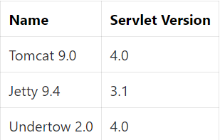
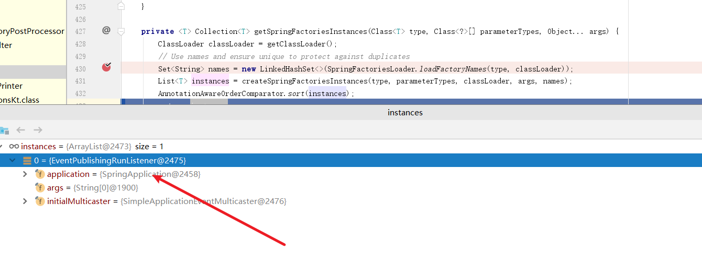
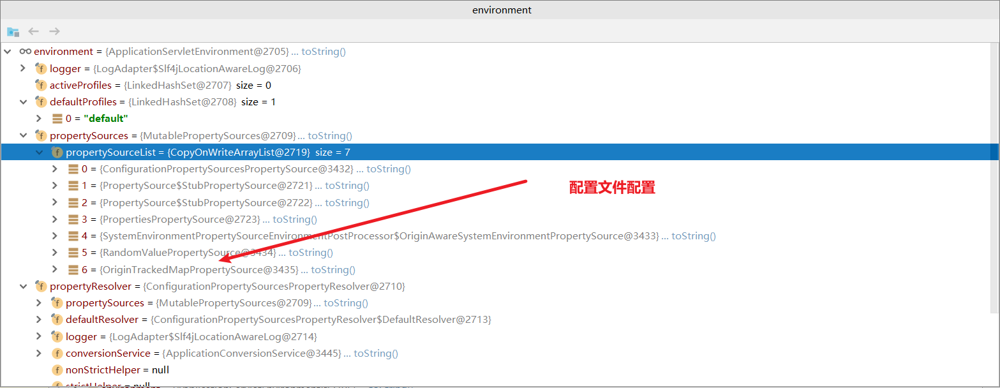
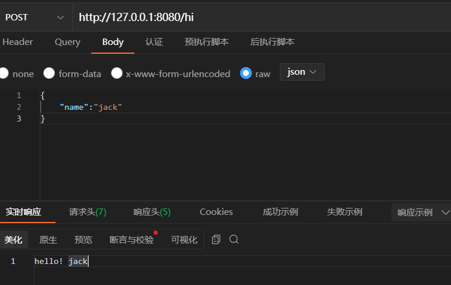
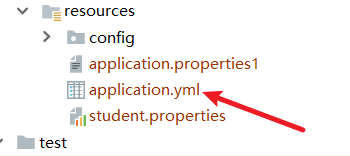
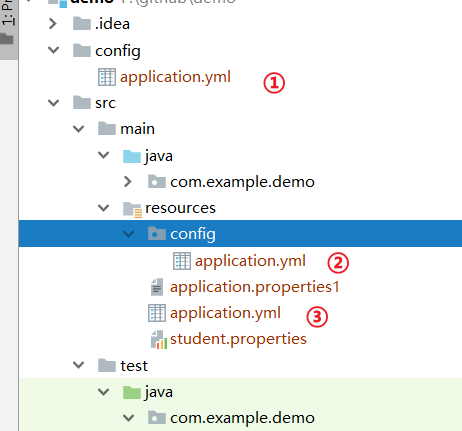
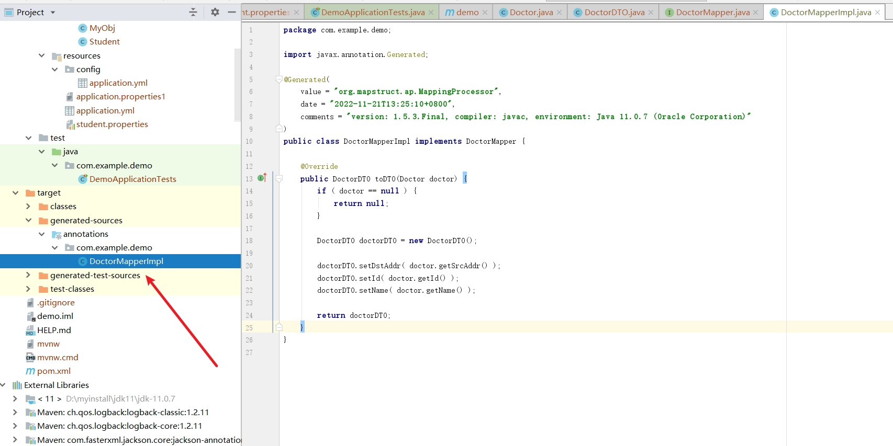

## Spring boot常用注解有哪些？(重点)

1. @RestController
2. @RequestMapping
3. @Configuration
4. @ResponseBody
5. @Component
6. @AutoWired
7. @RequestParam
8. @PathVariable
9. @ControllerAdvice
10. @ExceptionHandler
11. @ControllerAdvice
12. @ComponentScan
13. @Conditional

### Spring Boot 支持哪些内嵌 Servlet 容器知道吗？

**答：** 有3个：

1. `Tomcat` (这个是默认的容器)
2. `Jetty`
3. `Undertow`



正是因为`Spring boot`内嵌了`web`容器，使得我们启动web程序就像启动普通Java程序的一样方便，由于`Spring boot`默认使用的`web`容器是`Tomcat` ，如果我们想修改可以使用下面这种方式排除`tomcat`容器，再引入其他容器

```bash
<!--从Web启动器依赖中排除Tomcat-->
<dependency>
    <groupId>org.springframework.boot</groupId>
    <artifactId>spring-boot-starter-web</artifactId>
    <exclusions>
        <exclusion>
            <groupId>org.springframework.boot</groupId>
            <artifactId>spring-boot-starter-tomcat</artifactId>
        </exclusion>
    </exclusions>
</dependency>
<!--添加Jetty依赖-->
<dependency>
    <groupId>org.springframework.boot</groupId>
    <artifactId>spring-boot-starter-jetty</artifactId>
</dependency>
```

### 能不能介绍一下@SpringBootApplication 这个注解。

**答:** 这个注解我们完全可以通过源码就知道它大概做的实际，如下所示，可以看到`SpringBootApplication` 主要是由`SpringBootConfiguration`、`EnableAutoConfiguration`、`ComponentScan`构成。这三个注解分别是意思是：

1. `SpringBootConfiguration`内部有一个`Configuration`注解，所以它的意思是允许在上下文开启额外`bean`或者其他配置类。
2. `EnableAutoConfiguration`启用`Spring boot`自动配置机制。
3. `ComponentScan`自动扫描当前类的包下的所有被`@Component (@Service,@Controller)`注解的类。

```bash
@Target({ElementType.TYPE})
@Retention(RetentionPolicy.RUNTIME)
@Documented
@Inherited
@SpringBootConfiguration
@EnableAutoConfiguration
@ComponentScan(
    excludeFilters = {@Filter(
    type = FilterType.CUSTOM,
    classes = {TypeExcludeFilter.class}
), @Filter(
    type = FilterType.CUSTOM,
    classes = {AutoConfigurationExcludeFilter.class}
)}
)
public @interface SpringBootApplication {
.....
}
```

### Spring是如何启动的(重点)

**答:** 我们不妨基于源码找到答案,首先我们编写一个`Spring Boot`程序，启动代码如下所示:

```text
@SpringBootApplication
public class DemoApplication {

	public static void main(String[] args) {
		SpringApplication.run(DemoApplication.class, args);
	}

}
```

我们开启`debug`，查看堆栈执行到调用`run:1292, SpringApplication`，从方法不难看出就是拿着`DemoApplication.class`的信息完成容器加载，我们不妨步进看看

```text
public static ConfigurableApplicationContext run(Class<?> primarySource, String... args) {
		return run(new Class<?>[] { primarySource }, args);
	}
```

可以看到它要做的就是创建`SpringApplication`实体，并执行`run`方法。

```text
public static ConfigurableApplicationContext run(Class<?>[] primarySources, String[] args) {
		return new SpringApplication(primarySources).run(args);
	}
```

我们不妨先看看创建实体这一步做了是什么,如下源码可以看到它大抵时加载启动类信息`primarySources`,然后初始化web容器类型，初始化各种启动类和监听类

```text
public SpringApplication(ResourceLoader resourceLoader, Class<?>... primarySources) {
		this.resourceLoader = resourceLoader;
		Assert.notNull(primarySources, "PrimarySources must not be null");
		//项目启动类 SpringbootDemoApplication.class 设置为属性存储起来
		this.primarySources = new LinkedHashSet<>(Arrays.asList(primarySources));
		//设置应用类型是 SERVLET 应用（Spring 5 之前的传统 MVC 应用）还是 REACTIVE 应用（Spring 5 开始出现的 WebFlux 交互式应用）
		this.webApplicationType = WebApplicationType.deduceFromClasspath();
		
		this.bootstrapRegistryInitializers = new ArrayList<>(
				getSpringFactoriesInstances(BootstrapRegistryInitializer.class));
		// 设置初始化器(Initializer),最后会调用这些初始化器
		setInitializers((Collection) getSpringFactoriesInstances(ApplicationContextInitializer.class));
		// 设置监听器(Listener)
		setListeners((Collection) getSpringFactoriesInstances(ApplicationListener.class));
		// 初始化 mainApplicationClass 属性:通过堆栈调用信息获取 main()方法启动的主程序启动类
		this.mainApplicationClass = deduceMainApplicationClass();
	}
```

核心流程来了`run:327, SpringApplication`，笔者会对`Spring boot`的核心流程进行描述，见下文注释

```text
public ConfigurableApplicationContext run(String... args) {
		long startTime = System.nanoTime();
		DefaultBootstrapContext bootstrapContext = createBootstrapContext();
		ConfigurableApplicationContext context = null;
		configureHeadlessProperty();
		// 1. 获取并启动监听
		SpringApplicationRunListeners listeners = getRunListeners(args);
		listeners.starting(bootstrapContext, this.mainApplicationClass);
		try {
			ApplicationArguments applicationArguments = new DefaultApplicationArguments(args);
			//2. 项目环境environment 预配置
			ConfigurableEnvironment environment = prepareEnvironment(listeners, bootstrapContext, applicationArguments);
			configureIgnoreBeanInfo(environment);
			//打印banner，此时控制台会输出一个banner
			Banner printedBanner = printBanner(environment);
			//3. 创建Sring容器
			context = createApplicationContext();
			context.setApplicationStartup(this.applicationStartup);
			//4. 容器刷新前置处理
			prepareContext(bootstrapContext, context, environment, listeners, applicationArguments, printedBanner);
			//5.刷新容器，这里会进行IOC相关操作
			refreshContext(context);
			//6. 容器刷新后置操作
			afterRefresh(context, applicationArguments);
			Duration timeTakenToStartup = Duration.ofNanos(System.nanoTime() - startTime);
			if (this.logStartupInfo) {
				new StartupInfoLogger(this.mainApplicationClass).logStarted(getApplicationLog(), timeTakenToStartup);
			}
			// 7. 发出执行结束的事件通知
			listeners.started(context, timeTakenToStartup);
			//8. 调用runner，完成启动后的特定命令
			callRunners(context, applicationArguments);
		}
		catch (Throwable ex) {
			handleRunFailure(context, ex, listeners);
			throw new IllegalStateException(ex);
		}
		try {
			Duration timeTakenToReady = Duration.ofNanos(System.nanoTime() - startTime);
			listeners.ready(context, timeTakenToReady);
		}
		catch (Throwable ex) {
			handleRunFailure(context, ex, null);
			throw new IllegalStateException(ex);
		}
		//9. 返回上下文
		return context;
	}
```

总结一下大概有9个步骤:

1. 创建监听，并准备监听。
2. 容器环境预配置。
3. 打印banner。
4. 创建Spring容器。
5. 容器刷新前置处理。
6. 容器刷新。
7. 容器刷新后置处理。
8. 发出容器刷新结束通知。
9. 调用runner执行启动后的相关程序。

了解了整体步骤之后，我们再来具体了解相关步骤。

创建监听并准备监听，实际上做的就是从`META-INF/spring.factories`中获取关于监听器的类然后返回一个监听器列表，见下图

```text
private SpringApplicationRunListeners getRunListeners(String[] args) {
		Class<?>[] types = new Class<?>[] { SpringApplication.class, String[].class };
		return new SpringApplicationRunListeners(logger,
				getSpringFactoriesInstances(SpringApplicationRunListener.class, types, this, args),
				this.applicationStartup);
	}
```



接下来就是获取各种配置并加载的逻辑了，这个配置加载包含系统配置以及我们配置文件的配置，见下放代码和图片

```text
private ConfigurableEnvironment prepareEnvironment(SpringApplicationRunListeners listeners,
			DefaultBootstrapContext bootstrapContext, ApplicationArguments applicationArguments) {
		// Create and configure the environment
		ConfigurableEnvironment environment = getOrCreateEnvironment();
		configureEnvironment(environment, applicationArguments.getSourceArgs());
		ConfigurationPropertySources.attach(environment);
		listeners.environmentPrepared(bootstrapContext, environment);
		DefaultPropertiesPropertySource.moveToEnd(environment);
		Assert.state(!environment.containsProperty("spring.main.environment-prefix"),
				"Environment prefix cannot be set via properties.");
		bindToSpringApplication(environment);
		if (!this.isCustomEnvironment) {
			EnvironmentConverter environmentConverter = new EnvironmentConverter(getClassLoader());
			environment = environmentConverter.convertEnvironmentIfNecessary(environment, deduceEnvironmentClass());
		}
		ConfigurationPropertySources.attach(environment);
		return environment;
	}
```



完成加载后的设置逻辑

```text
private void configureIgnoreBeanInfo(ConfigurableEnvironment environment) {
		if (System.getProperty(CachedIntrospectionResults.IGNORE_BEANINFO_PROPERTY_NAME) == null) {
			Boolean ignore = environment.getProperty(CachedIntrospectionResults.IGNORE_BEANINFO_PROPERTY_NAME,
					Boolean.class, Boolean.TRUE);
					//将配置设置为系统属性
			System.setProperty(CachedIntrospectionResults.IGNORE_BEANINFO_PROPERTY_NAME, ignore.toString());
		}
	}
```

然后打印`banner`，这就不多说了，之后后控制台会输出一个`logo`

```text
Banner printedBanner = printBanner(environment);
```

创建应用上下文，同样的也是从`getFromSpringFactories`方法中的`META-INF/spring.factories`中获取对应类

```text
@Override
	public ConfigurableApplicationContext create(WebApplicationType webApplicationType) {
		try {
			return getFromSpringFactories(webApplicationType, ApplicationContextFactory::create,
					AnnotationConfigApplicationContext::new);
		}
		catch (Exception ex) {
			throw new IllegalStateException("Unable create a default ApplicationContext instance, "
					+ "you may need a custom ApplicationContextFactory", ex);
		}
	}
```

然后就到了容器刷新的前置步骤，主要做的是资源预处理，见下文注释

```text
private void prepareContext(DefaultBootstrapContext bootstrapContext, ConfigurableApplicationContext context,
			ConfigurableEnvironment environment, SpringApplicationRunListeners listeners,
			ApplicationArguments applicationArguments, Banner printedBanner) {
			//设置环境变量，包括各种变量
		context.setEnvironment(environment);
		//设置上下的bean生成器和资源加载器
		postProcessApplicationContext(context);
		//执行容器初始化工作
		applyInitializers(context);
		//触发所有监听contextPrepared方法
		listeners.contextPrepared(context);
		bootstrapContext.close(context);
		//记录启动日志
		if (this.logStartupInfo) {
			logStartupInfo(context.getParent() == null);
			logStartupProfileInfo(context);
		}
		// 注册启动参数bean以及一些BeanFactoryPostProcessor处理类
		ConfigurableListableBeanFactory beanFactory = context.getBeanFactory();
		beanFactory.registerSingleton("springApplicationArguments", applicationArguments);
		if (printedBanner != null) {
			beanFactory.registerSingleton("springBootBanner", printedBanner);
		}
		if (beanFactory instanceof AbstractAutowireCapableBeanFactory) {
			((AbstractAutowireCapableBeanFactory) beanFactory).setAllowCircularReferences(this.allowCircularReferences);
			if (beanFactory instanceof DefaultListableBeanFactory) {
				((DefaultListableBeanFactory) beanFactory)
						.setAllowBeanDefinitionOverriding(this.allowBeanDefinitionOverriding);
			}
		}
		if (this.lazyInitialization) {
			context.addBeanFactoryPostProcessor(new LazyInitializationBeanFactoryPostProcessor());
		}
		context.addBeanFactoryPostProcessor(new PropertySourceOrderingBeanFactoryPostProcessor(context));
		// 加载资源，为了后续IOC扫描提供信息
		Set<Object> sources = getAllSources();
		Assert.notEmpty(sources, "Sources must not be empty");
		 //加载我们的启动类，将启动类注入容器,为后续开启自动化配置奠定基础（感兴趣的读者可以自行debug看看，这个方法会将启动类存到beanDefinitionMap中）
		load(context, sources.toArray(new Object[0]));
		//监听器监听上下文
		listeners.contextLoaded(context);
	}
```

容器刷新，这里就是实现`IOC`的步骤了

```text
private void refreshContext(ConfigurableApplicationContext context) {
		if (this.registerShutdownHook) {
			shutdownHook.registerApplicationContext(context);
		}
		refresh(context);
	}
```

执行相应`Runner`

```text
private void callRunners(ApplicationContext context, ApplicationArguments args) {
		List<Object> runners = new ArrayList<>();
		runners.addAll(context.getBeansOfType(ApplicationRunner.class).values());
		runners.addAll(context.getBeansOfType(CommandLineRunner.class).values());
		AnnotationAwareOrderComparator.sort(runners);
		for (Object runner : new LinkedHashSet<>(runners)) {
			if (runner instanceof ApplicationRunner) {
				callRunner((ApplicationRunner) runner, args);
			}
			if (runner instanceof CommandLineRunner) {
				callRunner((CommandLineRunner) runner, args);
			}
		}
	}
```

最后返回上下文

```text
return context;
```

### Spring Boot 的自动装配是如何实现的?

篇幅原因可以参考笔者这篇文章，比较细致

[Spring Boot自动装配原理以及实践(opens new window)](http://t.csdn.cn/x2izP)

### 开发 RESTful Web 服务常用的注解有哪些？

**答:** 大概有以下几个注解吧：

1. `@Autowired` :自动注入`Spring容器`管理的类。
2. `@Component` :使用这个注解意味着这个类被`Spring容器`管理。
3. `@Service` :使用这个注解意为这服务层的`bean`。
4. `@Repository` :`Dao` 层的`bean`。
5. `@Controller` :控制器的`bean`。
6. `RestController` :即`ResponseBody`+`Controller`的集合，即这是个控制器的`bean`，返回值直接放到`响应体`中。

### 那开发RESTful Web API的常见的http请求方式注解有哪些知道嘛？

**答:** 和`HTTP`请求是一致的，有4个注解:

1. `@GetMapping`:get请求。
2. `@PostMapping`: post请求。
3. `@PutMapping`：put请求。
4. `@DeleteMapping`: delete请求。

### 嗯，那你知道这些请求获取参数的几个注解嘛？可以给个演示的例子嘛？

**答:** 有3个吧，分别是: `@Pathvairable` :即获取请求地址后面跟着的参数。 `@RequestParam`：将查询参数绑定到`Spring MVC`的参数上。

示例如下所示,可以看到`http`请求的路径参数`/hello/{name}`的name，如果我们需要获取则需要使用`PathVariable`获取。而查询参数(即问号后面的键值对的值，需要通过`RequestParam`获取)

```bash
@RestController
public class TestController {
    @GetMapping("/hello/{name}")
    public String hello(@PathVariable("name") String name, @RequestParam("sno") String sno) {
        return "hello! sno:" + sno + " name:" + name;
    }
}
```

请求示例

```bash
C:\Users\xxxx>curl 127.0.0.1:8080/hello/jack?sno=18
# 输出结果
hello! sno:18 name:jack
```

`@RequestBody` :将请求类型为 `Content-Type` 为`application/json`的参数通过`HttpMessageConverter`或者自定义的`HttpMessageConverter`转换为`Java`对象上。这个注解就比较常用了。

```java
@PostMapping("/hi")
    public String hi(@RequestBody User params) throws JSONException {
        return "hello! " + params.getName();
    }
```

使用示例如下所示



### Spirng Boot 常用的两种配置文件

**答:** `properties`和`yml`两种格式。

### 为什么会有yml格式的文件，和properties区别在哪。

**答:** 相比于`properties`，yml格式的文件结构更加清晰，更易于阅读和理解。但是`@PropertySource` 这个注解无法读取`yml`格式的配置数据。

### Spring Boot 常用的读取配置文件的方法有哪些知道嘛？

#### 通过 @value 读取简单直观的配置

为了演示这种读取方式，我们可以在resource目录下建立一个 `application.yml`文件



配置文件内容为

```bash
myConfig: 这个是helloworld配置的具体内容哦
```

后续如果我们希望获取到`myConfig`这个值的话，只需按照下面这种方式引入即可，注意`value`注解获取配置值的方式，`Spring`并不推荐使用。

```bash
	@Value("${myConfig}")
	private String value;
```

#### 通过@ConfigurationProperties读取并与 bean 绑定

这种方式相较于上面那种更加强大，可以与`bean`绑定，例如我们`yml`的配置文件内容如下(注意配置名称必须全小写，否则会报一些奇怪的错误)

```bash
myobj:
  name: out-side-config
  email: out-side-config@qq.com
```

那么我们就可以编写一个类，代码如下所示，使用`ConfigurationProperties`引入前缀为`myobj`的配置内容即可，该配置就会将`myobj`前缀下的所有配置和我们的类绑定

```bash
/**
 * 注意 yml配置文件不能有大写字母
 */
@ConfigurationProperties(prefix = "myobj")
public class MyObj {

    private String name;

    private String email;


    public String getName() {
        return name;
    }

    public void setName(String name) {
        this.name = name;
    }

    public String getEmail() {
        return email;
    }

    public void setEmail(String email) {
        this.email = email;
    }


    @Override
    public String toString() {
        return "MyObj{" +
                "name='" + name + '\'' +
                ", email='" + email + '\'' +
                '}';
    }
}
```

#### @PropertySource读取指定的 properties 文件

有时候我们希望指定配置文件和类进行绑定，那么我们就可以使用`PropertySource`注解，例如我们在`resource`目录下有个`student.properties`文件，内容为

```bash
name:xiaoming
no:18 
```

我们只需使用PropertySource执行路径以及配置文件名，再配合value即可完成属性绑定。

```bash
@Component
@PropertySource("classpath:student.properties")
public class Student {

    @Value("${name}")
    private String name;
    @Value("${no}")
    private String no;


    public String getName() {
        return name;
    }

    public void setName(String name) {
        this.name = name;
    }

    public String getNo() {
        return no;
    }

    public void setNo(String no) {
        this.no = no;
    }

    @Override
    public String toString() {
        return "Student{" +
                "name='" + name + '\'' +
                ", no='" + no + '\'' +
                '}';
    }
}
```

#### [#](https://www.sharkchili.com/pages/d50d3b/#spring-boot-加载配置文件的优先级了解么)Spring Boot 加载配置文件的优先级了解么？

**答:** 以下图为例，读取顺序优先取外层`config`目录下的`yml`文件，然后是`resource`目录下的`config`的`yml`文件，最后才是`resource`目录下的`yml`配置文件。

如下图，以笔者为例，笔者在在不同路径下都配置了yml文件，最外层内容为

```bash
myConfig: 这个是helloworld配置的具体内容哦

myobj:
  name: out-side-config
  email: out-side-config@qq.com
```



然后我们通过测试单元查看结果，读取的配置取的是最外层

```bash
@SpringBootTest
class DemoApplicationTests {

	@Resource
	private MyObj myObj;
	
	@Test
	void contextLoads() {
		//输出结果 MyObj{name='out-side-config', email='out-side-config@qq.com'}

		System.out.println(myObj);
		
	}
}
```

#### [#](https://www.sharkchili.com/pages/d50d3b/#常用的-bean-映射工具有哪些-能不能给我说说你最常用的是那种)常用的 Bean 映射工具有哪些？能不能给我说说你最常用的是那种？

**答:** 常见的是:`MapStruct`、`ModelMapper`、`Dozer`、`Orika`、`JMapper` 这几种吧。

最常用的还是`MapStruct`，它的工作原理也很简单，我们声明一个转换接口后，它会在编译期为了我们生成转换实现类的字节码文件。

对此我们不妨距离一下它的使用方式，首先引入版本号、依赖、插件

版本号

```bash
 <properties>
        <java.version>1.8</java.version>
        <org.mapstruct.version>1.5.3.Final</org.mapstruct.version>
    </properties>
```

依赖

```bash
<!--mapstruct依赖-->
        <dependency>
            <groupId>org.mapstruct</groupId>
            <artifactId>mapstruct</artifactId>
            <version>${org.mapstruct.version}</version>
        </dependency>
        <dependency>
            <groupId>org.projectlombok</groupId>
            <artifactId>lombok</artifactId>
            <version>1.18.12</version>
        </dependency>
```

插件

```bash
            <plugin>
                <groupId>org.apache.maven.plugins</groupId>
                <artifactId>maven-compiler-plugin</artifactId>
                <version>3.8.1</version>
                <configuration>
                    <source>1.8</source>
                    <target>1.8</target>
                    <annotationProcessorPaths>
                        <path>
                            <groupId>org.mapstruct</groupId>
                            <artifactId>mapstruct-processor</artifactId>
                            <version>${org.mapstruct.version}</version>
                        </path>
                    </annotationProcessorPaths>
                </configuration>
            </plugin>
```

例如我们现在有个`Doctor` 希望转为`DoctorDTO`类，代码如下所示

```bash
public class Doctor {
    private Integer id;

    private String name;

    private String srcAddr;


    public Integer getId() {
        return id;
    }

    public void setId(Integer id) {
        this.id = id;
    }

    public String getName() {
        return name;
    }

    public void setName(String name) {
        this.name = name;
    }


    public String getSrcAddr() {
        return srcAddr;
    }

    public void setSrcAddr(String srcAddr) {
        this.srcAddr = srcAddr;
    }


    @Override
    public String toString() {
        return "Doctor{" +
                "id=" + id +
                ", name='" + name + '\'' +
                ", srcAddr='" + srcAddr + '\'' +
                '}';
    }
}
```

`DoctorDTO` 类，可以看出地址的字段名为`dstAddr`，和上面的`srcAddr`有区别

```bash
public class DoctorDTO {

    private Integer id;

    private String name;

    private String dstAddr;


    public Integer getId() {
        return id;
    }

    public void setId(Integer id) {
        this.id = id;
    }

    public String getName() {
        return name;
    }

    public void setName(String name) {
        this.name = name;
    }


    public String getDstAddr() {
        return dstAddr;
    }

    public void setDstAddr(String dstAddr) {
        this.dstAddr = dstAddr;
    }


    @Override
    public String toString() {
        return "DoctorDTO{" +
                "id=" + id +
                ", name='" + name + '\'' +
                ", dstAddr='" + dstAddr + '\'' +
                '}';
    }
}
```

所以我们编写一个接口，如下所示，对于字段名不一样的，我们使用`Mapping`手动配置映射关系

```bash
import org.mapstruct.Mapper;
import org.mapstruct.Mapping;
import org.mapstruct.factory.Mappers;


@Mapper
public interface DoctorMapper {

    DoctorMapper INSTANCE = Mappers.getMapper(DoctorMapper.class);

    /**
     * 会在编译期生成
     * @param doctor
     * @return
     */
    @Mapping(source = "srcAddr", target = "dstAddr")
    DoctorDTO toDTO(Doctor doctor);
}
```

测试代码，可以看到bean转换完成

```bash
@Test
	public void testToDTO() {
		Integer doctorId = 15;
		String doctorName = "xiaoming";

		Doctor doctor = new Doctor();
		doctor.setId(doctorId);
		doctor.setName(doctorName);
		doctor.setSrcAddr("中国北京");

		DoctorDTO doctorDTO = DoctorMapper.INSTANCE.toDTO(doctor);

		// 输出结果 DoctorDTO{id=15, name='xiaoming', dstAddr='中国北京'}
        System.out.println(doctorDTO);
		assertEquals(doctorId, doctorDTO.getId());
		assertEquals(doctorName, doctorDTO.getName());
	}
```

通过源码我们可以看到这个接口的实现类会在编译器生成



#### Spring Boot 如何监控系统实际运行状况？

**答:** 很简单，引入下面这个依赖

```bash
<dependency>
    <groupId>org.springframework.boot</groupId>
    <artifactId>spring-boot-starter-actuator</artifactId>
</dependency>
```

然后键入下面的地址即可查看对应端点的信息

[http://localhost:8080/actuator(opens new window)](http://localhost:8080/actuator)

具体可以参考下面这篇文章

[集成Spring Boot Actuator很简单，难的是运用场景!(opens new window)](https://juejin.cn/post/6983803935328829453)

#### Spring Boot 如何做请求参数校验？能不能给我说说怎么使用。

**答:** 有两种校验框架，一个是`Hibernate Validator`，还有一个是`JSR(Java Specification Requests）`校验，后者比较常用，无需引入特殊的依赖。就例如我们现在有个Person类，希望名字不为空，性别是是数字最大值为2，而email必须为邮箱格式，那么我们就可以基于`JSR`的注解进行说明。

```java
public class Person {

    @NotNull(message = "姓名不可为空")
    @Size(max = 10, message = "姓名长度不可超过10位")
    private String name;

    @Max(value = 2, message = "性别最大值只能为2")
    private int sex;
    @Email(message = "邮箱格式不正确")
    private String email;

    public String getName() {
        return name;
    }

    public void setName(String name) {
        this.name = name;
    }

    public int getSex() {
        return sex;
    }

    public void setSex(int sex) {
        this.sex = sex;
    }

    public String getEmail() {
        return email;
    }

    public void setEmail(String email) {
        this.email = email;
    }

    @Override
    public String toString() {
        return "Person{" +
                "name='" + name + '\'' +
                ", sex='" + sex + '\'' +
                ", email='" + email + '\'' +
                '}';
    }
}
```

当他作为`controller`的`requestBody`的参数时，用法如下所示

```java
 @PostMapping("/test/hello")
    public void hello(@Valid Person person) {
        logger.info("hello {}", person.getName());
    }
```

假如我们想校验路径参数时，我们只需在`Controller`上方加一个注解`@Validated`,然后对于路径参数加入校验注解`Valid` +`校验规则注解`即可即可。

```java
@GetMapping("/test/hello2/{id}")
    public void hello2(@Valid @PathVariable("id") @Max(value = 5,message = "最大值为5") Integer  id) {
        logger.info("hello {}", id);
    }
```

补充一下常见的一些校验注解:

```java
1. @NotEmpty 被注释的字符串的不能为 null 也不能为空
2. @NotBlank 被注释的字符串非 null，并且必须包含一个非空白字符
3. @Null 被注释的元素必须为 null
4. @NotNull 被注释的元素必须不为 null
5. @AssertTrue 被注释的元素必须为 true
6. @AssertFalse 被注释的元素必须为 false
7. @Pattern(regex=,flag=)被注释的元素必须符合指定的正则表达式
8. @Email 被注释的元素必须是 Email 格式。
9. @Min(value)被注释的元素必须是一个数字，其值必须大于等于指定的最小值
10. @Max(value)被注释的元素必须是一个数字，其值必须小于等于指定的最大值
11. @DecimalMin(value)被注释的元素必须是一个数字，其值必须大于等于指定的最小值
12. @DecimalMax(value) 被注释的元素必须是一个数字，其值必须小于等于指定的最大值
13. @Size(max=, min=)被注释的元素的大小必须在指定的范围内
14. @Digits(integer, fraction)被注释的元素必须是一个数字，其值必须在可接受的范围内
15. @Past被注释的元素必须是一个过去的日期
16. @Future 被注释的元素必须是一个将来的日期
```

#### 如何使用 Spring Boot 实现全局异常处理？

答:通过`@ControllerAdvice`将控制器声明为增强器，然后通过`ExceptionHandler` 对自己自己的异常进行处理。 例如我们想处理所有控制器的BindException，代码如下所示

```bash
/**
 * 统一异常处理、数据预处理等
 */
@ControllerAdvice
public class ControllerExceptionHandler {

    private static final Logger LOG = LoggerFactory.getLogger(ControllerExceptionHandler.class);

    /**
     * 校验异常统一处理
     * @param e
     * @return
     */
    @ExceptionHandler(value = BindException.class)
    @ResponseBody
    public CommonResp validExceptionHandler(BindException e) {
        CommonResp commonResp = new CommonResp();
        LOG.warn("参数校验失败：{}", e.getBindingResult().getAllErrors().get(0).getDefaultMessage());
        commonResp.setSuccess(false);
        commonResp.setMessage(e.getBindingResult().getAllErrors().get(0).getDefaultMessage());
        return commonResp;
    }


}
```

#### Spring Boot 中如何实现定时任务 ?

答: 操作步骤很简单，首先在启动类中添加`@EnableScheduling`注解，然后编写一个定时任务`bean`，然后在定时任务的方法上添加`@Scheduled`注解

```bash
@Component
@EnableAsync
//@EnableAsync 和 @Async 使定时任务并行执行
public class AsyncScheduledTasks {
    private static final Logger log = LoggerFactory.getLogger(AsyncScheduledTasks.class);
    private static final SimpleDateFormat dateFormat = new SimpleDateFormat("HH:mm:ss");
    private List<Integer> index = Arrays.asList(6, 6, 2, 3);
    int i = 0;

    @Scheduled(fixedRate = 5000)
    @Async
    public void reportCurrentTimeWithFixedRate() {
        log.info("Current Thread : {}", Thread.currentThread().getName());

        if (i == 0) {
            log.info("Start time is {}", dateFormat.format(new Date()));
        }
        if (i < 4) {
            try {
                TimeUnit.SECONDS.sleep(index.get(i));
                log.info("Fixed Rate Task : The time is now {}", dateFormat.format(new Date()));
            } catch (InterruptedException e) {
                e.printStackTrace();
            }
            i++;
        }
    }

}
```

## 参考文献

[剖析面试最常见问题之 Spring Boot(opens new window)](https://xiaozhuanlan.com/topic/4923687015)

[@RequestParam注解使用(opens new window)](https://blog.csdn.net/sswqzx/article/details/84195043)

[如何在 Spring/Spring Boot 中做参数校验？你需要了解的都在这里！(opens new window)](https://juejin.cn/post/6844903991621451789)

[对象转换工具 MapStruct 介绍(opens new window)](https://juejin.cn/post/6994233847076356133)

[SpringBoot项目是如何启动的？(opens new window)](https://zhuanlan.zhihu.com/p/342530328)

[spring boot的常用注解有哪些？(opens new window)](https://zhuanlan.zhihu.com/p/84852136)

[SpringBoot 的 44 种应用启动器，你都知道吗？](https://developer.aliyun.com/article/780798)