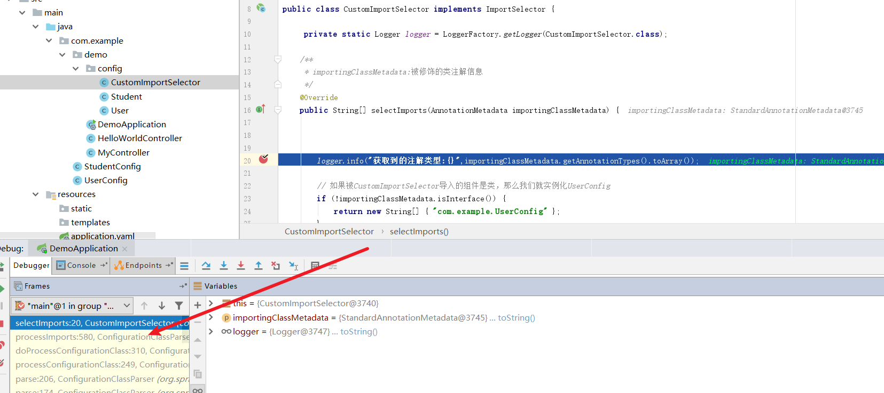
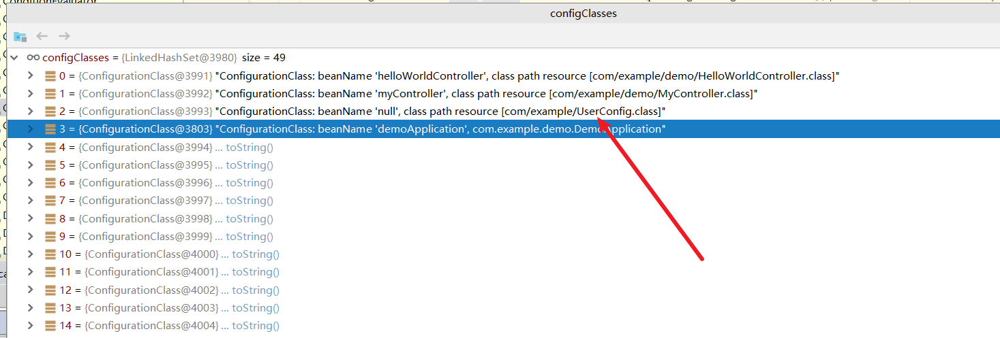
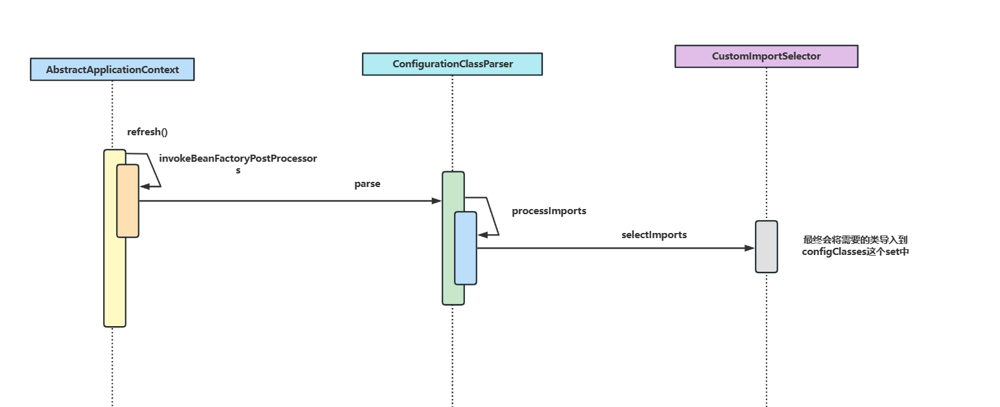
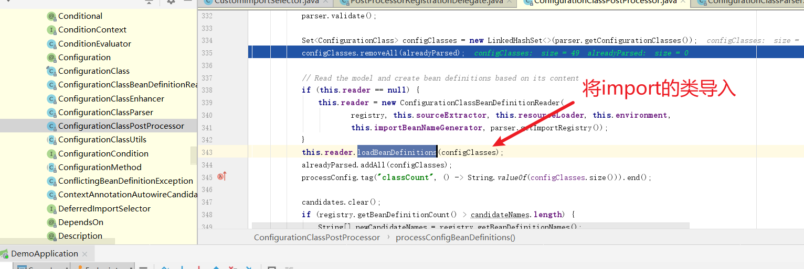
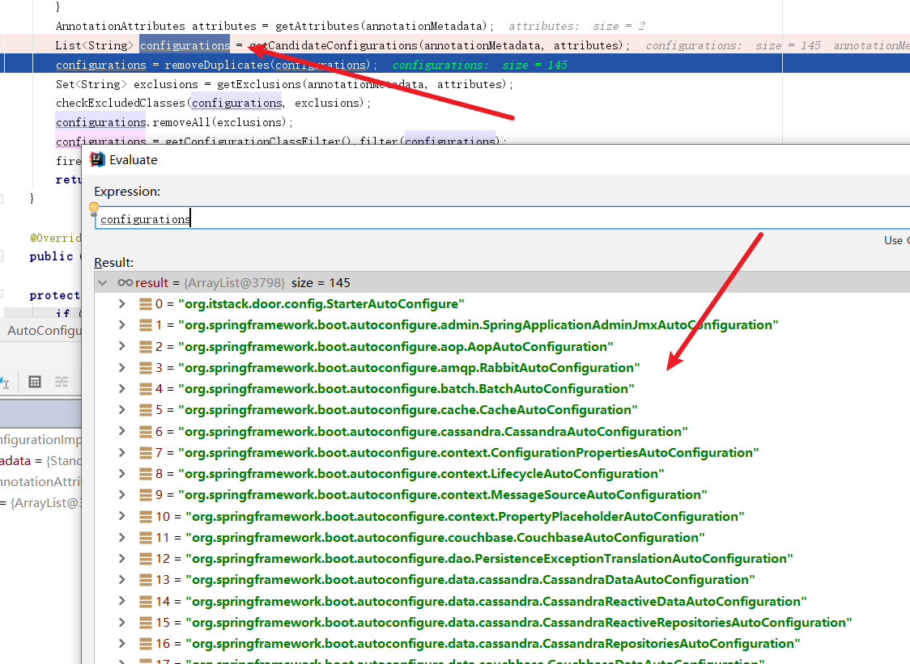

## 了解自动装配两个核心

### @Import注解的作用

@Import说Spring框架经常会看到的注解，它有以下几个作用:

1. 导入`@Configuration`类下所有的`@bean`方法中创建的`bean`。
2. 导入`import`指定的`bean`，例如`@Import(AService.class)`，就会生成`AService`的`bean`，并将其导入到`Spring`容器中。
3. 结合`ImportSelector`接口类导如指定类。(后文会展开介绍)

### ImportSelector详解

`ImportSelector`接口则是前者的辅助者，如果我们希望可以选择性的导入一些类，我们就可以继承`ImportSelector`接口编写一个`ImportSelector`类，告知容器需要导入的类。就以`Spring Boot`为例，它有个`@EnableAutoConfiguration`注解，其工作原理就是基于内部的`@Import({AutoConfigurationImportSelector.class})`注解将`AutoConfigurationImportSelector`导入容器中，Spring就会调用其`selectImports`方法获取需要导入的类，并将这些类导入容器中。

```java
@Override
	public String[] selectImports(AnnotationMetadata annotationMetadata) {
		if (!isEnabled(annotationMetadata)) {
			return NO_IMPORTS;
		}
		AutoConfigurationEntry autoConfigurationEntry = getAutoConfigurationEntry(annotationMetadata);
		//返回需要导入的类的字符串数组
		return StringUtils.toStringArray(autoConfigurationEntry.getConfigurations());
	}
```

使用示例

可能上文的原理对没有接触源码的读者比较模糊，所以我们不妨写一个`demo`来了解一下这个注解。我们现在有一个需求，希望通过`import`注解按需将`Student`类或者`User`类导入容器中。首先我们看看`user`类代码，没有任何实现，代码示例如下:

```java
public class User {
}
```

`Student` 类代码同理，没有任何实现仅仅做测试使用

```java
public class Student {
}
```

完成测试类的创建之后，我们就以用户类为例，创建`UserConfig` 代码如下：

```java
@Configuration
public class UserConfig {

    @Bean
    public User getUser() {
        return new User();
    }
}
```

然后编写`ImportSelector` 首先类，编写自己的导入逻辑，可以看到笔者简单实现了一个`selectImports方法`返回`UserConfig`的类路径。

```java
public class CustomImportSelector implements ImportSelector {

     private static Logger logger = LoggerFactory.getLogger(CustomImportSelector.class);

    /**
     * importingClassMetadata:被修饰的类注解信息
     */
    @Override
    public String[] selectImports(AnnotationMetadata importingClassMetadata) {


        logger.info("获取到的注解类型:{}",importingClassMetadata.getAnnotationTypes().toArray());

        // 如果被CustomImportSelector导入的组件是类，那么我们就实例化UserConfig
        if (!importingClassMetadata.isInterface()) {
            return new String[] { "com.example.UserConfig" };
        }

        // 此处不要返回null
        return new String[] { "com.example.StudentConfig" };
    }
}
```

完成这些步骤我们就要来到最关键的一步了，在`Spring Boot`启动类中使用`@Import`导入`CustomImportSelector`

```java
@SpringBootApplication
@Configuration
@Import(CustomImportSelector.class)
public class DemoApplication {

	public static void main(String[] args) {
		SpringApplication.run(DemoApplication.class, args);
	}

}
```

为了测试我们编写这样一个`controller`看看`bean`是否会导入到容器中

```java
@RestController
public class MyController {

    private static Logger logger = LoggerFactory.getLogger(MyController.class);

    @Autowired
    private User user;

    @RequestMapping("hello")
    public String hello() {
        logger.info("user:{}", user);
        return "hello";
    }
}
```

结果测试我们发现`user`不为空，说明`CustomImportSelector`确实将`UserConfig`导入到容器中，并将`User`导入到容器中了。

从源码角度了解`ImportSelector`工作原理

关于源码分析其实也很好做，感兴趣的读者可以直接在`CustomImportSelector`打个断点就能知道工作原理了:



断点之后我们不妨用以终为始的方式了解一下过程，首先入口是`AbstractApplicationContext`的`refresh()`方法，它会调用一个`invokeBeanFactoryPostProcessors(beanFactory);`进行`bean`工厂后置操作

```java
@Override
	public void refresh() throws BeansException, IllegalStateException {
		synchronized (this.startupShutdownMonitor) {
		.........
				invokeBeanFactoryPostProcessors(beanFactory);

			........

}
}
```

步入代码，可以看到容器会不断遍历各个`postProcessor` 即容器后置处理器，然后执行他们的逻辑

```java
for (BeanFactoryPostProcessor postProcessor : beanFactoryPostProcessors) {
			.....
			//执行各个postProcessor 的逻辑
			invokeBeanDefinitionRegistryPostProcessors(currentRegistryProcessors, registry, beanFactory.getApplicationStartup());
}
```

重点来了，遍历过程中得到一个`ConfigurationClassPostProcessor`，这个类就会得到我们的`CustomImportSelector`，然后执行`selectImports`获取需要导入的类信息，最终会生成一个`Set<ConfigurationClass> configClasses = new LinkedHashSet<>(parser.getConfigurationClasses());`

如下图所示可以看到`configClasses`就包含`UserConfig`



总结一下核心流程的时序图



完成上述步骤后`ConfigurationClassPostProcessor`就会通过这个set集合执行`loadBeanDefinitions`方法将需要的bean导入到容器中，进行后续`IOC`操作。



上图代码如下所示：

```java
//configClasses 中就包含了UserConfig类
Set<ConfigurationClass> configClasses = new LinkedHashSet<>(parser.getConfigurationClasses());
			configClasses.removeAll(alreadyParsed);

//执行	loadBeanDefinitions	
			this.reader.loadBeanDefinitions(configClasses);
```

## Spring Boot自动装配原理(重点)

了解了`import`原理后，我们了解`Spring Boot`自动装配原理也很简单了，我们不妨看看`Spring Boot`的`@SpringBootApplication`这个注解中包含一个`@EnableAutoConfiguration`注解，我们不妨点入看看，可以看到它包含一个`@Import(AutoConfigurationImportSelector.class)`注解，从名字上我们可以知晓这是一个`ImportSelector`的实现类。

所以我们不妨看看它的`selectImports`逻辑，可以看到它会通过`getAutoConfigurationEntry`方法获取需要装配的类，然后通过`StringUtils.toStringArray`切割返回。所以我们不妨看看`getAutoConfigurationEntry`

```java
@Override
	public String[] selectImports(AnnotationMetadata annotationMetadata) {
		if (!isEnabled(annotationMetadata)) {
			return NO_IMPORTS;
		}
		AutoConfigurationEntry autoConfigurationEntry = getAutoConfigurationEntry(annotationMetadata);
		return StringUtils.toStringArray(autoConfigurationEntry.getConfigurations());
	}
```

查看`getAutoConfigurationEntry`方法，我们可以看到它通过`getCandidateConfigurations`获取各个`xxxxAutoConfigure`，并返回结果

```java
protected AutoConfigurationEntry getAutoConfigurationEntry(AnnotationMetadata annotationMetadata) {
		if (!isEnabled(annotationMetadata)) {
			return EMPTY_ENTRY;
		}
		AnnotationAttributes attributes = getAttributes(annotationMetadata);
		//获取所有xxxxAutoConfigure
		List<String> configurations = getCandidateConfigurations(annotationMetadata, attributes);
		//移除不需要的
		configurations = removeDuplicates(configurations);
		Set<String> exclusions = getExclusions(annotationMetadata, attributes);
		checkExcludedClasses(configurations, exclusions);
		configurations.removeAll(exclusions);
		configurations = getConfigurationClassFilter().filter(configurations);
		fireAutoConfigurationImportEvents(configurations, exclusions);
		//返回结果
		return new AutoConfigurationEntry(configurations, exclusions);
	}
```



而`getCandidateConfigurations`实际上是会通过一个`loadSpringFactories`方法，如下所示遍历获取所有含有`META-INF/spring.factories`的`jar`包

```java
private static Map<String, List<String>> loadSpringFactories(ClassLoader classLoader) {
        Map<String, List<String>> result = (Map)cache.get(classLoader);
        if (result != null) {
            return result;
        } else {
            HashMap result = new HashMap();

            try {
            //解析这个配置文件获取所有配置类然后返回
                Enumeration urls = classLoader.getResources("META-INF/spring.factories");

              .....
                return result;
            } catch (IOException var14) {
                throw new IllegalArgumentException("Unable to load factories from location [META-INF/spring.factories]", var14);
            }
        }
    }
```

最终结果过滤解析，回到我们上文说的`beanDefinitionMap`中，最终通过`IOC`完成自动装配。

## 实践1-手写Spring Boot Starter中间件

了解自动装配我们不妨自己写一个中间件实践一下，现在需求如下，我们希望某些类的接口只有某几个用户可以访问，所以我们希望编写一个中间件判断请求用户是什么身份，如果没有权限则直接返回报错。

首先我们编写一个注解`DoDoor` ，用`key`记录传入的用户`id`，`returnJson`返回没有权限的响应结果

```java
@Retention(RetentionPolicy.RUNTIME)
@Target(ElementType.METHOD)
public @interface DoDoor {

    String key() default "";

    String returnJson() default "";

}
```

然后在编写`StarterServiceProperties` ,使用`ConfigurationProperties`将`itstack.door前缀`的值和当前类`userStr`绑定。

```java
/**
 * 通过"itstack.door前缀的配置获取userStr信息
 */
@ConfigurationProperties("itstack.door")
public class StarterServiceProperties {

    private String userStr;

    public String getUserStr() {
        return userStr;
    }

    public void setUserStr(String userStr) {
        this.userStr = userStr;
    }

}
```

完成后在编写`StarterService` 这个类会将`userStr`切割成数组，例如我们传`111,222`，最终就会得到`[111,222]`

```java
public class StarterService {

    private String userStr;

    public StarterService(String userStr) {
        this.userStr = userStr;
    }

    public String[] split(String separatorChar) {
        return StringUtils.split(this.userStr, separatorChar);
    }

}
```

这些佐料写完之后，我们就可以编写一个`AOP`类了，可以看到这个`AOP`做的是很简单，就是拦截带有`DoDoor`的请求，将注解key配置的值和我们的`userStr`数组比对，若包含则放行，反之拦截。

```java
@Aspect
@Component
public class DoJoinPoint {

    private Logger logger = LoggerFactory.getLogger(DoJoinPoint.class);

    @Autowired
    private StarterService starterService;

    @Pointcut("@annotation(org.itstack.door.annotation.DoDoor)")
    public void aopPoint() {
    }

    @Around("aopPoint()")
    public Object doRouter(ProceedingJoinPoint jp) throws Throwable {
        //获取内容
        Method method = getMethod(jp);
        DoDoor door = method.getAnnotation(DoDoor.class);
        //获取字段值
        String keyValue = getFiledValue(door.key(), jp.getArgs());
        logger.info("itstack door handler method：{} value：{}", method.getName(), keyValue);
        if (null == keyValue || "".equals(keyValue)) return jp.proceed();
        //配置内容
        String[] split = starterService.split(",");
        //白名单过滤
        for (String str : split) {
            if (keyValue.equals(str)) {
                return jp.proceed();
            }
        }
        //拦截
        return returnObject(door, method);
    }

    private Method getMethod(JoinPoint jp) throws NoSuchMethodException {
        Signature sig = jp.getSignature();
        MethodSignature methodSignature = (MethodSignature) sig;
        return getClass(jp).getMethod(methodSignature.getName(), methodSignature.getParameterTypes());
    }

    private Class<? extends Object> getClass(JoinPoint jp) throws NoSuchMethodException {
        return jp.getTarget().getClass();
    }

    //返回对象
    private Object returnObject(DoDoor doGate, Method method) throws IllegalAccessException, InstantiationException {
        Class<?> returnType = method.getReturnType();
        String returnJson = doGate.returnJson();
        if ("".equals(returnJson)) {
            return returnType.newInstance();
        }
        return JSON.parseObject(returnJson, returnType);
    }

    //获取属性值
    private String getFiledValue(String filed, Object[] args) {
        String filedValue = null;
        for (Object arg : args) {
            try {
                if (null == filedValue || "".equals(filedValue)) {
                    filedValue = BeanUtils.getProperty(arg, filed);
                } else {
                    break;
                }
            } catch (Exception e) {
                if (args.length == 1) {
                    return args[0].toString();
                }
            }
        }
        return filedValue;
    }

}
```

编写我们的`AutoConfigure` ,根据条件决定上述的类是否导入

```java
@Configuration
@ConditionalOnClass(StarterService.class)
@EnableConfigurationProperties(StarterServiceProperties.class)
public class StarterAutoConfigure {

    @Autowired
    private StarterServiceProperties properties;

    @Bean
    @ConditionalOnMissingBean
    @ConditionalOnProperty(prefix = "itstack.door", value = "enabled", havingValue = "true")
    StarterService starterService() {
        return new StarterService(properties.getUserStr());
    }

    @Bean
    @ConditionalOnMissingBean
    @ConditionalOnProperty(prefix = "itstack.door", value = "enabled", havingValue = "true")
    DoJoinPoint doJoinPoint() {
        return new DoJoinPoint();
    }

}
```

完成后编写一个`spring.factories`，导入这个`AutoConfigure`

```java
org.springframework.boot.autoconfigure.EnableAutoConfiguration=org.itstack.door.config.StarterAutoConfigure
```

修改一下`pom`，本地打个包

```java
<dependency>
	<groupId>org.springframework.boot</groupId>
	<artifactId>spring-boot-starter-aop</artifactId>
</dependency>
		
<plugin>
	<groupId>org.apache.maven.plugins</groupId>
	<artifactId>maven-jar-plugin</artifactId>
	<version>2.3.2</version>
	<configuration>
		<archive>
			<addMavenDescriptor>false</addMavenDescriptor>
			<index>true</index>
			<manifest>
				<addDefaultSpecificationEntries>true</addDefaultSpecificationEntries>
				<addDefaultImplementationEntries>true</addDefaultImplementationEntries>
			</manifest>
			<manifestEntries>
				<Implementation-Build>${maven.build.timestamp}</Implementation-Build>
			</manifestEntries>
		</archive>
	</configuration>
</plugin>			
```

在其他应用中导入

```java
<dependency>
			<groupId>org.itatack.demo</groupId>
			<artifactId>door-spring-boot-starter</artifactId>
			<version>1.0.1-SNAPSHOT</version>
		</dependency>
```

编写配置

```java
server:
  port: 9887

spring:
  application:
    name: demo

# 自定义中间件配置
itstack:
  door:
    enabled: true
    userStr: 1001,aaaa,ccc #白名单用户ID，多个逗号隔开
```

然后在导入这个中间件的应用中编写一个方法测试`@DoDoor`

```java
@RestController
public class HelloWorldController {
    @Autowired
    private ApplicationContext applicationContext;

    @DoDoor(key = "userId", returnJson = "{\"code\":\"1111\",\"info\":\"非白名单可访问用户拦截！\"}")
    @RequestMapping(path = "/user", method = RequestMethod.GET)
    public Map queryUserInfo(@RequestParam String userId) {
        Map<String, DoJoinPoint> beansOfType = applicationContext.getBeansOfType(DoJoinPoint.class);
        Map resultMap = new HashMap<>();
        resultMap.put("虫虫:" + userId, "天津市南开区旮旯胡同100号");
        return resultMap;
    }

}
```

测试结果

```java
C:\Users\xxxx>curl http://localhost:9887/user?userId=1001132
{"code":"1111","info":"非白名单可访问用户拦截！"}
C:\Users\xxx>curl http://localhost:9887/user?userId=1111
{"code":"1111","info":"非白名单可访问用户拦截！"}
C:\Users\xx>curl http://localhost:9887/user?userId=1001
{"虫虫:1001":"天津市南开区旮旯胡同100号"}
```

源码是借鉴小傅哥的，感兴趣的读者可以参考:


##  参考文献

[SpringBoot 自动装配原理(opens new window)](https://juejin.cn/post/7162568709955911717)

[@Import、ImportSelector注解使用及源码分析(opens new window)](https://juejin.cn/post/6844903925242396686)

[SpringBoot封装我们自己的Starter(opens new window)](https://juejin.cn/post/6844903923162038279)

[Spring Boot 中间件开发(一)《服务治理中间件之统一白名单验证》(opens new window)](https://bugstack.cn/md/assembly/middleware/2019-12-02-SpringBoot服务治理中间件之统一白名单验证.html)

[SpringCloud Alibaba微服务实战三十一 - 业务日志组件(opens new window)](https://mp.weixin.qq.com/s?__biz=MzAwMTk4NjM1MA==&mid=2247490759&idx=1&sn=2d7915c3f2db09bbff75b7ad6921853a&chksm=9ad00686ada78f906947058667625c425622347ef4e5e6dc24dcea604344bd8d4b3407708fbb&token=1863605670&lang=zh_CN#rd)

[Spring全解系列 - @Import注解(opens new window)](https://zhuanlan.zhihu.com/p/147025312)