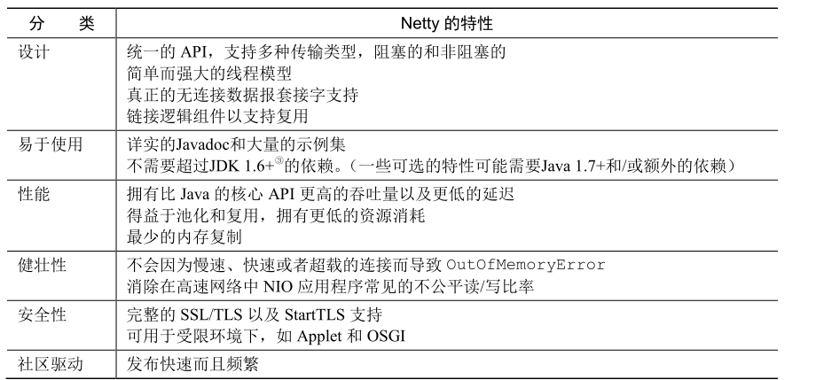

# Netty基础概念入门简记

## 来了解一下需要NIO

在了解Netty之前，我们必须了解一些基础的概念，首先自然是传统的BIO模型了代码如下所示，逻辑很简单，整体步骤大致为:

1. 创建连接。
2. 阻塞监听。
3. 收到请求，读取到流中。
4. 处理并响应。
5. 关闭连接。

```bash
public void serve(int portNumber) throws IOException {
        //创建一个新的 ServerSocket，用以监听指定端口上的连接请求
        ServerSocket serverSocket = new ServerSocket(portNumber);
        //对accept()方法的调用将被阻塞，直到一个连接建立
        Socket clientSocket = serverSocket.accept();
        //这些流对象都派生于该套接字的流对象
        BufferedReader in = new BufferedReader(
                new InputStreamReader(clientSocket.getInputStream()));
        PrintWriter out =
                new PrintWriter(clientSocket.getOutputStream(), true);
        String request, response;
        //处理循环开始
        while ((request = in.readLine()) != null) {
            if ("Done".equals(request)) {
                break;
            }
            //请求被传递给服务器的处理方法
            response = processRequest(request);
            //服务器的响应被发送给了客户端
            out.println(response);
            //继续执行处理循环
        }
        System.out.println("结束");
    }

    private String processRequest(String request) {
        System.out.println(request);
        return "Processed";
    }
```

为了更直观的看到BIO的样子，我们不妨编写一个启动代码来调试一下,这里笔者就以7000号端口作为连接端口。

```bash
public static void main(String[] args) throws IOException {
        new BlockingIoExample().serve(7000);
    }
```

然后我们在这里插一个断点:


启动后我们就发现，accept之后线程就会阻塞住，直到收到一个连接才会继续往下走。这就使得如果我们需要处理多个网络请求的话，就需要建立多线程进行处理，这样做就会导致一系列问题:

1. 高并发场景下，多线程会导致频繁的上下文切换，导致某些任务可能迟迟无法结束。
2. 资源浪费，创建一个线程需要在斩上分配64k甚至是1M的内存空间。


于是我们就有了NIO的概念，NIO的通信模型如下所示，可以看到它在线程和套接字直接增加了一个选择器，这个选择器使得整个线程处理连接变得更加灵活，无需主动监听，通过selector的事件通知机制使得我们可以知晓那个socket可以处理线程在进行工作，如果发现所有的socket都没有连接要处理的话，完全可以去处理其他的工作，这样做的好处也很多:

1. 用最少的线程尽可能处理更多的连接。
2. 当没有IO需要处理时，线程可以去用于其他任务。


## Netty简介

### 既然有了NIO，为什么还需要Netty

NIO虽然好，但是缺点也很明显:难用，想要正确的和安全及高校的调度IO非常繁琐且容易出错，而Netty将这些使用细节都封装起来，使得我们可以更加简单的使用NIO，通过统一的封装，按照约定去调用相关API即可实现一个支持成千上万高并发的服务端。



### 异步和事件驱动

Netty的设计思想就是通过选择器使用较少的线程监听更多的连接上的事件，实现非阻塞式的网络IO，结合异步回调的方式调用用户对于IO的逻辑，正是这种工作机制，使得Netty可以从容的应付高并发场景。

## Netty核心组件概览

### 管道(Channel)

我们常常称之为管道，这里我们暂时可以将其理解为一个数据的载体，通过Channel我们可以收到别的数据，也可以将自己的数据发送出去，同样的我们也可以将这个管道打开或者关闭。


### 什么是回调

这个和Netty无关，我们可以说回调其实是一种设计思想，我们还是以Netty为例，例如我们希望在连接被建立进行一些响应的处理，那么Netty就会在连接建立的时候预埋一个接口方法。

如下图，AbstractChannelHandlerContext就编写了一个ChannelInboundHandler接口channelActive方法。


如果我们希望在源码下方即连接建立的时候进行响应的处理，我们就可以继承这个接口，然后编写自己的逻辑，如下代码所示(具体案例笔者会在后文介绍，这里暂时了解一下就行了):

```bash
public class ConnectHandler extends ChannelInboundHandlerAdapter {
    @Override
    //当一个新的连接已经被建立时，channelActive(ChannelHandlerContext)将会被调用
    public void channelActive(ChannelHandlerContext ctx)
            throws Exception {
        System.out.println(
                "Client " + ctx.channel().remoteAddress() + " connected");
    }
}
```

### Future和channel串联

jdk中也有Future相关的概念，只不过Netty对此进行了进一步的优化，如下代码所示，当Netty需要建立连接时，只需使用connect方法建立连接即可，该方法会返回一个ChannelFuture 。

```bash
 //异步地连接到远程节点
        ChannelFuture future = channel.connect(
                new InetSocketAddress("192.168.0.1", 25));
```

而ChannelFuture 则是Netty继承JDK的Future之后自己编写的Future。


那么ChannelFuture 的优化点在哪呢？如下图所示，可以看到Netty使用异步建立连接任务之后，会通过回调的方式，调用我们的注册到future监听上的事件，这就使得我们无需像使用Future那样去阻塞等待或者说时不时的手动判断连接情况，对于连接完成的处理会变得更加高效灵活。


### EventLoop

Netty通过EventLoop将Selector抽象出来,EventLoop为我们做了如下几件事情：

1. 注册感兴趣的事件。
2. 派发请求给响应Handler。
3. 安排进一步的工作。


## Netty基础示例演示

### 服务端代码示例

通过上文我们了解了关于Netty一些概念，我们不妨编写一段代码入门一下Netty，首先我们编写一下服务端的代码，我们首先编写一下服务端的回调处理器，具体参见下方注释，可以看到逻辑很简单:

1. 当服务端收到请求，我们会让服务端走到我们EchoServerHandler ，它会通过channelRead接受客户端请求并输出到控制台，然后告诉客户端收到请求了。
2. 通过channelReadComplete告知channelRead当前读取的消息是最后一条消息了。
3. 当遇到异常时，通过exceptionCaught进行处理错误，避免该请求走到后续注册到ChannelPipeline的channel收到这个请求。

```bash
//标示一个ChannelHandler可以被多个 Channel 安全地共享
@Sharable
public class EchoServerHandler extends ChannelInboundHandlerAdapter {
    @Override
    public void channelRead(ChannelHandlerContext ctx, Object msg) {
        ByteBuf in = (ByteBuf) msg;

        // 创建一个Bytebuf，默认创建的容量是256
        ByteBuf buffer = ByteBufAllocator.DEFAULT.buffer();
        String resp = "服务端收到你的请求了";
        // 将数据写入ByteBuf
        buffer.writeBytes(resp.getBytes());


        //将消息记录到控制台
        System.out.println(
                "服务端收到客户端的请求: " + in.toString(CharsetUtil.UTF_8));
        //将接收到的消息写给发送者，而不冲刷出站消息
        ctx.write(buffer);
    }

    @Override
    public void channelReadComplete(ChannelHandlerContext ctx)
            throws Exception {
        //将未决消息冲刷到远程节点，并且关闭该 Channel
        ctx.writeAndFlush(Unpooled.EMPTY_BUFFER)
                .addListener(ChannelFutureListener.CLOSE);
    }

    @Override
    public void exceptionCaught(ChannelHandlerContext ctx,
                                Throwable cause) {
        //打印异常栈跟踪
        cause.printStackTrace();
        //关闭该Channel
        ctx.close();
    }
}
```

完成处理器的逻辑之后，我们就可以创建服务端了，代码如下，笔者已经给出详细逻辑这里就不多赘述了，唯一需要注意的就是`ch.pipeline().addLast(serverHandler);`就是告知服务端，收到请求后要走的回调处理器要用到我们的EchoServerHandler。

```bash
public class EchoServer {
    private final int port;

    public EchoServer(int port) {
        this.port = port;
    }

    public static void main(String[] args)
        throws Exception {

        //设置端口值
        int port = 7000;
        //调用服务器的 start()方法
        new EchoServer(port).start();
    }

    public void start() throws Exception {
        //自定义的ChannelHandler
        final EchoServerHandler serverHandler = new EchoServerHandler();
        //(1) 创建EventLoopGroup
        EventLoopGroup group = new NioEventLoopGroup();
        try {
            //(2) 创建ServerBootstrap
            ServerBootstrap b = new ServerBootstrap();
            b.group(group)
                //(3) 指定所使用的 NIO 传输 Channel
                .channel(NioServerSocketChannel.class)
                //(4) 使用指定的端口设置套接字地址
                .localAddress(new InetSocketAddress(port))
                //(5) 添加一个EchoServerHandler到于Channel的 ChannelPipeline
                .childHandler(new ChannelInitializer<SocketChannel>() {
                    @Override
                    public void initChannel(SocketChannel ch) throws Exception {
                        //EchoServerHandler 被标注为@Shareable，所以我们可以总是使用同样的实例
                        //这里对于所有的客户端连接来说，都会使用同一个 EchoServerHandler，因为其被标注为@Sharable，
                        //这将在后面的章节中讲到。
                        ch.pipeline().addLast(serverHandler);
                    }
                });
            //(6) 异步地绑定服务器；调用 sync()方法阻塞等待直到绑定完成
            ChannelFuture f = b.bind().sync();
            System.out.println(EchoServer.class.getSimpleName() +
                " 开始异步地绑定服务器: " + f.channel().localAddress());
            //(7) 获取 Channel 的CloseFuture，并且阻塞当前线程直到它完成
            f.channel().closeFuture().sync();
        } finally {
            //(8) 关闭 EventLoopGroup，释放所有的资源
            group.shutdownGracefully().sync();
        }
    }
}
```

### 客户端示例

同样我们编写客户端的回调处理器:

1. 它会在连接建立时触发channelActive回调，发送给服务端"你好，我是客户端"。通过channelRead0获取服务端发送的消息。
2. 通过channelRead0收到服务器的请求。
3. 通过exceptionCaught记录连接过程中的错误。

```bash
//标记该类的实例可以被多个 Channel 共享
@Sharable
public class EchoClientHandler
    extends SimpleChannelInboundHandler<ByteBuf> {
    @Override
    public void channelActive(ChannelHandlerContext ctx) {
        //当被通知 Channel是活跃的时候，发送一条消息
        ctx.writeAndFlush(Unpooled.copiedBuffer("你好，我是客户端", CharsetUtil.UTF_8));
    }

    @Override
    public void channelRead0(ChannelHandlerContext ctx, ByteBuf in) {
        //记录已接收消息的转储
        System.out.println(
                "客户端收到服务端消息: " + in.toString(CharsetUtil.UTF_8));
    }

    @Override
    //在发生异常时，记录错误并关闭Channel
    public void exceptionCaught(ChannelHandlerContext ctx,
        Throwable cause) {
        cause.printStackTrace();
        ctx.close();
    }
}
```

然后编写客户端的启动代码

```bash
public class EchoClient {
    private final String host;
    private final int port;

    public EchoClient(String host, int port) {
        this.host = host;
        this.port = port;
    }

    public void start()
        throws Exception {
        EventLoopGroup group = new NioEventLoopGroup();
        try {
            //创建 Bootstrap
            Bootstrap b = new Bootstrap();
            //指定 EventLoopGroup 以处理客户端事件；需要适用于 NIO 的实现
            b.group(group)
                //适用于 NIO 传输的Channel 类型
                .channel(NioSocketChannel.class)
                //设置服务器的InetSocketAddress
                .remoteAddress(new InetSocketAddress(host, port))
                //在创建Channel时，向 ChannelPipeline中添加一个 EchoClientHandler实例
                .handler(new ChannelInitializer<SocketChannel>() {
                    @Override
                    public void initChannel(SocketChannel ch)
                        throws Exception {
                        ch.pipeline().addLast(
                             new EchoClientHandler());
                    }
                });
            //连接到远程节点，阻塞等待直到连接完成
            ChannelFuture f = b.connect().sync();
            //阻塞，直到Channel 关闭
            f.channel().closeFuture().sync();
        } finally {
            //关闭线程池并且释放所有的资源
            group.shutdownGracefully().sync();
        }
    }

    public static void main(String[] args)
            throws Exception {


        final String host = "127.0.0.1";
        final int port = 7000;
        new EchoClient(host, port).start();
    }
}
```

### 运行效果

如下图我们首先运行服务端,可以看到服务端监听7000端口了。


然后将客户端启动，服务端就会收到消息


同样的客户端也会收到服务端的回复


自此我们就简单的完成了Netty的基础入门。

