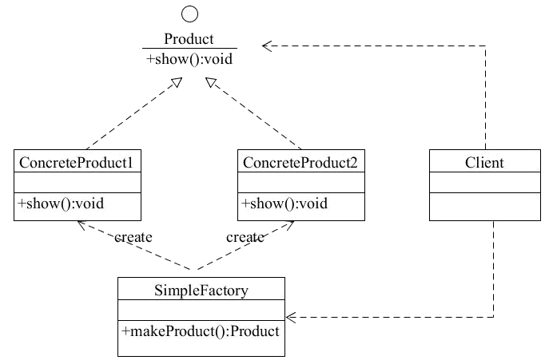
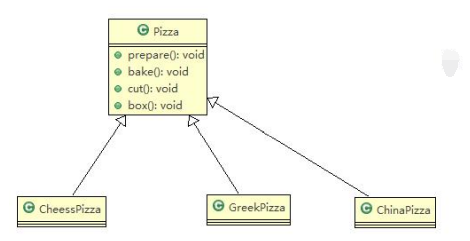
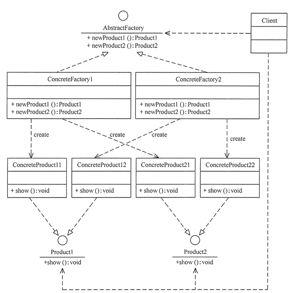
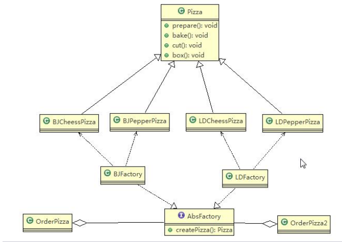
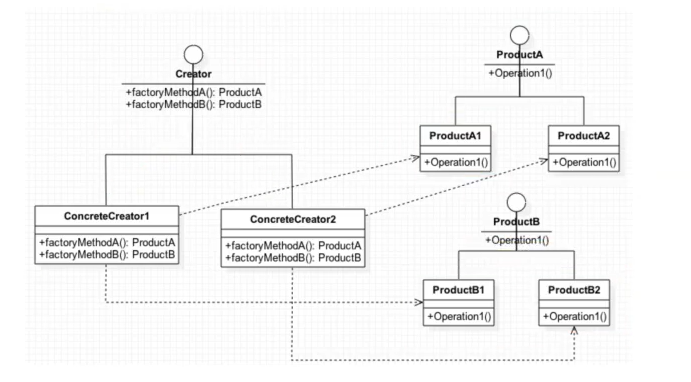

# 设计模式 - 创建型工厂模式

## 工厂模式概述

> 工厂模式很重要，后面的很多架构设计，都是工厂模式联合着其它设计模式使用。

一般情况下，工厂模式分为三种更加细分的类型：简单工厂、工厂方法和抽象工厂。不过，在 GOF 的《设计模式》一书中，它将简单工厂模式看作是工厂方法模式的一种特例，所以工厂模式只被分成了工厂方法和抽象工厂两类。实际上，前面一种分类方法更加常见，所以，在今天的讲解中，我们沿用第一种分类方法。

在这三种细分的工厂模式中，简单工厂、工厂方法原理比较简单，在实际的项目中也比较常用。而抽象工厂的原理稍微复杂点，在实际的项目中相对也不常用。

除此之外，本内容讲解的重点也不是原理和实现，因为这些都很简单，重点还是要搞清楚应用场景：什么时候该用工厂模式？相对于直接 new 来创建对象，用工厂模式来创建究竟有什么好处呢？

简单工厂模式

- 用来生产同一等级结构中的任意产品（对于增加新的产品，需要覆盖已有代码）

工厂方法模式

- 用来生产同一等级结构中的固定产品（支持增加任意产品）

抽象工厂模式

- 围绕一个超级工厂创建其他工厂，该超级工厂又称为其他工厂的工厂

## 简单工厂（Simple Factory）

### 简单工厂模式基本介绍

简单工厂模式是属于 **创建型模式**，是工厂模式的一种。**简单工厂模式是由一个工厂对象决定创建出哪一种产品类的实例**。简单工厂模式是 **工厂模式家族** 中最简单实用的模式。

**简单工厂模式**：定义了一个创建对象的类，由这个类来封装实例化对象的行为（代码）。

在简单工厂模式中创建实例的方法通常为静态（static）方法，因此 **简单工厂模式**（Simple Factory Pattern）又叫作 **静态工厂方法模式**（Static Factory Method Pattern）。

在软件开发中，当我们会用到大量的创建某种、某类或者某批对象时，就会使用到工厂模式。

> 主要优点

- 工厂类包含必要的逻辑判断，可以决定在什么时候创建哪一个产品的实例。客户端可以免除直接创建产品对象的职责，很方便的创建出相应的产品。工厂和产品的职责区分明确
- 客户端无需知道所创建具体产品的类名，只需知道参数即可
- 也可以引入配置文件，在不修改客户端代码的情况下更换和添加新的具体产品类

> 主要缺点

- 简单工厂模式的工厂类单一，负责所有产品的创建，职责过重，一旦异常，整个系统将受影响。且工厂类代码会非常臃肿，违背高聚合原则
- 使用简单工厂模式会增加系统中类的个数（引入新的工厂类），增加系统的复杂度和理解难度
- 系统扩展困难，一旦增加新产品不得不修改工厂逻辑，在产品类型较多时，可能造成逻辑过于复杂
- 简单工厂模式使用了 static 工厂方法，造成工厂角色无法形成基于继承的等级结构

> 主要角色

- 简单工厂（SimpleFactory）：是简单工厂模式的核心，负责实现创建所有实例的内部逻辑。工厂类的创建产品类的方法可以被外界直接调用，创建所需的产品对象
- 抽象产品（Product）：是简单工厂创建的所有对象的父类，负责描述所有实例共有的公共接口
- 具体产品（ConcreteProduct）：是简单工厂模式的创建目标

> 结构图



### 传统方式完成披萨案例

看一个披萨的项目：要便于披萨种类的扩展，要便于维护

- 披萨的种类很多（比如 GreekPizz、CheesePizz 等）
- 披萨的制作有 prepare，bake, cut, box
- 完成披萨店订购功能

思路分析（类图）



编写制作披萨的过程类 Pizza.java


```java
public abstract class Pizza {
	protected String name; // 名字

	// 准备原材料, 不同的披萨不一样，因此，我们做成抽象方法
	public abstract void prepare();
    
    // 省略 setter、getter 方法
}
class CheesePizza extends Pizza {

	@Override
	public void prepare() {
		System.out.println(" 给制作奶酪披萨 准备原材料 ");
	}
}
class GreekPizza extends Pizza {

	@Override
	public void prepare() {
		System.out.println(" 给希腊披萨 准备原材料 ");
	}
}
```


编写 OrderPizza.java 去订购需要的各种披萨


```java
public class OrderPizza {
    
    public static void main(String[] args) {
        CheesePizza cheesePizza = new CheesePizza();
        GreekPizza greekPizza = new GreekPizza();
        
        System.out.println(cheesePizza.getName);
        System.out.println(greekPizza.getName);
	}
}
```


需要什么类型的披萨，new 出该对象。

> 传统的方式的优缺点

- 优点是比较好理解，简单易操作
- 缺点是依赖性太强，不应该直接去 new 一个类

> 改进的思路分析

分析：修改代码可以接受，但是如果我们在其它的地方也有创建 Pizza 的代码，就意味着，也需要修改，而创建 Pizza 的代码，往往有多处。

思路：把创建 Pizza 对象封装到一个类中，这样我们有新的 Pizza 种类时，只需要修改该类就可，其它有创建到 Pizza 对象的代码就不需要修改了，即 **简单工厂模式**。


## 抽象工厂（Abstract Factory）

### 基本介绍

- **抽象工厂模式**：定义了一个 interface 用于创建相关或有依赖关系的对象簇，而无需指明具体的类
- 抽象工厂模式可以将简单工厂模式和工厂方法模式进行整合，是工厂方法模式的升级版本，工厂方法模式只生产一个等级的产品，而抽象工厂模式可生产多个等级的产品
- 从设计层面看，抽象工厂模式就是对简单工厂模式的改进（或者称为进一步的抽象）
- 将工厂抽象成两层，AbsFactory（抽象工厂）和具体实现的工厂子类。程序员可以根据创建对象类型使用对应的工厂子类。这样将单个的简单工厂类变成了 **工厂簇**，更利于代码的维护和扩展

> 优点

除了具有工厂方法模式的优点外，还有：

- 可以在类的内部对产品族中相关联的多等级产品共同管理，而不必专门引入多个新的类来进行管理。
- 当需要产品族时，抽象工厂可以保证客户端始终只使用同一个产品的产品组。
- 抽象工厂增强了程序的可扩展性，当增加一个新的产品族时，不需要修改原代码，满足开闭原则。

> 主要缺点

当产品族中需要增加一个新的产品时，所有的工厂类都需要进行修改。增加了系统的抽象性和理解难度。

> 主要角色

- 抽象工厂（Abstract Factory）：提供了创建产品的接口，它包含多个创建产品的方法 newProduct()，可以创建多个不同等级的产品
- 具体工厂（Concrete Factory）：主要是实现抽象工厂中的多个抽象方法，完成具体产品的创建
- 抽象产品（Product）：定义了产品的规范，描述了产品的主要特性和功能，抽象工厂模式有多个抽象产品
- 具体产品（ConcreteProduct）：实现了抽象产品角色所定义的接口，由具体工厂来创建，它同具体工厂之间是多对一的关系

抽象工厂结构图：



上面的披萨案例抽象工厂类图：



### 抽象工厂模式应用实例

换个案例：生产小米手机、小米路由器；华为手机、华为路由器。



## 工厂模式小结

- 工厂模式的意义将实例化对象的代码提取出来，放到一个类中统一管理和维护，达到和主项目的依赖关系的解耦。从而提高项目的扩展和维护性
- 三种工厂模式 (简单工厂模式、工厂方法模式、抽象工厂模式）
- 设计模式的依赖抽象原则
  - 创建对象实例时，不要直接 new 类, 而是把这个 new 类的动作放在一个工厂的方法中，并返回。有的书上说，变量不要直接持有具体类的引用
  - 不要让类继承具体类，而是继承抽象类或者是实现 interface（接口）
  - 不要覆盖基类中已经实现的方法

## 如何设计实现一个Dependency Injection框架

当创建对象是一个「大工程」的时候，我们一般会选择使用工厂模式，来封装对象复杂的创建过程，将对象的创建和使用分离，让代码更加清晰。那何为「大工程」呢？上面我们讲了两种情况，一种是创建过程涉及复杂的 if-else 分支判断，另一种是对象创建需要组装多个其他类对象或者需要复杂的初始化过程。

我们来学习一个创建对象的「大工程」，依赖注入框架，或者叫依赖注入容器（Dependency Injection Container），简称 DI 容器。在今天的讲解中，我会带你一块搞清楚这样几个问题：DI 容器跟我们讲的工厂模式又有何区别和联系？DI 容器的核心功能有哪些，以及如何实现一个简单的 DI 容器？

### 工厂模式和 DI 容器有何区别

实际上，DI 容器底层最基本的设计思路就是基于工厂模式的。DI 容器相当于一个大的工厂类，负责在程序启动的时候，根据配置（要创建哪些类对象，每个类对象的创建需要依赖哪些其他类对象）事先创建好对象。当应用程序需要使用某个类对象的时候，直接从容器中获取即可。正是因为它持有一堆对象，所以这个框架才被称为「容器」。

DI 容器相对于我们上面讲的工厂模式的例子来说，它处理的是更大的对象创建工程。上面讲的工厂模式中，一个工厂类只负责某个类对象或者某一组相关类对象（继承自同一抽象类或者接口的子类）的创建，而 DI 容器负责的是整个应用中所有类对象的创建。

除此之外，DI 容器负责的事情要比单纯的工厂模式要多。比如，它还包括配置的解析、对象生命周期的管理。接下来，我们就详细讲讲，一个简单的 DI 容器应该包含哪些核心功能。

### DI 容器的核心功能有哪些

总结一下，一个简单的 DI 容器的核心功能一般有三个：配置解析、对象创建和对象生命周期管理。

> 首先，我们来看配置解析。

1. 在上面讲的工厂模式中，工厂类要创建哪个类对象是事先确定好的，并且是写死在工厂类代码中的。作为一个通用的框架来说，框架代码跟应用代码应该是高度解耦的，DI 容器事先并不知道应用会创建哪些对象，不可能把某个应用要创建的对象写死在框架代码中。所以，我们需要通过一种形式，让应用告知 DI 容器要创建哪些对象。这种形式就是我们要讲的配置
2. 我们将需要由 DI 容器来创建的类对象和创建类对象的必要信息（使用哪个构造函数以及对应的构造函数参数都是什么等等），放到配置文件中。容器读取配置文件，根据配置文件提供的信息来创建对象
3. 下面是一个典型的 Spring 容器的配置文件。Spring 容器读取这个配置文件，解析出要创建的两个对象：rateLimiter 和 redisCounter，并且得到两者的依赖关系：rateLimiter 依赖 redisCounter