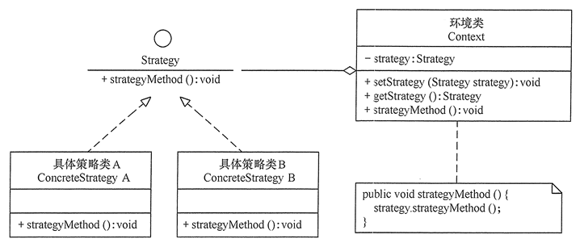

# 设计模式 - 行为型策略模式

## 策略模式基本介绍

在现实生活中常常遇到实现某种目标存在多种策略可供选择的情况，例如，出行旅游可以乘坐飞机、乘坐火车、骑自行车或自己开私家车等，超市促销可以釆用打折、送商品、送积分等方法。

在软件开发中也常常遇到类似的情况，当实现某一个功能存在多种算法或者策略，我们可以根据环境或者条件的不同选择不同的算法或者策略来完成该功能，如数据排序策略有冒泡排序、选择排序、插入排序、二叉树排序等。

如果使用多重条件转移语句实现（即硬编码），不但使条件语句变得很复杂，而且增加、删除或更换算法要修改原代码，不易维护，违背开闭原则。如果采用策略模式就能很好解决该问题。

**策略模式**（Strategy Pattern）：该模式定义了一系列算法，并将每个算法封装起来，使它们可以相互替换，且算法的变化不会影响使用算法的客户。

策略模式属于对象行为模式，它通过对算法进行封装，把使用算法的责任和算法的实现分割开来，并委派给不同的对象对这些算法进行管理。即定义 **算法族**（**策略组**），并分别封装起来，让他们之间可以互相替换，此模式让 **算法的变化** 独立于 **使用算法的客户**。

这算法体现了几个设计原则：

- 把变化的代码从不变的代码中分离出来
- 针对接口编程而不是具体类（定义了策略接口）
- 多用组合/聚合，少用继承（客户通过组合方式使用策略模式）

> 主要优点

- 多重条件语句不易维护，而使用策略模式可以避免使用多重条件语句，如 `if-else` 语句、`switch-case` 语句
- 策略模式提供了一系列的可供重用的算法族，恰当使用继承可以把算法族的公共代码转移到父类里面，从而避免重复的代码
- 策略模式可以提供相同行为的不同实现，客户可以根据不同时间或空间要求选择不同的
- 策略模式提供了对开闭原则的完美支持，可以在不修改原代码的情况下，灵活增加新算法
- 策略模式把算法的使用放到环境类中，而算法的实现移到具体策略类中，实现了二者的分离

> 主要缺点

- 客户端必须理解所有策略算法的区别，以便适时选择恰当的算法类
- 策略模式造成很多的策略类，增加维护难度

## 策略模式的结构与实现

策略模式是准备一组算法，并将这组算法封装到一系列的策略类里面，作为一个抽象策略类的子类。策略模式的重心不是如何实现算法，而是如何组织这些算法，从而让程序结构更加灵活，具有更好的维护性和扩展性，现在我们来分析其基本结构和实现方法。

策略模式的主要角色如下：

- 抽象策略（Strategy）类：定义了一个公共接口，各种不同的算法以不同的方式实现这个接口，环境角色使用这个接口调用不同的算法，一般使用接口或抽象类实现
- 具体策略（Concrete Strategy）类：实现了抽象策略定义的接口，提供具体的算法实现
- 环境（Context）类：持有一个策略类的引用，最终给客户端调用

其结构图如图下所示：

## 策略模式的注意事项和细节

- 策略模式的关键是：分析项目中变化部分与不变部分
- 策略模式的核心思想是：多用组合/聚合，少用继承；用行为类组合，而不是行为的继承。这样才会更有弹性
- 策略模式体现了「对修改关闭，对扩展开放」原则，客户端增加行为不用修改原有代码，只要添加一种策略（或者行为）即可，避免了使用多重转移语句（if-else if-else）
- 策略模式提供了可以替换继承关系的办法：策略模式将算法封装在独立的 Strategy 类中，使得可以独立于其 Context 并改变它，使它易于切换、易于理解、易于扩展
- 需要注意的是：每添加一个策略就要增加一个类，当策略过多是会导致类数目庞

## 策略模式的应用场景

策略模式在很多地方用到，如 Java SE 中的容器布局管理就是一个典型的实例，Java SE 中的每个容器都存在多种布局供用户选择。

在程序设计中，通常在以下几种情况中使用策略模式较多：

- 一个系统需要动态地在几种算法中选择一种时，可将每个算法封装到策略类中
- 一个类定义了多种行为，并且这些行为在这个类的操作中以多个条件语句的形式出现，可将每个条件分支移入它们各自的策略类中以代替这些条件语句
- 系统中各算法彼此完全独立，且要求对客户隐藏具体算法的实现细节时
- 系统要求使用算法的客户不应该知道其操作的数据时，可使用策略模式来隐藏与算法相关的数据结构
- 多个类只区别在表现行为不同，可以使用策略模式，在运行时动态选择具体要执行的行为