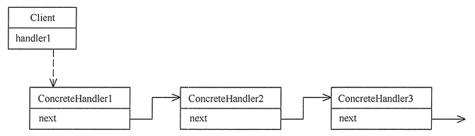
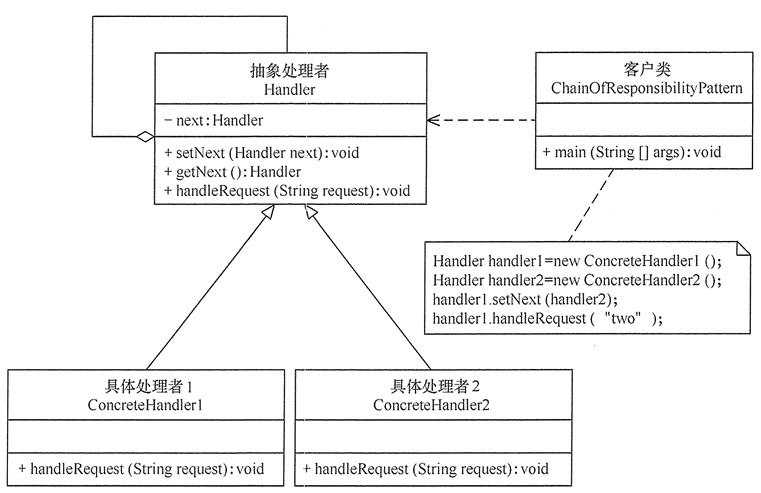

# 设计模式 - 行为型职责链模式

## 职责链模式基本介绍

在现实生活中，一个事件需要经过多个对象处理是很常见的场景。例如，采购审批流程、请假流程等。公司员工请假，可批假的领导有部门负责人、副总经理、总经理等，但每个领导能批准的天数不同，员工必须根据需要请假的天数去找不同的领导签名，也就是说员工必须记住每个领导的姓名、电话和地址等信息，这无疑增加了难度。

在计算机软硬件中也有相关例子，如总线网中数据报传送，每台计算机根据目标地址是否同自己的地址相同来决定是否接收；还有异常处理中，处理程序根据异常的类型决定自己是否处理该异常；还有 Struts2 的拦截器、JSP 和 Servlet 的 Filter 等，所有这些都可以考虑使用职责链模式来实现。

**职责链模式**（Chain of Responsibility Pattern）又叫 **责任链模式**，为了避免请求发送者与多个请求处理者耦合在一起，于是将所有请求的处理者通过前一对象记住其下一个对象的引用而连成一条链；当有请求发生时，可将请求沿着这条链传递，直到有对象处理它为止。这种模式对请求的发送者和接收者进行解耦。

在职责链模式中，通常每个接收者都包含对另一个接收者的引用。客户只需要将请求发送到职责链上即可，无须关心请求的处理细节和请求的传递过程，请求会自动进行传递，如果一个对象不能处理该请求，那么它会把相同的请求传给下一个接收者，依此类推。所以职责链将请求的发送者和请求的处理者解耦了。

这种类型的设计模式属于行为型模式。

> 主要优点

- 降低了对象之间的耦合度。该模式使得一个对象无须知道到底是哪一个对象处理其请求以及链的结构，发送者和接收者也无须拥有对方的明确信息
- 增强了系统的可扩展性。可以根据需要增加新的请求处理类，满足开闭原则
- 增强了给对象指派职责的灵活性。当工作流程发生变化，可以动态地改变链内的成员或者调动它们的次序，也可动态地新增或者删除责任
- 职责链简化了对象之间的连接。每个对象只需保持一个指向其后继者的引用，不需保持其他所有处理者的引用，这避免了使用众多的 if 或者 if-else 语句
- 责任分担。每个类只需要处理自己该处理的工作，不该处理的传递给下一个对象完成，明确各类的责任范围，符合类的单一职责原则

> 主要缺点

- 不能保证每个请求一定被处理。由于一个请求没有明确的接收者，所以不能保证它一定会被处理，该请求可能一直传到链的末端都得不到处理
- 对比较长的职责链，请求的处理可能涉及多个处理对象，系统性能将受到一定影响
- 职责链建立的合理性要靠客户端来保证，增加了客户端的复杂性，可能会由于职责链的错误设置而导致系统出错，如可能会造成循环调用

## 职责链模式的结构与实现

职责链模式主要包含以下角色：

- 抽象处理者（Handler）角色：定义一个处理请求的接口，包含抽象处理方法和一个后继连接
- 具体处理者（Concrete Handler）角色：实现抽象处理者的处理方法，判断能否处理本次请求，如果可以处理请求则处理，否则将该请求转给它的后继者
- 客户类（Client）角色：创建处理链，并向链头的具体处理者对象提交请求，它不关心处理细节和请求的传递过程

责任链模式的本质是 **解耦请求与处理**，让请求在处理链中能进行传递与被处理；理解责任链模式应当理解其模式，而不是其具体实现。责任链模式的独到之处是将其节点处理者组合成了链式结构，并允许节点自身决定是否进行请求处理或转发，相当于让请求流动起来。

其结构图如下图所示：

客户端可按下图所示设置职责链：

## 职责链模式基本介绍

在现实生活中，一个事件需要经过多个对象处理是很常见的场景。例如，采购审批流程、请假流程等。公司员工请假，可批假的领导有部门负责人、副总经理、总经理等，但每个领导能批准的天数不同，员工必须根据需要请假的天数去找不同的领导签名，也就是说员工必须记住每个领导的姓名、电话和地址等信息，这无疑增加了难度。

在计算机软硬件中也有相关例子，如总线网中数据报传送，每台计算机根据目标地址是否同自己的地址相同来决定是否接收；还有异常处理中，处理程序根据异常的类型决定自己是否处理该异常；还有 Struts2 的拦截器、JSP 和 Servlet 的 Filter 等，所有这些都可以考虑使用职责链模式来实现。

**职责链模式**（Chain of Responsibility Pattern）又叫 **责任链模式**，为了避免请求发送者与多个请求处理者耦合在一起，于是将所有请求的处理者通过前一对象记住其下一个对象的引用而连成一条链；当有请求发生时，可将请求沿着这条链传递，直到有对象处理它为止。这种模式对请求的发送者和接收者进行解耦。

在职责链模式中，通常每个接收者都包含对另一个接收者的引用。客户只需要将请求发送到职责链上即可，无须关心请求的处理细节和请求的传递过程，请求会自动进行传递，如果一个对象不能处理该请求，那么它会把相同的请求传给下一个接收者，依此类推。所以职责链将请求的发送者和请求的处理者解耦了。

这种类型的设计模式属于行为型模式。

> 主要优点

- 降低了对象之间的耦合度。该模式使得一个对象无须知道到底是哪一个对象处理其请求以及链的结构，发送者和接收者也无须拥有对方的明确信息
- 增强了系统的可扩展性。可以根据需要增加新的请求处理类，满足开闭原则
- 增强了给对象指派职责的灵活性。当工作流程发生变化，可以动态地改变链内的成员或者调动它们的次序，也可动态地新增或者删除责任
- 职责链简化了对象之间的连接。每个对象只需保持一个指向其后继者的引用，不需保持其他所有处理者的引用，这避免了使用众多的 if 或者 if-else 语句
- 责任分担。每个类只需要处理自己该处理的工作，不该处理的传递给下一个对象完成，明确各类的责任范围，符合类的单一职责原则

> 主要缺点

- 不能保证每个请求一定被处理。由于一个请求没有明确的接收者，所以不能保证它一定会被处理，该请求可能一直传到链的末端都得不到处理
- 对比较长的职责链，请求的处理可能涉及多个处理对象，系统性能将受到一定影响
- 职责链建立的合理性要靠客户端来保证，增加了客户端的复杂性，可能会由于职责链的错误设置而导致系统出错，如可能会造成循环调用

## 职责链模式的结构与实现

职责链模式主要包含以下角色：

- 抽象处理者（Handler）角色：定义一个处理请求的接口，包含抽象处理方法和一个后继连接
- 具体处理者（Concrete Handler）角色：实现抽象处理者的处理方法，判断能否处理本次请求，如果可以处理请求则处理，否则将该请求转给它的后继者
- 客户类（Client）角色：创建处理链，并向链头的具体处理者对象提交请求，它不关心处理细节和请求的传递过程

责任链模式的本质是 **解耦请求与处理**，让请求在处理链中能进行传递与被处理；理解责任链模式应当理解其模式，而不是其具体实现。责任链模式的独到之处是将其节点处理者组合成了链式结构，并允许节点自身决定是否进行请求处理或转发，相当于让请求流动起来。

其结构图如下图所示：

客户端可按下图所示设置职责链：

