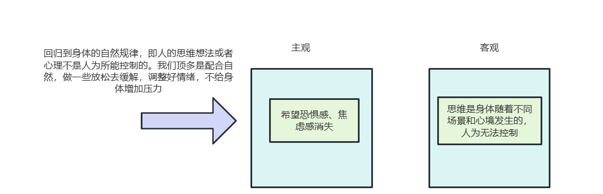
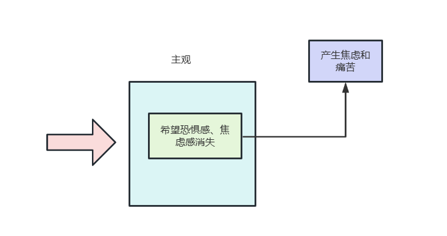
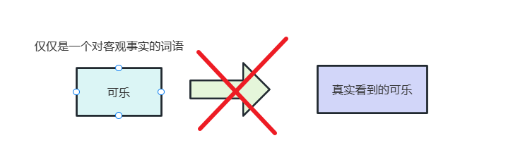
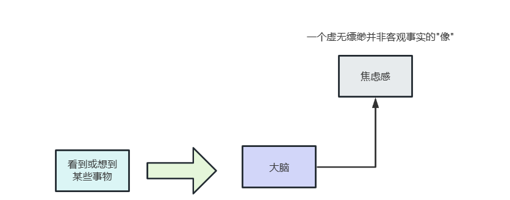
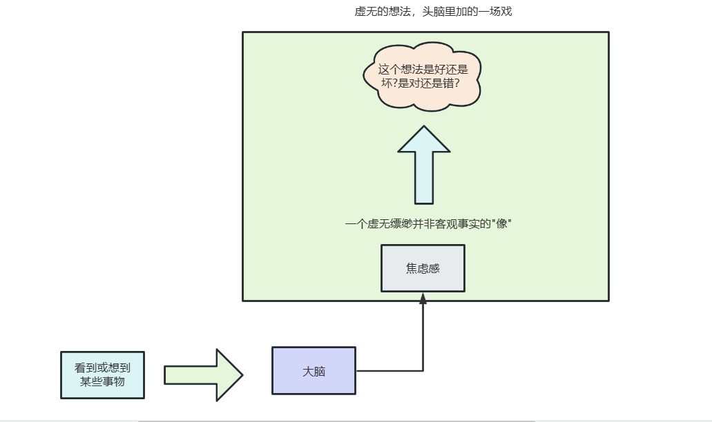
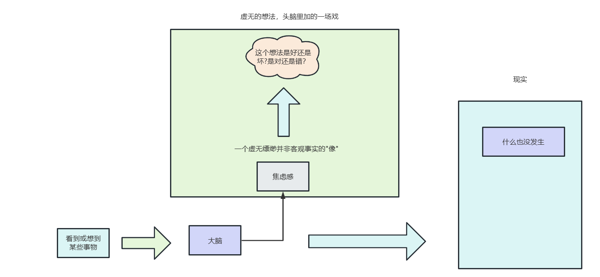
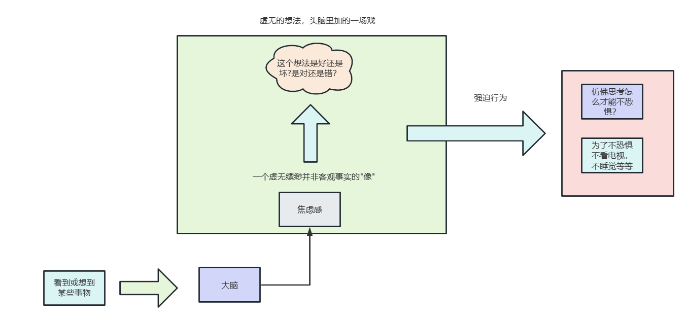
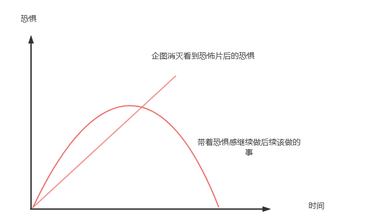
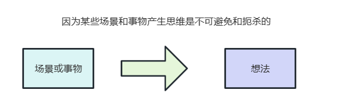
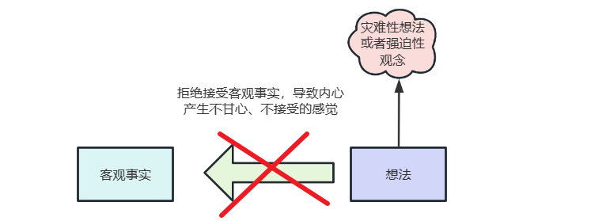

# 生活哲学之顺其自然

## 前言

近期阅读了一些不错的心理学科普的教程，觉得很有道理，所以就索性将这些知识整理出来。生活中有那么些人存在着强迫性思维，许多心理学的书籍都提到了一种神奇的治疗方式:森田疗法。

森田疗法要求存在强迫思维的人，以顺其自然的心态来面对症状。初次听到可能无法理解，感觉这就是一句有用的废话，因为我们日常生活无论遇到什么事，似乎都会听到顺其自然这样的话语。就例如下面这么几个例子:

1. 明天的篮球赛我们能不能赢？顺其自然吧。
2. 后面的面试我能不能过？顺其自然吧。

这样说，肯定也没什么问题。但好像没有什么实际意义和可操作性，完全就是一句没有任何解决方案的废话罢了。所以我还是要带着问题去思考。森田疗法中的顺其自然指的是什么？为何要提出顺其自然。

## 什么是逆其自然

要了解顺其自然，我们不妨就通过类似反证法的方式来了解一下逆其自然的概念。逆其自然的概念也很简单:我们日常生活中主观上认为的事情，应该按照自己的想法发生。而客观的事实却和它结果相反，进而出现了思想矛盾。

比如惊恐发作、焦虑来袭，当身体已经具备了发作条件，箭在弦上，不得不发。我们不希望这种感觉发生，于是反复持续的纠结想让这个症状消失。但是事实就是发生了，结果我们越是想要控制和摆脱， 就是在内心制造矛盾，试图让这些想法消失，这时候就和客观事实冲突起来了。

所以消除矛盾的方法，就是放弃控制，回归到身体的自然规律，即人的思维想法或者心理不是人为所能控制的。我们顶多是配合自然，做一些放松去缓解，调整好情绪，不给身体增加压力。但如果想通过某种方式，去躲避它的发生，这几乎是不可能的。因为它已经具备了发作条件，怎么能不发呢？

又比如说，我们现在希望自己能马上开心起来，事实是很难做到，因为情感不受人的意志力支配，正如我们不想早起想赖床多睡一会的的时候，很难把早起的心态变成高兴快乐。

正如森田老师所说:

> 本来，我们的身体和精神活动，是一种自然现象，不可能人为的力量来左右它们，可是，人们往往认为这一切都是可以由自己随心所欲地支配。尤其在精神方面，更是如此。

也就是想法和本来的事实真相，是经常有出入的，但自己如果总希望事情，能够如你所愿，对存在的客观事实，并不以现实的方式去对待，把心中所想拓展到完全不可能的范围，就会发生过分的心理冲突，越是不尊重客观事实，就越容易感受痛苦和焦虑，那为什么想法和事实真相总是会混淆呢？

举个例子:可乐这个词并不是可乐，除非你喝过可乐，你才会知道它的味道，也就是说可乐这个词仅仅代表着对客观事物的一个抽象描述。换句话说，我们思维里可乐这个词语，并不一定是代表我们所看到的真相，比如你想的可乐是可口可乐，可是接下来你看到的确实百事可乐。

词语是达到目的的手段，它是抽象的并不代表事实本身，所以我们不要陷入词语的字面意思中。也就是说，我们脑海里的思维记忆想法，都是源自于现实的抽象描述。它们更像我们的脸照在镜子上，镜子里只是保留一个虚拟的自己，并不能代表一个真实存在的自己，它只是一个像。

但我们往往会把想法，投射到了外界事物，误以为外界事物的真实就是心中所想，例如冬天人们走在路上感觉寒风刺耳，这并不代表寒风真的像刺一样扎你，而是寒风冻得你浑身难受，心中所产生的一种感触而已。

回到我们的思维模式。当你想着:"我的强迫症能不能马上好，遇到考试能不能不焦虑，看恐怖片能不能不恐惧"，这就是"像"。当你对疾病的灾难性想法，担心自己会不会死，会不会疯，这也是"像"。诸如此类，所有的像，都是我们心理上不断地琢磨某种情况，而并没有真正地在当下采取行动。

这些都来自于思维，思维就很容易评判这些情况:是好还是坏?是对还是错?但这些全都是想法。也正因为如此，我们总觉得自己被神经症束缚，感到山穷水尽，事实上并未上穷水尽，所以才感到不行。我们总是很执着，执着的对象是什么呢？其实是一个虚无的想法，头脑里加的一场戏，是一个不存在的对现实的想象。甚至对这些想法，我们还产生了焦虑和恐惧。产生了矛盾和冲突。

那如何才能远离这些执着呢？其实很简单，只要我们不再拘泥于个人情绪，舍弃自己原来的想法。看到事实的本质，想法就变得很简单了，"像"本来就是不存在的，正如猴子捞月，不可能捞出真正的月亮，那为什么还要消灭它们呢？你怎么能消灭一个，本身就不存在的东西呢？既然它们只是我们脑海里的想法，该怎么做呢？

其实什么也不用做，什么也不用管。它之所以很痛苦，赶也赶不走，是因为自己盲目的认同它，或者是否定它，批判它，认为它不该出现。但事实它就是出现了，出现在脑海里，但不代表真正的现实情况。现实情况是什么也没有发生，什么也不存在。所以我们不需要花心思去对付它们。

放弃对它们的执着。自然的也就回归到真实状态。真实的状态就是当下你所看到的，听到和感受到的所有。焦虑也好，紧张也罢，这都是当下切实的感受。

所以我们不要去否定、批判这些想法，带着这些想法和感觉去做好现在能做的，应该做的，这就很棒了。因为如果我们如实的相信思想为真，并受到它的束缚和支配时，就会出现许多事与愿违的事情。

比如失眠的朋友总是在内心的纠葛中，度过一个晚上，认为自己不能失眠，失眠了对身体不好该怎么办？影响明天状态怎么办？很想睡着，但是什么时候能睡着，这本来就是身体的事情，我们无法知道也无法控制，而自己对睡着的执着，反而制造了冲突。但自己没有睡着，事实就是没有睡着，不断失落和焦虑，那还不如索性随他去吧，睡不着就睡不着。

再比如，一个人如果愿意洗手， 那么他洗上一天，也不会觉得疲劳，但拥有保持绝对干净的想法，这种与客观事实不切实际的想法使其反复纠结，就会发展成不洁恐惧者。

话说到这里到底思想矛盾是什么呢？就是我们把内心产生的想法，"理应如此"的"像"把它跟客观事实摆在一起，产生了冲突，并且我们仍然不承认客观事实，企图将不显示的想法变成现实，是不可能做到的。

## 顺其自然

先来看一段森田老师的原文:

> 那么，怎样才能打破这种思想矛盾呢？一句话概括来说，就是放弃认为的拙笨意图，而应该是顺从它那客观存在的自然状态，企图依照人为设计，随意支配自己的想法，或打算让河水倒流那样，不能如愿以偿，就会徒然增加烦恼，力量达不到，就会妄受难耐的痛苦，这是必然的。

《神经衰弱和强迫观念根治法》中也提到:

> 那么，什么是自然呢？夏热寒冬是自然，希望不觉得热，希望不让人冷的想法是人为的，顺从并忍耐，这属于自然。对死亡的恐惧，对灾难的悲伤，讨厌不快，遇到不合心愿的事就要抒发感慨等等，这些都是人之常情的自然流露。就和水要向低处流是一样的。进一步来看，再如觉睡过了头，头就会沉，吃太饱胃就会难受，受惊则会心悸加剧等情况一样。都是人接受自然法则支配的表现，其中的因果规律是无法逃脱的，对此光想着适合自己是不行的，除了顺从自然别无他法。

所以顺其自然是什么意思呢？

1. 顺:是顺应，绝对服从客观事实，有一种顺势而为的感觉，不去对抗的意思。
2. 其:是代词指代的是强迫症状，以及我们的负面情绪。
3. 自然:就是保持它存在的面目，不要多做任何的行为。

所以顺其自然，整句话可以翻译为:把症状和负面情绪的产生，当作是一种自然状态,来了就来了,不对它施加任何的力，即应该恐怖的时候就发生恐怖，在应该安心的时候表现安心，不去反复纠结，任其自然而然的发展，这都是真实的自然。

> "不愿意去想那些无聊的事情，不愿发生那些讨厌的想法"而想法设法的回避，或为此而痛苦不堪，懊恼不已的问题。但是，通过接触身边的事物产生某种感受，涌现出某种想法，这是人们在生存期间绝对不能否定的一种实际情况，我们可以断炊不食，也可以裸体不着衣物，但是唯独不用脑思考是无论如何也做不到的。
>
> "要把心胸放宽一些才行，对于任何问题，千万都不要去想"正是因为如此，患者们也会更加陷入痛苦的深渊。上文明明说到思想是是不可能阻断的，人们为什么拿这种根本办不到的事情向别人提出要求呢？这不是思想矛盾嘛？

其实,他的意思是说:感到恐惧就是感到恐惧，不再去祈求摆脱恐惧(这种焦虑不安的感觉),那么恐惧就会依照情感自然升降的规律而消失不见。

这种情况其实也是正常的思维，只是特定场景和心情下你产生的一个简单的好奇思维而已，正如森田老师所说:

> 如果知道这是最初因为某种契机下引起的精神拮抗作用，是在常态下，发生的普遍现象，那就不会出现强迫观念。 但如果认为它是异常的，病态的特殊心里，就会发展成为强迫观念，也就是说，所谓的常态和强迫之间，仅仅是毫厘之差。

我们遇到某个场景或某个事物，就会产生某种想法，什么都不要想，这是根本不可能的事情。因此脑海里的想法不断，那就让他出现好了，不去否定他，排斥他。

说到这里，很多人都会误解，顺其自然就是什么也不做，然而事实真的是这样嘛？ 其实，顺其自然的意思是让我们放弃对错误的执着，纯心理上臣服于客观事实。并不是说行动上什么也不做，正是因为有内心的矛盾，我们才经常觉得自己什么也做不了，是因为我们的想法和客观的事实发生了冲突。导致想法里拒绝签收客观事实，内心种种不甘心、不接受。且自认为自己可以控制很多事情，但我们无论怎么反抗，我们必须承认事实就是事实，无论你是否允许，它们都是客观存在的，不可能的事情就是不可能。

顺其自然的道理看似很简单，但在实际中的体验，我们却还是不愿意去接受客观事实，其实让自己内心平静的方法也很简单，减少对思维中虚拟的批判，不再去反复纠结和批判，返回到它的本来，恢复事实中原始面貌，不在想法里虚构一个场景扭曲事实。改变适应外界事物的态度，主动让想法和事实切合。

## 参考文献

[森田疗法思想矛盾&顺其自然](https://www.sharkchili.com/pages/972cbd/[森田疗法思想矛盾&顺其自然_哔哩哔哩_bilibili](https://www.bilibili.com/video/BV18q4y1U7iA/?spm_id_from=333.999.0.0&vd_source=bf04f9a485aa892c0242fbfdfca25589))

[“我担心的事情90%都没发生”：如何摆脱过分担忧？ - 知乎 (zhihu.com)](https://zhuanlan.zhihu.com/p/264395921)
