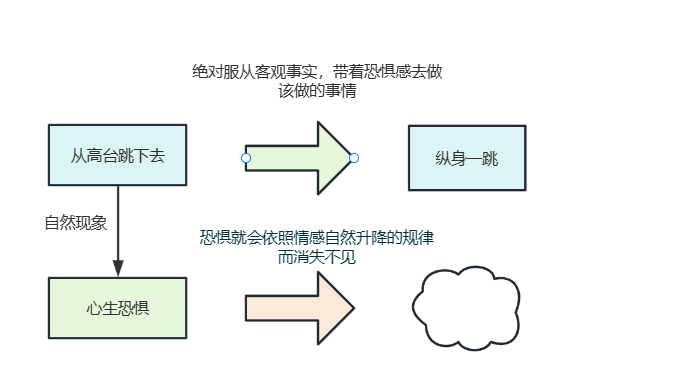
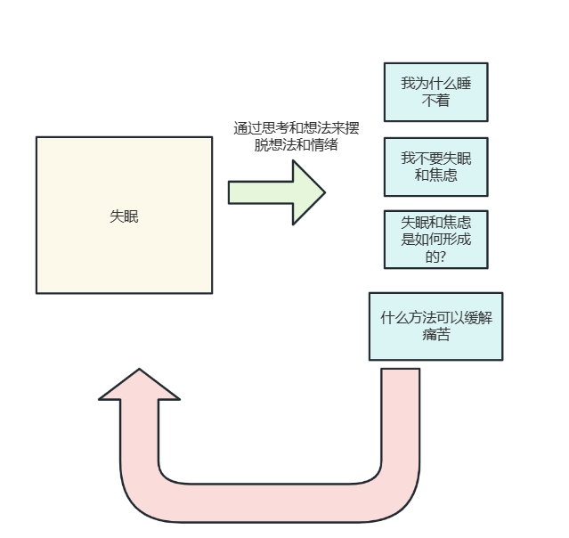
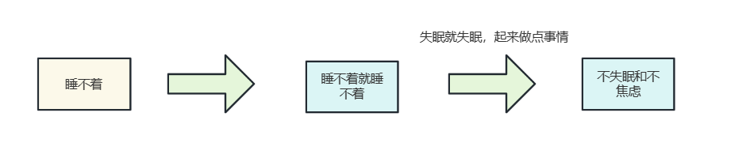
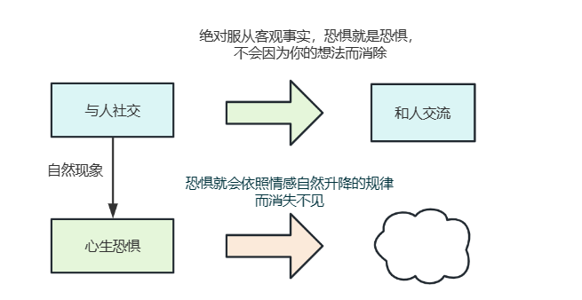
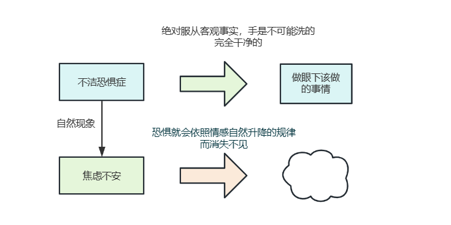
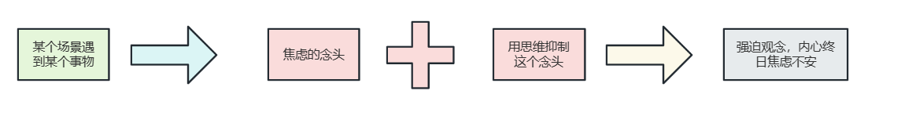
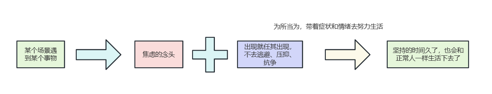
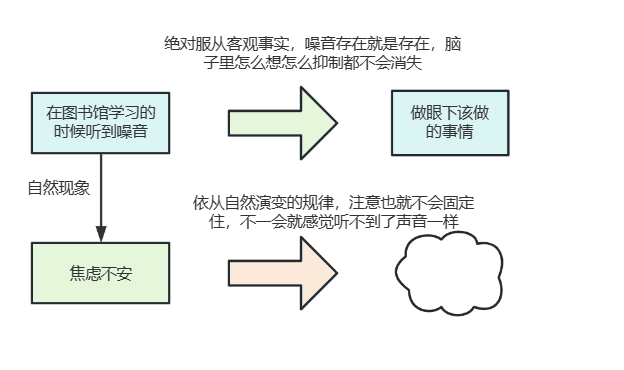

# 生活哲学之为所当为

## 什么是顺其自然

顺其自然就是一切从事实出发,没有假设,也没有逃避,没有反抗。就如:

1. 失眠的人不能既想着很快入睡，又让自己放松，这是矛盾的。
2. 想不明白某些事情的人希望能够立刻解决问题，但内心又不会烦躁，这也是矛盾的。


所以我们要学会顺其自然:

1. 睡不着就起来，从心里上绝对服从客观事实,舍弃内心想法的矛盾。
2. 超出认知以外想明白的事情要么通过学习了解，要么就不要纠结了，去做眼下该做的事情，从内心服自己目前就是想不明白的这个问题客观事实，带着内心的烦恼去做你现在应该做的事情。

说到这里，很多人会认为森田疗法的顺其自然就类似于放弃，是过度的消极，是什么也不做，然而事实真的是这样嘛？

## 什么是放弃？什么是顺其自然?

什么是放弃？什么是顺其自然?对此我们不妨来看看下面这个案例:

```bash
小明在游泳课上要求从游泳池高台跳下去，此时他心生恐惧，因为恐惧想着不跳了，然后从跳台回去，不想跳水了。
```

其实每个人都有着恐惧的情绪，因为恐惧而不去跳水，是放弃的态度，或者认为恐惧是一个令人讨厌的东西， 然后一厢情愿的企图去消灭它，待恐惧没有了再去跳，这种人为的心理干涉，是一种放弃的态度，是通向神经症的温床。 其实恐惧感是正常的心理现象，企图把恐惧感消灭掉再跳，反而忽视了跳水这个本来的目的，因此顺其自然就是原封不动的接受，自然会引起的恐惧心里，尽管提心吊胆，依然纵身一跳，这就是顺其自然的态度。



这个案例告诉我们，消除恐惧之后再跳，这种重复的造作不起任何作用，只有依靠实际行动，才能淡化恐惧心理，用森田疗法的话，概括就是:

> 理论上来说，感情并非受我们意志自由所支配，所以观念性的要消除恐惧心理是不能如愿的。可是，从行动可以自由支配这个比较广泛这一心理学的事实出发，可以借助行动能把"顺其自然"的态度转化成现实。

我们再来看看这个场景:

有这么两个人，一个人认为一晚上不睡，进而就想到自己第二天可能就会非常累，进而就想到肯定无法好好工作，进而就想到这样就会收到老板的批评，进而就想到这个月的奖金可能就没了。



而另一个人认为，一晚上睡不着不是什么大不了的事情，即便自己会感觉累一点，但是仍然可以坚持工作，于是刷了一会手机睡着了。



这两种人，谁会跟容易陷入长期失眠呢？不同的人对同样的事情，有不同的心里暗示和观念，正是因为这些不良的想法阻碍了把顺其自然的心态转换为现实行动，使得第一个人困在失眠或焦虑的很大原因。

## 顺其自然和放任自流的区别

对社交恐惧患者，与人见面就会感到痛苦，就干脆避免与人接触，这是放任自流的态度。然而顺其自然就不同，它要求患者出现了对人恐怖心理时，就应该带着这种心理，坚持和人去接触，不逃避，那么社交恐惧的症状就会减轻。



又比如不洁恐惧者，动不动就出现想洗手的冲动，就紧接着去洗手，结果就会永远的洗下去，这是"放任自流"，但如果患者承认自己有想洗手的冲动，让这种状态存在着，但不要去洗手，而是努力坚持正常的工作，那么坚持的时间久了，就会和正常人一样生活下去了。



也就是说即使有症状、内心有纠葛，也要求态度不变的去做应该做的事情。这样做的的话，我们就能体验到:即使有症状，也依旧能够正常生活，由此症状的威力就会慢慢的削弱。其实要做到这一点，开始时痛苦的，尽管痛苦，只要去做就一定能够成功，总归好过重复性绝望和什么也不干。

## 用思维抑制思维是无用功

我们回过头来看一下举得例子，如果用抑制的力量去抑制强迫观念的产生，又会是什么结果呢？比如:和人接触时出现对人恐怖的反射的心理，不洁恐怖的人要做些厨房的事情，立刻就想到要反复洗手。他们要抑制，这种必然出现的心理现象，最终的结果就是失败，从而造成内心冲突。



他们不允许自己惶恐不安，而总想着自己一定要淡定自若，强迫观念正是由于这种内心冲突而形成的，也就是说症状、情绪、想法都应该采取顺其自然的态度，出现就任其出现，不去逃避、压抑、抗争。不是放任自流无所作为，而是我们可以为所当为，带着症状和情绪去努力生活。



我们往往想，通过思考和想法来摆脱想法和情绪，但有趣的是，思考的过程也是提问和回答，我们往往提出了许多的问题，却很少寻找正确答案，就如最常见，我不要失眠和焦虑，我不想那么痛苦，然后你肯定也会问自己失眠和焦虑是如何形成的？有什么方法可以缓解痛苦？很少积极主动地去解决问题，而是重复性的滞留问题且纠结着不放。


## 顺其自然打破强迫观念的固着

许多神经症的症状，都是由固着引起的，从这个意义来看“顺其自然”，它可以打破注意力的固着。小明以前常有强烈的头重感，工作或者学习的时候会感觉脑子像抽筋了一样难受，此时小明会采取3种选择:

1. 停下手头的工作，静静的存粹去感受不舒服的感觉。
2. 继续坚持手头的工作，虽然也会受到一些影响，但是还是可以继续专注，应该做的事情。
3. 实在累的受不了，直接休息。

这3种做法都是对出现的情绪采取了顺其自然的态度。但是不正确的做法是，一天到晚想着:"只要这个症状没有了就好了，不断的告诉自己，我不能头痛，我会不会中风。"然后停下手里的工作，什么也不干了，违背当前确实存在头重感的客观事实，然后不断把头重感的注意和感觉交互起来，造成强迫。

对于耳朵里老听到声音，而睡不着的失眠朋友，也是因为把声音当作妨碍而去排斥它，反而增加了抵抗作用和精神交互。 更意识到了声音的存在，但客观的事实就是，比如我们在图书馆学习的时候，对听到的声音听之任之，依从自然演变的规律，注意也就不会固定住，不一会就感觉听不到了声音一样。



但是，当晚上来临或者状态不太好的时候，我们总是会肆意任由情绪控制自己，不断的对声音心烦和关注，而忽略了客观事实，客观事实就是，我们既不能把这个声音关掉，我们对声援听之任之即不心烦，要对客观事实绝对服从，这样才可以释放内心的矛盾。我们人的感觉，只要把注意力放在那里，感觉就会变得敏锐起来了，也正是因为集中注意力，所以才妨碍了情感的自然流动。

> 神经质的人尤其是这样，他们虽然想法设法急于从痛苦和不安中解脱出来，但却事与愿违，它们不懂要顺其自然，要对痛苦不安听之任之。
>
> 如果有人失去父母或孩子，遇到这样令人悲伤的失去，应该痛苦悲伤的同时，奋力于自己的日常工作，这样，即使不能短时间内忘记，也会随着时间一年年的过去，而使痛苦和悲伤逐渐淡薄。更何况我们日常生活中遇到的微不足道的不快和不安呢？如果顺其自然，听任自然的经过，一般几天之后就忘记了，但越想赶快忘掉，印象就会更深。

越想摆脱就越会集中注意力，症状也就越严重，相信你我都深有体会，所以正确的做法是，顺应自然的接受自己的情绪、症状、想法，以应当做的事为目的为所当为，一开始肯定不会一帆风顺，甚至是痛苦的。 但是如果你受够了，那就坚持改变，一个好的习惯形成都需要21天，所以希望大家能够在理解的基础上去提回为什么总是强调需要顺其自然和积极生活。

## 参考资料

[森田疗法之顺其自然&为所当为](https://www.bilibili.com/video/BV1xq4y1T7Eh/?spm_id_from=333.999.0.0&vd_source=bf04f9a485aa892c0242fbfdfca25589)
